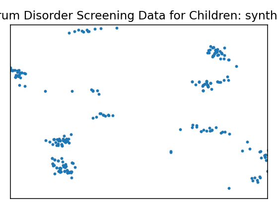
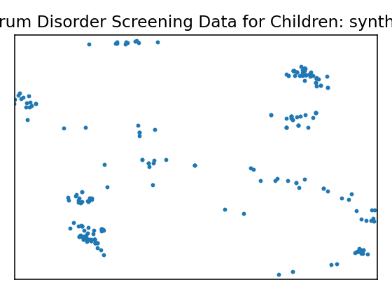
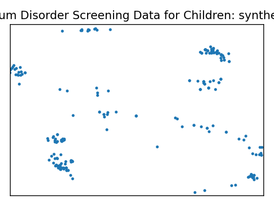
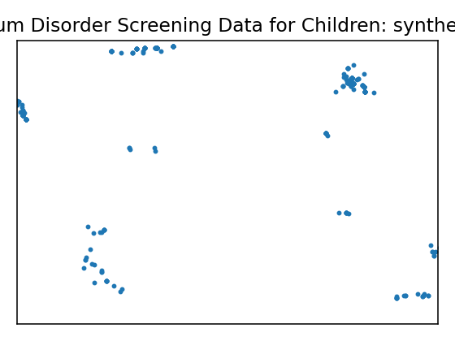
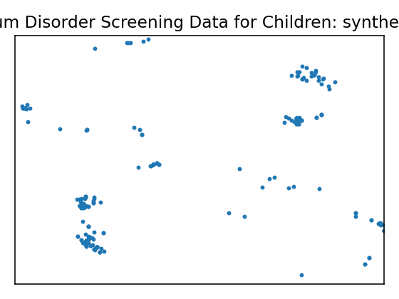
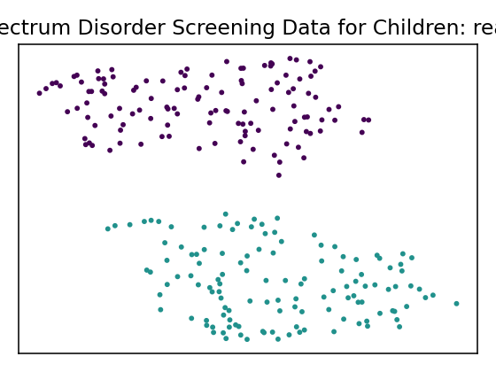
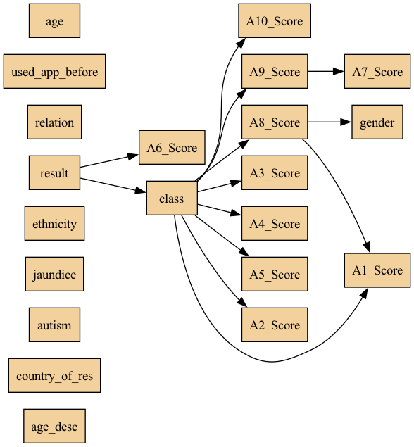

# Data Report — Autistic Spectrum Disorder Screening Data for Children

see attached file for variables' description 

**Documentation**: see attached file for variables' description 

**Source**: [UCI dataset 419](https://archive.ics.uci.edu/dataset/419)

**SemMap JSON-LD**: [dataset.semmap.json](dataset.semmap.json) · [RDFa HTML](dataset.semmap.html)
## Overview

| Metric      | Value                                                                         |
|:------------|:------------------------------------------------------------------------------|
| Dataset     | Autistic Spectrum Disorder Screening Data for Children                        |
| Source      | [UCI dataset 419](https://archive.ics.uci.edu/dataset/419)                    |
| Rows        | 248                                                                           |
| Columns     | 21                                                                            |
| Discrete    | 21                                                                            |
| Continuous  | 0                                                                             |
| SemMap      | [SemMap JSON-LD](dataset.semmap.json) [SemMap HTML](dataset.semmap.html) |
| Missingness | Not modeled                                                                   |

## Variables and summary

| variable        | inferred   | dist                                                                                                                                                                                                                                                                                                            |
|:----------------|:-----------|:----------------------------------------------------------------------------------------------------------------------------------------------------------------------------------------------------------------------------------------------------------------------------------------------------------------|
| A1_Score        | discrete   | 1: 170 (68.55%)                                                                                                                                                                                                                                                                                                 |
| A2_Score        | discrete   | 1: 128 (51.61%)                                                                                                                                                                                                                                                                                                 |
| A3_Score        | discrete   | 1: 185 (74.60%)                                                                                                                                                                                                                                                                                                 |
| A4_Score        | discrete   | 1: 142 (57.26%)                                                                                                                                                                                                                                                                                                 |
| A5_Score        | discrete   | 1: 187 (75.40%)                                                                                                                                                                                                                                                                                                 |
| A6_Score        | discrete   | 1: 177 (71.37%)                                                                                                                                                                                                                                                                                                 |
| A7_Score        | discrete   | 1: 155 (62.50%)                                                                                                                                                                                                                                                                                                 |
| A8_Score        | discrete   | 1: 119 (47.98%)                                                                                                                                                                                                                                                                                                 |
| A9_Score        | discrete   | 1: 134 (54.03%)                                                                                                                                                                                                                                                                                                 |
| A10_Score       | discrete   | 1: 182 (73.39%)                                                                                                                                                                                                                                                                                                 |
| age             | discrete   | 4: 78 (31.45%) 5: 36 (14.52%) 6: 33 (13.31%) 7: 24 (9.68%) 11: 23 (9.27%) 8: 20 (8.06%) 9: 17 (6.85%) 10: 17 (6.85%)                                                                                                                                                         |
| gender          | discrete   | m: 174 (70.16%)                                                                                                                                                                                                                                                                                                 |
| ethnicity       | discrete   | White-European: 108 (43.55%) Asian: 46 (18.55%) 'Middle Eastern ': 26 (10.48%) 'South Asian': 21 (8.47%) Others: 14 (5.65%) Black: 14 (5.65%) Latino: 8 (3.23%) Hispanic: 7 (2.82%) Pasifika: 2 (0.81%) Turkish: 2 (0.81%)                                         |
| jaundice        | discrete   | yes: 61 (24.60%)                                                                                                                                                                                                                                                                                                |
| autism          | discrete   | yes: 45 (18.15%)                                                                                                                                                                                                                                                                                                |
| country_of_res  | discrete   | 'United Kingdom': 49 (19.76%) 'United States': 42 (16.94%) India: 42 (16.94%) Australia: 23 (9.27%) 'New Zealand': 13 (5.24%) Jordan: 9 (3.63%) Canada: 7 (2.82%) Bangladesh: 6 (2.42%) 'United Arab Emirates': 5 (2.02%) Philippines: 4 (1.61%) … (+42 more) |
| used_app_before | discrete   | yes: 6 (2.42%)                                                                                                                                                                                                                                                                                                  |
| result          | discrete   | 8: 37 (14.92%) 7: 36 (14.52%) 6: 34 (13.71%) 9: 32 (12.90%) 4: 30 (12.10%) 5: 28 (11.29%) 10: 21 (8.47%) 3: 16 (6.45%) 2: 8 (3.23%) 1: 5 (2.02%) … (+1 more)                                                                                                  |
| age_desc        | discrete   | '4-11 years': 248 (100.00%)                                                                                                                                                                                                                                                                                     |
| relation        | discrete   | Parent: 213 (85.89%) Relative: 17 (6.85%) 'Health care professional': 13 (5.24%) Self: 4 (1.61%) self: 1 (0.40%)                                                                                                                                                                            |
| class           | discrete   | YES: 126 (50.81%)                                                                                                                                                                                                                                                                                               |

## Fidelity summary

| umap                                                 | model      | backend   |   disc jsd mean |   disc jsd median | cont ks mean   | cont w1 mean   |   downstream sign match |
|:-----------------------------------------------------|:-----------|:----------|----------------:|------------------:|:---------------|:---------------|------------------------:|
|     | metasyn    | metasyn   |          0.1203 |            0.0999 |                |                |                  0.6111 |
|     | clg_mi2    | pybnesian |          0.111  |            0.0626 |                |                |                         |
|    | semi_mi5   | pybnesian |          0.111  |            0.0626 |                |                |                         |
|  | ctgan_fast | synthcity |          0.338  |            0.304  |                |                |                         |
|  | tvae_quick | synthcity |          0.1713 |            0.1231 |                |                |                         |

## Privacy summary

| model      | backend   |   n real |   n synth |   exact overlap rate |   near duplicate rate eps |   nn distance mean |   k min |   k pct lt5 |   k map |   rare qi reproduction rate | identifiability score   |   delta presence |
|:-----------|:----------|---------:|----------:|---------------------:|--------------------------:|-------------------:|--------:|------------:|--------:|----------------------------:|:------------------------|-----------------:|
| metasyn    | metasyn   |      248 |       292 |                0     |                    0.6048 |             0.2013 |       1 |           1 |       4 |                      0      |                         |           4.25   |
| clg_mi2    | pybnesian |      248 |       292 |                0.004 |                    0.0121 |             0.4247 |       1 |           1 |       6 |                      0.0041 |                         |           2.8182 |
| semi_mi5   | pybnesian |      248 |       292 |                0.004 |                    0.0121 |             0.4247 |       1 |           1 |       6 |                      0.0041 |                         |           2.8182 |
| ctgan_fast | synthcity |      248 |       256 |                0     |                    0.1008 |             0.5117 |       1 |           1 |       2 |                      0      |                         |          30.5    |
| tvae_quick | synthcity |      248 |       256 |                0     |                    0.7581 |             0.1512 |       1 |           1 |       1 |                      0      |                         |          17      |

## Models

<table>
<tr><th>UMAP</th><th>Details</th><th>Structure</th></tr>
<tr><td></td><td>
<h3>Real data</h3></td><td></td></tr>
<tr><td></td><td>

<h3>Model: metasyn (metasyn)</h3>
<ul>
<li>Seed: 42, rows: 292</li>
<li> <a href="models/metasyn/synthetic.csv">Synthetic CSV</a></li>
<li> <a href="models/metasyn/per_variable_metrics.csv">Per-variable metrics</a></li>
<li> <a href="models/metasyn/metrics.json">Metrics JSON</a></li>
<li> <a href="models/metasyn/metrics.privacy.json">Privacy metrics</a></li>
<li> <a href="models/metasyn/metrics.downstream.json">Downstream metrics</a></li>
</ul>

<strong>Per-variable fidelity</strong>

<table class="dataframe">
  <thead>
    <tr style="text-align: right;">
      <th>variable</th>
      <th>type</th>
      <th>JSD</th>
    </tr>
  </thead>
  <tbody>
    <tr>
      <td>A1_Score</td>
      <td>discrete</td>
      <td>0.0235</td>
    </tr>
    <tr>
      <td>A2_Score</td>
      <td>discrete</td>
      <td>0.0365</td>
    </tr>
    <tr>
      <td>A3_Score</td>
      <td>discrete</td>
      <td>0.1217</td>
    </tr>
    <tr>
      <td>A4_Score</td>
      <td>discrete</td>
      <td>0.0577</td>
    </tr>
    <tr>
      <td>A5_Score</td>
      <td>discrete</td>
      <td>0.1674</td>
    </tr>
    <tr>
      <td>A6_Score</td>
      <td>discrete</td>
      <td>0.0296</td>
    </tr>
    <tr>
      <td>A7_Score</td>
      <td>discrete</td>
      <td>0.1511</td>
    </tr>
    <tr>
      <td>A8_Score</td>
      <td>discrete</td>
      <td>0.0398</td>
    </tr>
    <tr>
      <td>A9_Score</td>
      <td>discrete</td>
      <td>0.0999</td>
    </tr>
    <tr>
      <td>A10_Score</td>
      <td>discrete</td>
      <td>0.1037</td>
    </tr>
  </tbody>
</table>

<strong>Downstream metrics</strong>

<table class="dataframe">
  <thead>
    <tr style="text-align: right;">
      <th>metric</th>
      <th>value</th>
    </tr>
  </thead>
  <tbody>
    <tr>
      <td>sign_match_rate</td>
      <td>0.6111</td>
    </tr>
    <tr>
      <td>formula</td>
      <td>col_class ~ Q('A1_Score') + Q('A2_Score') + Q('A3_Score') + Q('A4_Score') + Q('A5_Score') + Q('A6_Score') + Q('A7_Score') + Q('A8_Score') + Q('A9_Score') + Q('A10_Score') + Q('age') + Q('result') + Q('A1_Score'):Q('A2_Score') + Q('A2_Score'):Q('A3_Score') + Q('A3_Score'):Q('A4_Score') + Q('A4_Score'):Q('A5_Score') + Q('A5_Score'):Q('A6_Score')</td>
    </tr>
    <tr>
      <td>skipped_reason</td>
      <td></td>
    </tr>
  </tbody>
</table>

<strong>Privacy metrics</strong>

<table class="dataframe">
  <thead>
    <tr style="text-align: right;">
      <th>metric</th>
      <th>value</th>
    </tr>
  </thead>
  <tbody>
    <tr>
      <td>n_real</td>
      <td>248</td>
    </tr>
    <tr>
      <td>n_synth</td>
      <td>292</td>
    </tr>
    <tr>
      <td>exact_overlap_rate</td>
      <td>0</td>
    </tr>
    <tr>
      <td>near_duplicate_rate_eps</td>
      <td>0.6048</td>
    </tr>
    <tr>
      <td>nn_distance_mean</td>
      <td>0.2013</td>
    </tr>
    <tr>
      <td>k_min</td>
      <td>1</td>
    </tr>
    <tr>
      <td>k_pct_lt5</td>
      <td>1</td>
    </tr>
    <tr>
      <td>k_map</td>
      <td>4</td>
    </tr>
    <tr>
      <td>rare_qi_reproduction_rate</td>
      <td>0</td>
    </tr>
    <tr>
      <td>delta_presence</td>
      <td>4.25</td>
    </tr>
  </tbody>
</table>

</td><td>
<table class="dataframe">
  <thead>
    <tr style="text-align: right;">
      <th>variable</th>
      <th>distribution</th>
    </tr>
  </thead>
  <tbody>
    <tr>
      <td>A1_Score</td>
      <td>core.multinoulli</td>
    </tr>
    <tr>
      <td>A2_Score</td>
      <td>core.multinoulli</td>
    </tr>
    <tr>
      <td>A3_Score</td>
      <td>core.multinoulli</td>
    </tr>
    <tr>
      <td>A4_Score</td>
      <td>core.multinoulli</td>
    </tr>
    <tr>
      <td>A5_Score</td>
      <td>core.multinoulli</td>
    </tr>
    <tr>
      <td>A6_Score</td>
      <td>core.multinoulli</td>
    </tr>
    <tr>
      <td>A7_Score</td>
      <td>core.multinoulli</td>
    </tr>
    <tr>
      <td>A8_Score</td>
      <td>core.multinoulli</td>
    </tr>
    <tr>
      <td>A9_Score</td>
      <td>core.multinoulli</td>
    </tr>
    <tr>
      <td>A10_Score</td>
      <td>core.multinoulli</td>
    </tr>
    <tr>
      <td>age</td>
      <td>core.multinoulli</td>
    </tr>
    <tr>
      <td>gender</td>
      <td>core.multinoulli</td>
    </tr>
    <tr>
      <td>ethnicity</td>
      <td>core.multinoulli</td>
    </tr>
    <tr>
      <td>jaundice</td>
      <td>core.multinoulli</td>
    </tr>
    <tr>
      <td>autism</td>
      <td>core.multinoulli</td>
    </tr>
    <tr>
      <td>country_of_res</td>
      <td>core.multinoulli</td>
    </tr>
    <tr>
      <td>used_app_before</td>
      <td>core.multinoulli</td>
    </tr>
    <tr>
      <td>result</td>
      <td>core.multinoulli</td>
    </tr>
    <tr>
      <td>age_desc</td>
      <td>core.multinoulli</td>
    </tr>
    <tr>
      <td>relation</td>
      <td>core.multinoulli</td>
    </tr>
    <tr>
      <td>class</td>
      <td>core.multinoulli</td>
    </tr>
  </tbody>
</table></td></tr>

<tr><td></td><td>

<h3>Model: clg_mi2 (pybnesian)</h3>
<ul>
<li>Seed: 42, rows: 292</li>
<li> Params: <tt>{"max_indegree": 2, "operators": ["arcs"], "score": "bic", "type": "clg"}</tt></li><li> <a href="models/clg_mi2/synthetic.csv">Synthetic CSV</a></li>
<li> <a href="models/clg_mi2/per_variable_metrics.csv">Per-variable metrics</a></li>
<li> <a href="models/clg_mi2/metrics.json">Metrics JSON</a></li>
<li> <a href="models/clg_mi2/metrics.privacy.json">Privacy metrics</a></li>
</ul>

<strong>Per-variable fidelity</strong>

<table class="dataframe">
  <thead>
    <tr style="text-align: right;">
      <th>variable</th>
      <th>type</th>
      <th>JSD</th>
    </tr>
  </thead>
  <tbody>
    <tr>
      <td>A1_Score</td>
      <td>discrete</td>
      <td>0.0017</td>
    </tr>
    <tr>
      <td>A2_Score</td>
      <td>discrete</td>
      <td>0.0394</td>
    </tr>
    <tr>
      <td>A3_Score</td>
      <td>discrete</td>
      <td>0.0932</td>
    </tr>
    <tr>
      <td>A4_Score</td>
      <td>discrete</td>
      <td>0.0132</td>
    </tr>
    <tr>
      <td>A5_Score</td>
      <td>discrete</td>
      <td>0.1745</td>
    </tr>
    <tr>
      <td>A6_Score</td>
      <td>discrete</td>
      <td>0.0454</td>
    </tr>
    <tr>
      <td>A7_Score</td>
      <td>discrete</td>
      <td>0.1267</td>
    </tr>
    <tr>
      <td>A8_Score</td>
      <td>discrete</td>
      <td>0.0456</td>
    </tr>
    <tr>
      <td>A9_Score</td>
      <td>discrete</td>
      <td>0.0301</td>
    </tr>
    <tr>
      <td>A10_Score</td>
      <td>discrete</td>
      <td>0.0626</td>
    </tr>
  </tbody>
</table>

<strong>Privacy metrics</strong>

<table class="dataframe">
  <thead>
    <tr style="text-align: right;">
      <th>metric</th>
      <th>value</th>
    </tr>
  </thead>
  <tbody>
    <tr>
      <td>n_real</td>
      <td>248</td>
    </tr>
    <tr>
      <td>n_synth</td>
      <td>292</td>
    </tr>
    <tr>
      <td>exact_overlap_rate</td>
      <td>0.004</td>
    </tr>
    <tr>
      <td>near_duplicate_rate_eps</td>
      <td>0.0121</td>
    </tr>
    <tr>
      <td>nn_distance_mean</td>
      <td>0.4247</td>
    </tr>
    <tr>
      <td>k_min</td>
      <td>1</td>
    </tr>
    <tr>
      <td>k_pct_lt5</td>
      <td>1</td>
    </tr>
    <tr>
      <td>k_map</td>
      <td>6</td>
    </tr>
    <tr>
      <td>rare_qi_reproduction_rate</td>
      <td>0.0041</td>
    </tr>
    <tr>
      <td>delta_presence</td>
      <td>2.8182</td>
    </tr>
  </tbody>
</table>

</td><td>
</td></tr>

<tr><td></td><td>

<h3>Model: semi_mi5 (pybnesian)</h3>
<ul>
<li>Seed: 42, rows: 292</li>
<li> Params: <tt>{"max_indegree": 5, "operators": ["arcs"], "score": "bic", "type": "semiparametric"}</tt></li><li> <a href="models/semi_mi5/synthetic.csv">Synthetic CSV</a></li>
<li> <a href="models/semi_mi5/per_variable_metrics.csv">Per-variable metrics</a></li>
<li> <a href="models/semi_mi5/metrics.json">Metrics JSON</a></li>
<li> <a href="models/semi_mi5/metrics.privacy.json">Privacy metrics</a></li>
</ul>

<strong>Per-variable fidelity</strong>

<table class="dataframe">
  <thead>
    <tr style="text-align: right;">
      <th>variable</th>
      <th>type</th>
      <th>JSD</th>
    </tr>
  </thead>
  <tbody>
    <tr>
      <td>A1_Score</td>
      <td>discrete</td>
      <td>0.0017</td>
    </tr>
    <tr>
      <td>A2_Score</td>
      <td>discrete</td>
      <td>0.0394</td>
    </tr>
    <tr>
      <td>A3_Score</td>
      <td>discrete</td>
      <td>0.0932</td>
    </tr>
    <tr>
      <td>A4_Score</td>
      <td>discrete</td>
      <td>0.0132</td>
    </tr>
    <tr>
      <td>A5_Score</td>
      <td>discrete</td>
      <td>0.1745</td>
    </tr>
    <tr>
      <td>A6_Score</td>
      <td>discrete</td>
      <td>0.0454</td>
    </tr>
    <tr>
      <td>A7_Score</td>
      <td>discrete</td>
      <td>0.1267</td>
    </tr>
    <tr>
      <td>A8_Score</td>
      <td>discrete</td>
      <td>0.0456</td>
    </tr>
    <tr>
      <td>A9_Score</td>
      <td>discrete</td>
      <td>0.0301</td>
    </tr>
    <tr>
      <td>A10_Score</td>
      <td>discrete</td>
      <td>0.0626</td>
    </tr>
  </tbody>
</table>

<strong>Privacy metrics</strong>

<table class="dataframe">
  <thead>
    <tr style="text-align: right;">
      <th>metric</th>
      <th>value</th>
    </tr>
  </thead>
  <tbody>
    <tr>
      <td>n_real</td>
      <td>248</td>
    </tr>
    <tr>
      <td>n_synth</td>
      <td>292</td>
    </tr>
    <tr>
      <td>exact_overlap_rate</td>
      <td>0.004</td>
    </tr>
    <tr>
      <td>near_duplicate_rate_eps</td>
      <td>0.0121</td>
    </tr>
    <tr>
      <td>nn_distance_mean</td>
      <td>0.4247</td>
    </tr>
    <tr>
      <td>k_min</td>
      <td>1</td>
    </tr>
    <tr>
      <td>k_pct_lt5</td>
      <td>1</td>
    </tr>
    <tr>
      <td>k_map</td>
      <td>6</td>
    </tr>
    <tr>
      <td>rare_qi_reproduction_rate</td>
      <td>0.0041</td>
    </tr>
    <tr>
      <td>delta_presence</td>
      <td>2.8182</td>
    </tr>
  </tbody>
</table>

</td><td>
</td></tr>

<tr><td></td><td>

<h3>Model: ctgan_fast (synthcity)</h3>
<ul>
<li>Seed: 42, rows: 256</li>
<li> Params: <tt>{"batch_size": 256, "n_iter": 5}</tt></li><li> <a href="models/ctgan_fast/synthetic.csv">Synthetic CSV</a></li>
<li> <a href="models/ctgan_fast/per_variable_metrics.csv">Per-variable metrics</a></li>
<li> <a href="models/ctgan_fast/metrics.json">Metrics JSON</a></li>
<li> <a href="models/ctgan_fast/metrics.privacy.json">Privacy metrics</a></li>
</ul>

<strong>Per-variable fidelity</strong>

<table class="dataframe">
  <thead>
    <tr style="text-align: right;">
      <th>variable</th>
      <th>type</th>
      <th>JSD</th>
    </tr>
  </thead>
  <tbody>
    <tr>
      <td>A1_Score</td>
      <td>discrete</td>
      <td>0.1559</td>
    </tr>
    <tr>
      <td>A2_Score</td>
      <td>discrete</td>
      <td>0.0838</td>
    </tr>
    <tr>
      <td>A3_Score</td>
      <td>discrete</td>
      <td>0.3513</td>
    </tr>
    <tr>
      <td>A4_Score</td>
      <td>discrete</td>
      <td>0.4338</td>
    </tr>
    <tr>
      <td>A5_Score</td>
      <td>discrete</td>
      <td>0.3434</td>
    </tr>
    <tr>
      <td>A6_Score</td>
      <td>discrete</td>
      <td>0.2481</td>
    </tr>
    <tr>
      <td>A7_Score</td>
      <td>discrete</td>
      <td>0.304</td>
    </tr>
    <tr>
      <td>A8_Score</td>
      <td>discrete</td>
      <td>0.4082</td>
    </tr>
    <tr>
      <td>A9_Score</td>
      <td>discrete</td>
      <td>0.3157</td>
    </tr>
    <tr>
      <td>A10_Score</td>
      <td>discrete</td>
      <td>0.2948</td>
    </tr>
  </tbody>
</table>

<strong>Privacy metrics</strong>

<table class="dataframe">
  <thead>
    <tr style="text-align: right;">
      <th>metric</th>
      <th>value</th>
    </tr>
  </thead>
  <tbody>
    <tr>
      <td>n_real</td>
      <td>248</td>
    </tr>
    <tr>
      <td>n_synth</td>
      <td>256</td>
    </tr>
    <tr>
      <td>exact_overlap_rate</td>
      <td>0</td>
    </tr>
    <tr>
      <td>near_duplicate_rate_eps</td>
      <td>0.1008</td>
    </tr>
    <tr>
      <td>nn_distance_mean</td>
      <td>0.5117</td>
    </tr>
    <tr>
      <td>k_min</td>
      <td>1</td>
    </tr>
    <tr>
      <td>k_pct_lt5</td>
      <td>1</td>
    </tr>
    <tr>
      <td>k_map</td>
      <td>2</td>
    </tr>
    <tr>
      <td>rare_qi_reproduction_rate</td>
      <td>0</td>
    </tr>
    <tr>
      <td>delta_presence</td>
      <td>30.5</td>
    </tr>
  </tbody>
</table>

</td><td>
</td></tr>

<tr><td></td><td>

<h3>Model: tvae_quick (synthcity)</h3>
<ul>
<li>Seed: 42, rows: 256</li>
<li> Params: <tt>{"batch_size": 256}</tt></li><li> <a href="models/tvae_quick/synthetic.csv">Synthetic CSV</a></li>
<li> <a href="models/tvae_quick/per_variable_metrics.csv">Per-variable metrics</a></li>
<li> <a href="models/tvae_quick/metrics.json">Metrics JSON</a></li>
<li> <a href="models/tvae_quick/metrics.privacy.json">Privacy metrics</a></li>
</ul>

<strong>Per-variable fidelity</strong>

<table class="dataframe">
  <thead>
    <tr style="text-align: right;">
      <th>variable</th>
      <th>type</th>
      <th>JSD</th>
    </tr>
  </thead>
  <tbody>
    <tr>
      <td>A1_Score</td>
      <td>discrete</td>
      <td>0.014</td>
    </tr>
    <tr>
      <td>A2_Score</td>
      <td>discrete</td>
      <td>0.0734</td>
    </tr>
    <tr>
      <td>A3_Score</td>
      <td>discrete</td>
      <td>0.1875</td>
    </tr>
    <tr>
      <td>A4_Score</td>
      <td>discrete</td>
      <td>0.0699</td>
    </tr>
    <tr>
      <td>A5_Score</td>
      <td>discrete</td>
      <td>0.226</td>
    </tr>
    <tr>
      <td>A6_Score</td>
      <td>discrete</td>
      <td>0.0614</td>
    </tr>
    <tr>
      <td>A7_Score</td>
      <td>discrete</td>
      <td>0.1805</td>
    </tr>
    <tr>
      <td>A8_Score</td>
      <td>discrete</td>
      <td>0.1039</td>
    </tr>
    <tr>
      <td>A9_Score</td>
      <td>discrete</td>
      <td>0.0088</td>
    </tr>
    <tr>
      <td>A10_Score</td>
      <td>discrete</td>
      <td>0.2116</td>
    </tr>
  </tbody>
</table>

<strong>Privacy metrics</strong>

<table class="dataframe">
  <thead>
    <tr style="text-align: right;">
      <th>metric</th>
      <th>value</th>
    </tr>
  </thead>
  <tbody>
    <tr>
      <td>n_real</td>
      <td>248</td>
    </tr>
    <tr>
      <td>n_synth</td>
      <td>256</td>
    </tr>
    <tr>
      <td>exact_overlap_rate</td>
      <td>0</td>
    </tr>
    <tr>
      <td>near_duplicate_rate_eps</td>
      <td>0.7581</td>
    </tr>
    <tr>
      <td>nn_distance_mean</td>
      <td>0.1512</td>
    </tr>
    <tr>
      <td>k_min</td>
      <td>1</td>
    </tr>
    <tr>
      <td>k_pct_lt5</td>
      <td>1</td>
    </tr>
    <tr>
      <td>k_map</td>
      <td>1</td>
    </tr>
    <tr>
      <td>rare_qi_reproduction_rate</td>
      <td>0</td>
    </tr>
    <tr>
      <td>delta_presence</td>
      <td>17</td>
    </tr>
  </tbody>
</table>

</td><td>
</td></tr>

</table>