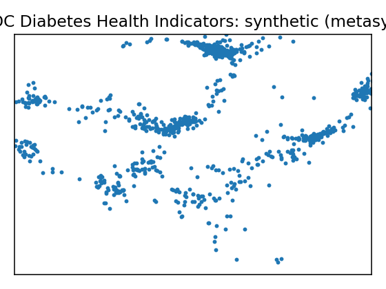
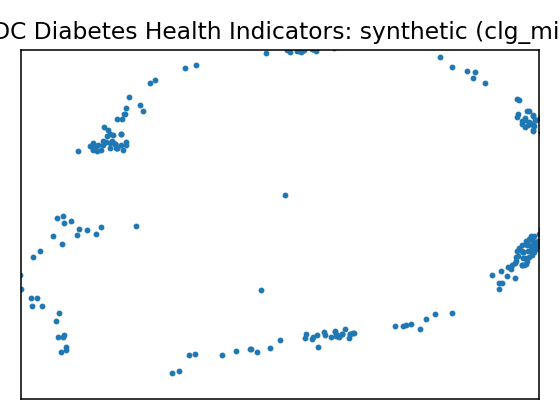
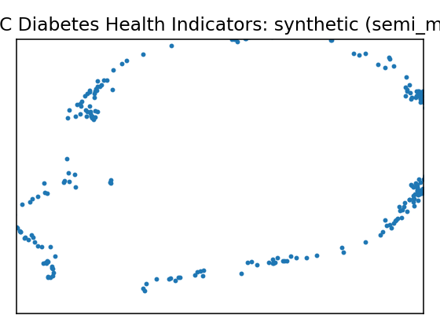
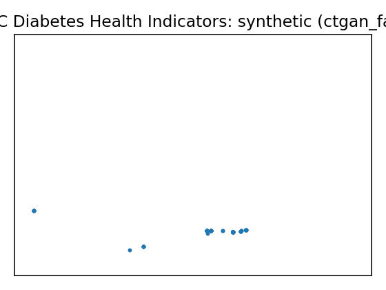
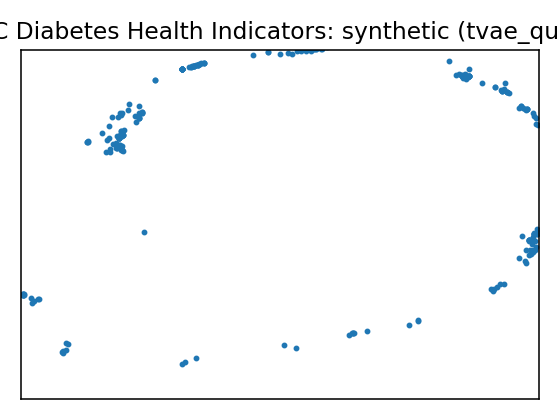
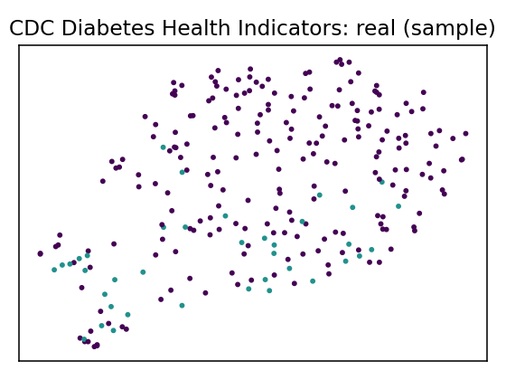
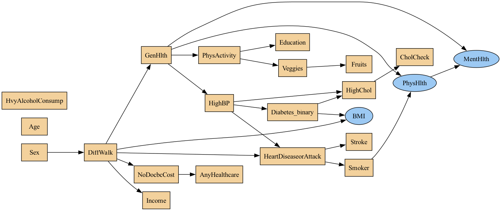
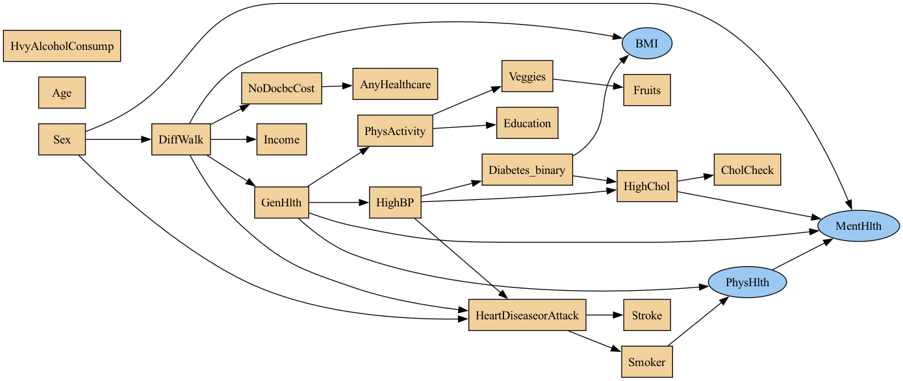

# Data Report — CDC Diabetes Health Indicators

**Source**: [UCI dataset 891](https://archive.ics.uci.edu/dataset/891)

**SemMap JSON-LD**: [dataset.semmap.json](dataset.semmap.json) · [RDFa HTML](dataset.semmap.html)
## Overview

| Metric      | Value                                                                         |
|:------------|:------------------------------------------------------------------------------|
| Dataset     | CDC Diabetes Health Indicators                                                |
| Source      | [UCI dataset 891](https://archive.ics.uci.edu/dataset/891)                    |
| Rows        | 253,680                                                                       |
| Columns     | 22                                                                            |
| Discrete    | 19                                                                            |
| Continuous  | 3                                                                             |
| SemMap      | [SemMap JSON-LD](dataset.semmap.json) [SemMap HTML](dataset.semmap.html) |
| Missingness | Not modeled                                                                   |

## Variables and summary

| variable             | inferred   | dist                                                                                                                                                                                                                                                                                                                                                                                              |
|:---------------------|:-----------|:--------------------------------------------------------------------------------------------------------------------------------------------------------------------------------------------------------------------------------------------------------------------------------------------------------------------------------------------------------------------------------------------------|
| HighBP               | discrete   | Reported high blood pressure [1]: 108829 (42.90%)                                                                                                                                                                                                                                                                                                                                                 |
| HighChol             | discrete   | Reported high cholesterol [1]: 107591 (42.41%)                                                                                                                                                                                                                                                                                                                                                    |
| CholCheck            | discrete   | Cholesterol check in past five years [1]: 244210 (96.27%)                                                                                                                                                                                                                                                                                                                                         |
| BMI                  | continuous | 28.3824 ± 6.6087 [12, 24, 27, 31, 98]                                                                                                                                                                                                                                                                                                                                                             |
| Smoker               | discrete   | At least 100 cigarettes ever [1]: 112423 (44.32%)                                                                                                                                                                                                                                                                                                                                                 |
| Stroke               | discrete   | Stroke diagnosis [1]: 10292 (4.06%)                                                                                                                                                                                                                                                                                                                                                               |
| HeartDiseaseorAttack | discrete   | CHD or MI diagnosis [1]: 23893 (9.42%)                                                                                                                                                                                                                                                                                                                                                            |
| PhysActivity         | discrete   | Physical activity reported [1]: 191920 (75.65%)                                                                                                                                                                                                                                                                                                                                                   |
| Fruits               | discrete   | Daily fruit consumption [1]: 160898 (63.43%)                                                                                                                                                                                                                                                                                                                                                      |
| Veggies              | discrete   | Daily vegetable consumption [1]: 205841 (81.14%)                                                                                                                                                                                                                                                                                                                                                  |
| HvyAlcoholConsump    | discrete   | Alcohol consumption above heavy threshold [1]: 14256 (5.62%)                                                                                                                                                                                                                                                                                                                                      |
| AnyHealthcare        | discrete   | Has health care coverage [1]: 241263 (95.11%)                                                                                                                                                                                                                                                                                                                                                     |
| NoDocbcCost          | discrete   | Cost prevented doctor visit [1]: 21354 (8.42%)                                                                                                                                                                                                                                                                                                                                                    |
| GenHlth              | discrete   | Very good health [2]: 89084 (35.12%) Good health [3]: 75646 (29.82%) Excellent health [1]: 45299 (17.86%) Fair health [4]: 31570 (12.44%) Poor health [5]: 12081 (4.76%)                                                                                                                                                                                                      |
| MentHlth             | continuous | 3.1848 ± 7.4128 [0, 0, 0, 2, 30]                                                                                                                                                                                                                                                                                                                                                                  |
| PhysHlth             | continuous | 4.2421 ± 8.7180 [0, 0, 0, 3, 30]                                                                                                                                                                                                                                                                                                                                                                  |
| DiffWalk             | discrete   | Reported difficulty walking or climbing stairs [1]: 42675 (16.82%)                                                                                                                                                                                                                                                                                                                                |
| Sex                  | discrete   | Male [1]: 111706 (44.03%)                                                                                                                                                                                                                                                                                                                                                                         |
| Age                  | discrete   | 60–64 years [9]: 33244 (13.10%) 65–69 years [10]: 32194 (12.69%) 55–59 years [8]: 30832 (12.15%) 50–54 years [7]: 26314 (10.37%) 70–74 years [11]: 23533 (9.28%) 45–49 years [6]: 19819 (7.81%) 80 years or older [13]: 17363 (6.84%) 40–44 years [5]: 16157 (6.37%) 75–79 years [12]: 15980 (6.30%) 35–39 years [4]: 13823 (5.45%) … (+3 more) |
| Education            | discrete   | College 4 years or more (college graduate) [6]: 107325 (42.31%) College 1–3 years (some college or technical school) [5]: 69910 (27.56%) Grade 12 or GED (high school graduate) [4]: 62750 (24.74%) Grades 9–11 (some high school) [3]: 9478 (3.74%) Grades 1–8 (elementary) [2]: 4043 (1.59%) Never attended school or only kindergarten [1]: 174 (0.07%)               |
| Income               | discrete   | $75,000 or more [8]: 90385 (35.63%) $50,000 to <$75,000 [7]: 43219 (17.04%) $35,000 to <$50,000 [6]: 36470 (14.38%) $25,000 to <$35,000 [5]: 25883 (10.20%) $20,000 to <$25,000 [4]: 20135 (7.94%) $15,000 to <$20,000 [3]: 15994 (6.30%) $10,000 to <$15,000 [2]: 11783 (4.64%) Less than $10,000 [1]: 9811 (3.87%)                                           |
| Diabetes_binary      | discrete   | Prediabetes or diabetes diagnosis [1]: 35346 (13.93%)                                                                                                                                                                                                                                                                                                                                             |

## Fidelity summary

| umap                                                 | model      | backend   |   disc jsd mean |   disc jsd median |   cont ks mean |   cont w1 mean |   downstream sign match |
|:-----------------------------------------------------|:-----------|:----------|----------------:|------------------:|---------------:|---------------:|------------------------:|
|     | metasyn    | metasyn   |          0.0288 |            0.0209 |         0.4691 |         2.2955 |                  0.5185 |
|     | clg_mi2    | pybnesian |          0.0229 |            0.0186 |         0.2691 |         2.9528 |                         |
|    | semi_mi5   | pybnesian |          0.0239 |            0.0157 |         0.2634 |         2.9669 |                         |
|  | ctgan_fast | synthcity |          0.2127 |            0.1539 |         0.802  |         7.7665 |                         |
|  | tvae_quick | synthcity |          0.0864 |            0.0658 |         0.3607 |         1.8369 |                         |

## Privacy summary

| model      | backend   |   n real |   n synth |   exact overlap rate |   near duplicate rate eps |   nn distance mean |   k min |   k pct lt5 |   k map |   rare qi reproduction rate | identifiability score   |   delta presence |
|:-----------|:----------|---------:|----------:|---------------------:|--------------------------:|-------------------:|--------:|------------:|--------:|----------------------------:|:------------------------|-----------------:|
| metasyn    | metasyn   |   253680 |      1000 |                    0 |                    0.876  |             0.1199 |       1 |      0.9939 |       1 |                           0 |                         |          79      |
| clg_mi2    | pybnesian |   253680 |      1000 |                    0 |                    0.945  |             0.074  |       1 |      0.9939 |       2 |                           0 |                         |          14.5    |
| semi_mi5   | pybnesian |   253680 |      1000 |                    0 |                    0.899  |             0.0977 |       1 |      0.9939 |      12 |                           0 |                         |           1.9333 |
| ctgan_fast | synthcity |   253680 |       256 |                    0 |                    0.1367 |             0.3833 |       1 |      0.9939 |       5 |                           0 |                         |           3.8    |
| tvae_quick | synthcity |   253680 |       256 |                    0 |                    0.9258 |             0.0772 |       1 |      0.9939 |       2 |                           0 |                         |           4      |

## Models

<table>
<tr><th>UMAP</th><th>Details</th><th>Structure</th></tr>
<tr><td></td><td>
<h3>Real data</h3></td><td></td></tr>
<tr><td></td><td>

<h3>Model: metasyn (metasyn)</h3>
<ul>
<li>Seed: 42, rows: 1000</li>
<li> Missingness: wrapped (random state 42) via pipeline</li><li> <a href="models/metasyn/synthetic.csv">Synthetic CSV</a></li>
<li> <a href="models/metasyn/per_variable_metrics.csv">Per-variable metrics</a></li>
<li> <a href="models/metasyn/metrics.json">Metrics JSON</a></li>
<li> <a href="models/metasyn/metrics.privacy.json">Privacy metrics</a></li>
<li> <a href="models/metasyn/metrics.downstream.json">Downstream metrics</a></li>
</ul>

<strong>Per-variable fidelity</strong>

<table class="dataframe">
  <thead>
    <tr style="text-align: right;">
      <th>variable</th>
      <th>type</th>
      <th>KS</th>
      <th>W1</th>
      <th>JSD</th>
    </tr>
  </thead>
  <tbody>
    <tr>
      <td>HighBP</td>
      <td>discrete</td>
      <td></td>
      <td></td>
      <td>0.0346</td>
    </tr>
    <tr>
      <td>HighChol</td>
      <td>discrete</td>
      <td></td>
      <td></td>
      <td>0.0356</td>
    </tr>
    <tr>
      <td>CholCheck</td>
      <td>discrete</td>
      <td></td>
      <td></td>
      <td>0.0302</td>
    </tr>
    <tr>
      <td>BMI</td>
      <td>continuous</td>
      <td>0.084</td>
      <td>0.7286</td>
      <td></td>
    </tr>
    <tr>
      <td>Smoker</td>
      <td>discrete</td>
      <td></td>
      <td></td>
      <td>0.0053</td>
    </tr>
    <tr>
      <td>Stroke</td>
      <td>discrete</td>
      <td></td>
      <td></td>
      <td>0.032</td>
    </tr>
    <tr>
      <td>HeartDiseaseorAttack</td>
      <td>discrete</td>
      <td></td>
      <td></td>
      <td>0.0198</td>
    </tr>
    <tr>
      <td>PhysActivity</td>
      <td>discrete</td>
      <td></td>
      <td></td>
      <td>0.0094</td>
    </tr>
    <tr>
      <td>Fruits</td>
      <td>discrete</td>
      <td></td>
      <td></td>
      <td>0.0212</td>
    </tr>
    <tr>
      <td>Veggies</td>
      <td>discrete</td>
      <td></td>
      <td></td>
      <td>0.0017</td>
    </tr>
  </tbody>
</table>

<strong>Downstream metrics</strong>

<table class="dataframe">
  <thead>
    <tr style="text-align: right;">
      <th>metric</th>
      <th>value</th>
    </tr>
  </thead>
  <tbody>
    <tr>
      <td>sign_match_rate</td>
      <td>0.5185</td>
    </tr>
    <tr>
      <td>formula</td>
      <td>Diabetes_binary ~ Q('HighBP') + Q('HighChol') + Q('CholCheck') + Q('BMI') + Q('Smoker') + Q('Stroke') + Q('HeartDiseaseorAttack') + Q('PhysActivity') + Q('Fruits') + Q('Veggies') + Q('HvyAlcoholConsump') + Q('AnyHealthcare') + Q('NoDocbcCost') + Q('GenHlth') + Q('MentHlth') + Q('PhysHlth') + Q('DiffWalk') + Q('Sex') + Q('Age') + Q('Education') + Q('Income') + Q('HighBP'):Q('HighChol') + Q('HighChol'):Q('CholCheck') + Q('CholCheck'):Q('BMI') + Q('BMI'):Q('Smoker') + Q('Smoker'):Q('Stroke')</td>
    </tr>
    <tr>
      <td>skipped_reason</td>
      <td></td>
    </tr>
  </tbody>
</table>

<strong>Privacy metrics</strong>

<table class="dataframe">
  <thead>
    <tr style="text-align: right;">
      <th>metric</th>
      <th>value</th>
    </tr>
  </thead>
  <tbody>
    <tr>
      <td>n_real</td>
      <td>253680</td>
    </tr>
    <tr>
      <td>n_synth</td>
      <td>1000</td>
    </tr>
    <tr>
      <td>exact_overlap_rate</td>
      <td>0</td>
    </tr>
    <tr>
      <td>near_duplicate_rate_eps</td>
      <td>0.876</td>
    </tr>
    <tr>
      <td>nn_distance_mean</td>
      <td>0.1199</td>
    </tr>
    <tr>
      <td>k_min</td>
      <td>1</td>
    </tr>
    <tr>
      <td>k_pct_lt5</td>
      <td>0.9939</td>
    </tr>
    <tr>
      <td>k_map</td>
      <td>1</td>
    </tr>
    <tr>
      <td>rare_qi_reproduction_rate</td>
      <td>0</td>
    </tr>
    <tr>
      <td>delta_presence</td>
      <td>79</td>
    </tr>
  </tbody>
</table>

</td><td>
<table class="dataframe">
  <thead>
    <tr style="text-align: right;">
      <th>variable</th>
      <th>distribution</th>
    </tr>
  </thead>
  <tbody>
    <tr>
      <td>HighBP</td>
      <td>core.multinoulli</td>
    </tr>
    <tr>
      <td>HighChol</td>
      <td>core.multinoulli</td>
    </tr>
    <tr>
      <td>CholCheck</td>
      <td>core.multinoulli</td>
    </tr>
    <tr>
      <td>BMI</td>
      <td>core.lognormal</td>
    </tr>
    <tr>
      <td>Smoker</td>
      <td>core.multinoulli</td>
    </tr>
    <tr>
      <td>Stroke</td>
      <td>core.multinoulli</td>
    </tr>
    <tr>
      <td>HeartDiseaseorAttack</td>
      <td>core.multinoulli</td>
    </tr>
    <tr>
      <td>PhysActivity</td>
      <td>core.multinoulli</td>
    </tr>
    <tr>
      <td>Fruits</td>
      <td>core.multinoulli</td>
    </tr>
    <tr>
      <td>Veggies</td>
      <td>core.multinoulli</td>
    </tr>
    <tr>
      <td>HvyAlcoholConsump</td>
      <td>core.multinoulli</td>
    </tr>
    <tr>
      <td>AnyHealthcare</td>
      <td>core.multinoulli</td>
    </tr>
    <tr>
      <td>NoDocbcCost</td>
      <td>core.multinoulli</td>
    </tr>
    <tr>
      <td>GenHlth</td>
      <td>core.multinoulli</td>
    </tr>
    <tr>
      <td>MentHlth</td>
      <td>core.truncated_normal</td>
    </tr>
    <tr>
      <td>PhysHlth</td>
      <td>core.truncated_normal</td>
    </tr>
    <tr>
      <td>DiffWalk</td>
      <td>core.multinoulli</td>
    </tr>
    <tr>
      <td>Sex</td>
      <td>core.multinoulli</td>
    </tr>
    <tr>
      <td>Age</td>
      <td>core.multinoulli</td>
    </tr>
    <tr>
      <td>Education</td>
      <td>core.multinoulli</td>
    </tr>
    <tr>
      <td>Income</td>
      <td>core.multinoulli</td>
    </tr>
    <tr>
      <td>Diabetes_binary</td>
      <td>core.multinoulli</td>
    </tr>
  </tbody>
</table></td></tr>

<tr><td></td><td>

<h3>Model: clg_mi2 (pybnesian)</h3>
<ul>
<li>Seed: 42, rows: 1000</li>
<li> Params: <tt>{"max_indegree": 2, "operators": ["arcs"], "score": "bic", "type": "clg"}</tt></li><li> Missingness: wrapped (random state 42) via pipeline</li><li> <a href="models/clg_mi2/synthetic.csv">Synthetic CSV</a></li>
<li> <a href="models/clg_mi2/per_variable_metrics.csv">Per-variable metrics</a></li>
<li> <a href="models/clg_mi2/metrics.json">Metrics JSON</a></li>
<li> <a href="models/clg_mi2/metrics.privacy.json">Privacy metrics</a></li>
</ul>

<strong>Per-variable fidelity</strong>

<table class="dataframe">
  <thead>
    <tr style="text-align: right;">
      <th>variable</th>
      <th>type</th>
      <th>KS</th>
      <th>W1</th>
      <th>JSD</th>
    </tr>
  </thead>
  <tbody>
    <tr>
      <td>HighBP</td>
      <td>discrete</td>
      <td></td>
      <td></td>
      <td>0.0233</td>
    </tr>
    <tr>
      <td>HighChol</td>
      <td>discrete</td>
      <td></td>
      <td></td>
      <td>0.0199</td>
    </tr>
    <tr>
      <td>CholCheck</td>
      <td>discrete</td>
      <td></td>
      <td></td>
      <td>0.0037</td>
    </tr>
    <tr>
      <td>BMI</td>
      <td>continuous</td>
      <td>0.1348</td>
      <td>1.2745</td>
      <td></td>
    </tr>
    <tr>
      <td>Smoker</td>
      <td>discrete</td>
      <td></td>
      <td></td>
      <td>0.0169</td>
    </tr>
    <tr>
      <td>Stroke</td>
      <td>discrete</td>
      <td></td>
      <td></td>
      <td>0.0373</td>
    </tr>
    <tr>
      <td>HeartDiseaseorAttack</td>
      <td>discrete</td>
      <td></td>
      <td></td>
      <td>0.0229</td>
    </tr>
    <tr>
      <td>PhysActivity</td>
      <td>discrete</td>
      <td></td>
      <td></td>
      <td>0.0165</td>
    </tr>
    <tr>
      <td>Fruits</td>
      <td>discrete</td>
      <td></td>
      <td></td>
      <td>0.0186</td>
    </tr>
    <tr>
      <td>Veggies</td>
      <td>discrete</td>
      <td></td>
      <td></td>
      <td>0.0072</td>
    </tr>
  </tbody>
</table>

<strong>Privacy metrics</strong>

<table class="dataframe">
  <thead>
    <tr style="text-align: right;">
      <th>metric</th>
      <th>value</th>
    </tr>
  </thead>
  <tbody>
    <tr>
      <td>n_real</td>
      <td>253680</td>
    </tr>
    <tr>
      <td>n_synth</td>
      <td>1000</td>
    </tr>
    <tr>
      <td>exact_overlap_rate</td>
      <td>0</td>
    </tr>
    <tr>
      <td>near_duplicate_rate_eps</td>
      <td>0.945</td>
    </tr>
    <tr>
      <td>nn_distance_mean</td>
      <td>0.074</td>
    </tr>
    <tr>
      <td>k_min</td>
      <td>1</td>
    </tr>
    <tr>
      <td>k_pct_lt5</td>
      <td>0.9939</td>
    </tr>
    <tr>
      <td>k_map</td>
      <td>2</td>
    </tr>
    <tr>
      <td>rare_qi_reproduction_rate</td>
      <td>0</td>
    </tr>
    <tr>
      <td>delta_presence</td>
      <td>14.5</td>
    </tr>
  </tbody>
</table>

</td><td>
</td></tr>

<tr><td></td><td>

<h3>Model: semi_mi5 (pybnesian)</h3>
<ul>
<li>Seed: 42, rows: 1000</li>
<li> Params: <tt>{"max_indegree": 5, "operators": ["arcs"], "score": "bic", "type": "semiparametric"}</tt></li><li> Missingness: wrapped (random state 42) via pipeline</li><li> <a href="models/semi_mi5/synthetic.csv">Synthetic CSV</a></li>
<li> <a href="models/semi_mi5/per_variable_metrics.csv">Per-variable metrics</a></li>
<li> <a href="models/semi_mi5/metrics.json">Metrics JSON</a></li>
<li> <a href="models/semi_mi5/metrics.privacy.json">Privacy metrics</a></li>
</ul>

<strong>Per-variable fidelity</strong>

<table class="dataframe">
  <thead>
    <tr style="text-align: right;">
      <th>variable</th>
      <th>type</th>
      <th>KS</th>
      <th>W1</th>
      <th>JSD</th>
    </tr>
  </thead>
  <tbody>
    <tr>
      <td>HighBP</td>
      <td>discrete</td>
      <td></td>
      <td></td>
      <td>0.0095</td>
    </tr>
    <tr>
      <td>HighChol</td>
      <td>discrete</td>
      <td></td>
      <td></td>
      <td>0.0426</td>
    </tr>
    <tr>
      <td>CholCheck</td>
      <td>discrete</td>
      <td></td>
      <td></td>
      <td>0.0053</td>
    </tr>
    <tr>
      <td>BMI</td>
      <td>continuous</td>
      <td>0.0958</td>
      <td>1.066</td>
      <td></td>
    </tr>
    <tr>
      <td>Smoker</td>
      <td>discrete</td>
      <td></td>
      <td></td>
      <td>0.0044</td>
    </tr>
    <tr>
      <td>Stroke</td>
      <td>discrete</td>
      <td></td>
      <td></td>
      <td>0.0219</td>
    </tr>
    <tr>
      <td>HeartDiseaseorAttack</td>
      <td>discrete</td>
      <td></td>
      <td></td>
      <td>0.0229</td>
    </tr>
    <tr>
      <td>PhysActivity</td>
      <td>discrete</td>
      <td></td>
      <td></td>
      <td>0.0025</td>
    </tr>
    <tr>
      <td>Fruits</td>
      <td>discrete</td>
      <td></td>
      <td></td>
      <td>0.0139</td>
    </tr>
    <tr>
      <td>Veggies</td>
      <td>discrete</td>
      <td></td>
      <td></td>
      <td>0.0309</td>
    </tr>
  </tbody>
</table>

<strong>Privacy metrics</strong>

<table class="dataframe">
  <thead>
    <tr style="text-align: right;">
      <th>metric</th>
      <th>value</th>
    </tr>
  </thead>
  <tbody>
    <tr>
      <td>n_real</td>
      <td>253680</td>
    </tr>
    <tr>
      <td>n_synth</td>
      <td>1000</td>
    </tr>
    <tr>
      <td>exact_overlap_rate</td>
      <td>0</td>
    </tr>
    <tr>
      <td>near_duplicate_rate_eps</td>
      <td>0.899</td>
    </tr>
    <tr>
      <td>nn_distance_mean</td>
      <td>0.0977</td>
    </tr>
    <tr>
      <td>k_min</td>
      <td>1</td>
    </tr>
    <tr>
      <td>k_pct_lt5</td>
      <td>0.9939</td>
    </tr>
    <tr>
      <td>k_map</td>
      <td>12</td>
    </tr>
    <tr>
      <td>rare_qi_reproduction_rate</td>
      <td>0</td>
    </tr>
    <tr>
      <td>delta_presence</td>
      <td>1.9333</td>
    </tr>
  </tbody>
</table>

</td><td>
</td></tr>

<tr><td></td><td>

<h3>Model: ctgan_fast (synthcity)</h3>
<ul>
<li>Seed: 42, rows: 256</li>
<li> Params: <tt>{"batch_size": 256, "n_iter": 5}</tt></li><li> Missingness: wrapped (random state 42) via pipeline</li><li> <a href="models/ctgan_fast/synthetic.csv">Synthetic CSV</a></li>
<li> <a href="models/ctgan_fast/per_variable_metrics.csv">Per-variable metrics</a></li>
<li> <a href="models/ctgan_fast/metrics.json">Metrics JSON</a></li>
<li> <a href="models/ctgan_fast/metrics.privacy.json">Privacy metrics</a></li>
</ul>

<strong>Per-variable fidelity</strong>

<table class="dataframe">
  <thead>
    <tr style="text-align: right;">
      <th>variable</th>
      <th>type</th>
      <th>KS</th>
      <th>W1</th>
      <th>JSD</th>
    </tr>
  </thead>
  <tbody>
    <tr>
      <td>HighBP</td>
      <td>discrete</td>
      <td></td>
      <td></td>
      <td>0.2</td>
    </tr>
    <tr>
      <td>HighChol</td>
      <td>discrete</td>
      <td></td>
      <td></td>
      <td>0.1011</td>
    </tr>
    <tr>
      <td>CholCheck</td>
      <td>discrete</td>
      <td></td>
      <td></td>
      <td>0.0582</td>
    </tr>
    <tr>
      <td>BMI</td>
      <td>continuous</td>
      <td>0.9613</td>
      <td>15.7567</td>
      <td></td>
    </tr>
    <tr>
      <td>Smoker</td>
      <td>discrete</td>
      <td></td>
      <td></td>
      <td>0.083</td>
    </tr>
    <tr>
      <td>Stroke</td>
      <td>discrete</td>
      <td></td>
      <td></td>
      <td>0.0789</td>
    </tr>
    <tr>
      <td>HeartDiseaseorAttack</td>
      <td>discrete</td>
      <td></td>
      <td></td>
      <td>0.1539</td>
    </tr>
    <tr>
      <td>PhysActivity</td>
      <td>discrete</td>
      <td></td>
      <td></td>
      <td>0.3231</td>
    </tr>
    <tr>
      <td>Fruits</td>
      <td>discrete</td>
      <td></td>
      <td></td>
      <td>0.0336</td>
    </tr>
    <tr>
      <td>Veggies</td>
      <td>discrete</td>
      <td></td>
      <td></td>
      <td>0.0846</td>
    </tr>
  </tbody>
</table>

<strong>Privacy metrics</strong>

<table class="dataframe">
  <thead>
    <tr style="text-align: right;">
      <th>metric</th>
      <th>value</th>
    </tr>
  </thead>
  <tbody>
    <tr>
      <td>n_real</td>
      <td>253680</td>
    </tr>
    <tr>
      <td>n_synth</td>
      <td>256</td>
    </tr>
    <tr>
      <td>exact_overlap_rate</td>
      <td>0</td>
    </tr>
    <tr>
      <td>near_duplicate_rate_eps</td>
      <td>0.1367</td>
    </tr>
    <tr>
      <td>nn_distance_mean</td>
      <td>0.3833</td>
    </tr>
    <tr>
      <td>k_min</td>
      <td>1</td>
    </tr>
    <tr>
      <td>k_pct_lt5</td>
      <td>0.9939</td>
    </tr>
    <tr>
      <td>k_map</td>
      <td>5</td>
    </tr>
    <tr>
      <td>rare_qi_reproduction_rate</td>
      <td>0</td>
    </tr>
    <tr>
      <td>delta_presence</td>
      <td>3.8</td>
    </tr>
  </tbody>
</table>

</td><td>
</td></tr>

<tr><td></td><td>

<h3>Model: tvae_quick (synthcity)</h3>
<ul>
<li>Seed: 42, rows: 256</li>
<li> Params: <tt>{"batch_size": 256}</tt></li><li> Missingness: wrapped (random state 42) via pipeline</li><li> <a href="models/tvae_quick/synthetic.csv">Synthetic CSV</a></li>
<li> <a href="models/tvae_quick/per_variable_metrics.csv">Per-variable metrics</a></li>
<li> <a href="models/tvae_quick/metrics.json">Metrics JSON</a></li>
<li> <a href="models/tvae_quick/metrics.privacy.json">Privacy metrics</a></li>
</ul>

<strong>Per-variable fidelity</strong>

<table class="dataframe">
  <thead>
    <tr style="text-align: right;">
      <th>variable</th>
      <th>type</th>
      <th>KS</th>
      <th>W1</th>
      <th>JSD</th>
    </tr>
  </thead>
  <tbody>
    <tr>
      <td>HighBP</td>
      <td>discrete</td>
      <td></td>
      <td></td>
      <td>0.0605</td>
    </tr>
    <tr>
      <td>HighChol</td>
      <td>discrete</td>
      <td></td>
      <td></td>
      <td>0.0984</td>
    </tr>
    <tr>
      <td>CholCheck</td>
      <td>discrete</td>
      <td></td>
      <td></td>
      <td>0.0122</td>
    </tr>
    <tr>
      <td>BMI</td>
      <td>continuous</td>
      <td>0.2469</td>
      <td>2.4764</td>
      <td></td>
    </tr>
    <tr>
      <td>Smoker</td>
      <td>discrete</td>
      <td></td>
      <td></td>
      <td>0.0149</td>
    </tr>
    <tr>
      <td>Stroke</td>
      <td>discrete</td>
      <td></td>
      <td></td>
      <td>0.0529</td>
    </tr>
    <tr>
      <td>HeartDiseaseorAttack</td>
      <td>discrete</td>
      <td></td>
      <td></td>
      <td>0.0571</td>
    </tr>
    <tr>
      <td>PhysActivity</td>
      <td>discrete</td>
      <td></td>
      <td></td>
      <td>0.0839</td>
    </tr>
    <tr>
      <td>Fruits</td>
      <td>discrete</td>
      <td></td>
      <td></td>
      <td>0.0658</td>
    </tr>
    <tr>
      <td>Veggies</td>
      <td>discrete</td>
      <td></td>
      <td></td>
      <td>0.1223</td>
    </tr>
  </tbody>
</table>

<strong>Privacy metrics</strong>

<table class="dataframe">
  <thead>
    <tr style="text-align: right;">
      <th>metric</th>
      <th>value</th>
    </tr>
  </thead>
  <tbody>
    <tr>
      <td>n_real</td>
      <td>253680</td>
    </tr>
    <tr>
      <td>n_synth</td>
      <td>256</td>
    </tr>
    <tr>
      <td>exact_overlap_rate</td>
      <td>0</td>
    </tr>
    <tr>
      <td>near_duplicate_rate_eps</td>
      <td>0.9258</td>
    </tr>
    <tr>
      <td>nn_distance_mean</td>
      <td>0.0772</td>
    </tr>
    <tr>
      <td>k_min</td>
      <td>1</td>
    </tr>
    <tr>
      <td>k_pct_lt5</td>
      <td>0.9939</td>
    </tr>
    <tr>
      <td>k_map</td>
      <td>2</td>
    </tr>
    <tr>
      <td>rare_qi_reproduction_rate</td>
      <td>0</td>
    </tr>
    <tr>
      <td>delta_presence</td>
      <td>4</td>
    </tr>
  </tbody>
</table>

</td><td>
</td></tr>

</table>