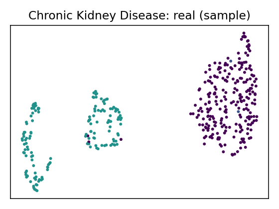

# Data Report — Chronic Kidney Disease

**Source**: [UCI dataset 336](https://archive.ics.uci.edu/dataset/336)

**SemMap JSON-LD**: [dataset.semmap.json](dataset.semmap.json) · [RDFa HTML](dataset.semmap.html)
## Overview

| Metric      | Value                                                                         |
|:------------|:------------------------------------------------------------------------------|
| Dataset     | Chronic Kidney Disease                                                        |
| Source      | [UCI dataset 336](https://archive.ics.uci.edu/dataset/336)                    |
| Rows        | 400                                                                           |
| Columns     | 25                                                                            |
| Discrete    | 22                                                                            |
| Continuous  | 3                                                                             |
| SemMap      | [SemMap JSON-LD](dataset.semmap.json) [SemMap HTML](dataset.semmap.html) |
| Missingness | Not modeled                                                                   |

## Variables and summary

| variable   | inferred   | dist                                                            |
|:-----------|:-----------|:----------------------------------------------------------------|
| age        | discrete   |                                                                 |
| bp         | discrete   |                                                                 |
| sg         | continuous | 1.0172 ± 0.0057 [1.005, 1.01, 1.02, 1.02, 1.025]                |
| al         | discrete   |                                                                 |
| su         | discrete   |                                                                 |
| rbc        | discrete   | normal: 291 (72.75%)                                            |
| pc         | discrete   | normal: 309 (77.25%)                                            |
| pcc        | discrete   | notpresent: 358 (89.50%)                                        |
| ba         | discrete   | notpresent: 378 (94.50%)                                        |
| bgr        | discrete   |                                                                 |
| bu         | discrete   |                                                                 |
| sc         | discrete   |                                                                 |
| sod        | discrete   |                                                                 |
| pot        | discrete   |                                                                 |
| hemo       | discrete   |                                                                 |
| pcv        | discrete   |                                                                 |
| wbcc       | continuous | 8448.0000 ± 2951.5632 [2200, 6575, 8000, 9800, 26400]           |
| rbcc       | continuous | 4.4730 ± 1.0091 [2.1, 3.8, 4.5, 5.2, 8]                         |
| htn        | discrete   | yes: 147 (36.75%)                                               |
| dm         | discrete   | no: 262 (65.50%) yes: 137 (34.25%) no: 1 (0.25%)      |
| cad        | discrete   | yes: 34 (8.50%)                                                 |
| appet      | discrete   | good: 318 (79.50%)                                              |
| pe         | discrete   | yes: 76 (19.00%)                                                |
| ane        | discrete   | yes: 60 (15.00%)                                                |
| class      | discrete   | ckd: 248 (62.00%) notckd: 150 (37.50%) ckd: 2 (0.50%) |

## Fidelity summary

| model      | backend   |   disc_jsd_mean |   disc_jsd_median |   cont_ks_mean |   cont_w1_mean | privacy_overlap   | downstream_sign_match   |
|:-----------|:----------|----------------:|------------------:|---------------:|---------------:|:------------------|:------------------------|
| metasyn    | metasyn   |          0.0539 |            0.0557 |         0.16   |        157.065 |                   |                         |
| clg_mi2    | pybnesian |          0.0857 |            0.058  |         0.1592 |        198.246 |                   |                         |
| semi_mi5   | pybnesian |          0.0857 |            0.058  |         0.1592 |        198.246 |                   |                         |
| ctgan_fast | synthcity |          0.2545 |            0.2495 |         0.6192 |       1535.26  |                   |                         |
| tvae_quick | synthcity |          0.1255 |            0.1375 |         0.2225 |        386.616 |                   |                         |

## Models

<table>
<tr><th>UMAP</th><th>Details</th><th>Structure</th></tr>
<tr><td></td><td>
<h3>Real data</h3></td><td></td></tr>
<tr><td></td><td>

<h3>Model: metasyn (metasyn)</h3>
<ul>
<li>Seed: 42, rows: 400</li>
<li> <a href="models/metasyn/synthetic.csv">Synthetic CSV</a></li>
<li> <a href="models/metasyn/per_variable_metrics.csv">Per-variable metrics</a></li>
<li> <a href="models/metasyn/metrics.json">Metrics JSON</a></li>
<li> <a href="models/metasyn/metrics.downstream.json">Downstream metrics</a></li>
</ul>

</td><td>
</td></tr>

<tr><td></td><td>

<h3>Model: clg_mi2 (pybnesian)</h3>
<ul>
<li>Seed: 42, rows: 400</li>
<li> Params: <tt>{"max_indegree": 2, "operators": ["arcs"], "score": "bic", "type": "clg"}</tt></li><li> <a href="models/clg_mi2/synthetic.csv">Synthetic CSV</a></li>
<li> <a href="models/clg_mi2/per_variable_metrics.csv">Per-variable metrics</a></li>
<li> <a href="models/clg_mi2/metrics.json">Metrics JSON</a></li>
<li> <a href="models/clg_mi2/metrics.downstream.json">Downstream metrics</a></li>
</ul>

</td><td>
</td></tr>

<tr><td></td><td>

<h3>Model: semi_mi5 (pybnesian)</h3>
<ul>
<li>Seed: 42, rows: 400</li>
<li> Params: <tt>{"max_indegree": 5, "operators": ["arcs"], "score": "bic", "type": "semiparametric"}</tt></li><li> <a href="models/semi_mi5/synthetic.csv">Synthetic CSV</a></li>
<li> <a href="models/semi_mi5/per_variable_metrics.csv">Per-variable metrics</a></li>
<li> <a href="models/semi_mi5/metrics.json">Metrics JSON</a></li>
<li> <a href="models/semi_mi5/metrics.downstream.json">Downstream metrics</a></li>
</ul>

</td><td>
</td></tr>

<tr><td></td><td>

<h3>Model: ctgan_fast (synthcity)</h3>
<ul>
<li>Seed: 42, rows: 400</li>
<li> Params: <tt>{"batch_size": 256, "n_iter": 5}</tt></li><li> <a href="models/ctgan_fast/synthetic.csv">Synthetic CSV</a></li>
<li> <a href="models/ctgan_fast/per_variable_metrics.csv">Per-variable metrics</a></li>
<li> <a href="models/ctgan_fast/metrics.json">Metrics JSON</a></li>
<li> <a href="models/ctgan_fast/metrics.downstream.json">Downstream metrics</a></li>
</ul>

</td><td>
</td></tr>

<tr><td></td><td>

<h3>Model: tvae_quick (synthcity)</h3>
<ul>
<li>Seed: 42, rows: 400</li>
<li> Params: <tt>{"batch_size": 256}</tt></li><li> <a href="models/tvae_quick/synthetic.csv">Synthetic CSV</a></li>
<li> <a href="models/tvae_quick/per_variable_metrics.csv">Per-variable metrics</a></li>
<li> <a href="models/tvae_quick/metrics.json">Metrics JSON</a></li>
<li> <a href="models/tvae_quick/metrics.downstream.json">Downstream metrics</a></li>
</ul>

</td><td>
</td></tr>

</table>
