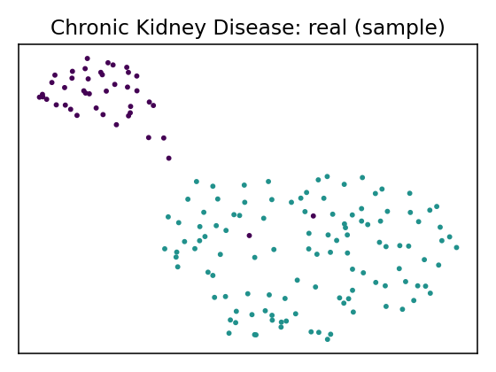
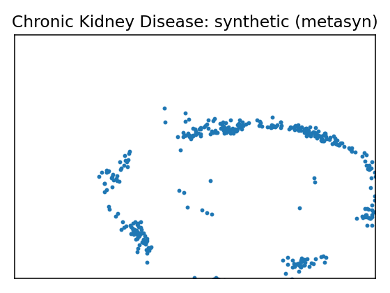

# Data Report — Chronic Kidney Disease

**Source**: [UCI dataset 336](https://archive.ics.uci.edu/dataset/336)

**SemMap JSON-LD**: [dataset.semmap.json](dataset.semmap.json) · [RDFa HTML](dataset.semmap.html)
## Overview

| Metric      | Value                                                                         |
|:------------|:------------------------------------------------------------------------------|
| Dataset     | Chronic Kidney Disease                                                        |
| Source      | [UCI dataset 336](https://archive.ics.uci.edu/dataset/336)                    |
| Rows        | 158                                                                           |
| Columns     | 25                                                                            |
| Discrete    | 13                                                                            |
| Continuous  | 12                                                                            |
| SemMap      | [SemMap JSON-LD](dataset.semmap.json) [SemMap HTML](dataset.semmap.html) |
| Missingness | Not modeled                                                                   |

## Variables and summary

| variable   | inferred   | dist                                                                                                                                                                                               |
|:-----------|:-----------|:---------------------------------------------------------------------------------------------------------------------------------------------------------------------------------------------------|
| age        | continuous | 49.5633 ± 15.5122 [6, 39.25, 50.5, 60, 83]                                                                                                                                                         |
| bp         | continuous | 74.0506 ± 11.1754 [50, 60, 80, 80, 110]                                                                                                                                                            |
| sg         | continuous | 1.0199 ± 0.0055 [1.005, 1.02, 1.02, 1.025, 1.025]                                                                                                                                                  |
| al         | discrete   | Albumin negative [0]: 116 (73.42%) Albumin 2+ [3]: 15 (9.49%) Albumin 3+ [4]: 15 (9.49%) Albumin 1+ [2]: 9 (5.70%) Trace albumin [1]: 3 (1.90%) Albumin 4+ [5]: 0 (0.00%) |
| su         | discrete   | Sugar negative [0]: 140 (88.61%) Trace sugar [1]: 6 (3.80%) Sugar 1+ [2]: 6 (3.80%) Sugar 2+ [3]: 3 (1.90%) Sugar 3+ [4]: 2 (1.27%) Sugar 4+ [5]: 1 (0.63%)               |
| rbc        | discrete   | Normal [normal]: 140 (88.61%)                                                                                                                                                                      |
| pc         | discrete   | Normal [normal]: 129 (81.65%)                                                                                                                                                                      |
| pcc        | discrete   | Not present [notpresent]: 144 (91.14%)                                                                                                                                                             |
| ba         | discrete   | Not present [notpresent]: 146 (92.41%)                                                                                                                                                             |
| bgr        | continuous | 131.3418 ± 64.9398 [70, 97, 115.5, 131.75, 490]                                                                                                                                                    |
| bu         | continuous | 52.5759 ± 47.3954 [10, 26, 39.5, 49.75, 309]                                                                                                                                                       |
| sc         | continuous | 2.1886 ± 3.0776 [0.4, 0.7, 1.1, 1.6, 15.2]                                                                                                                                                         |
| sod        | continuous | 138.8481 ± 7.4894 [111, 135, 139, 144, 150]                                                                                                                                                        |
| pot        | continuous | 4.6367 ± 3.4764 [2.5, 3.7, 4.5, 4.9, 47]                                                                                                                                                           |
| hemo       | continuous | 13.6873 ± 2.8822 [3.1, 12.6, 14.25, 15.775, 17.8]                                                                                                                                                  |
| pcv        | continuous | 41.9177 ± 9.1052 [9, 37.5, 44, 48, 54]                                                                                                                                                             |
| wbcc       | continuous | 8475.9494 ± 3126.8802 [3800, 6525, 7800, 9775, 26400]                                                                                                                                              |
| rbcc       | continuous | 4.8918 ± 1.0194 [2.1, 4.5, 4.95, 5.6, 8]                                                                                                                                                           |
| htn        | discrete   | Yes [yes]: 34 (21.52%)                                                                                                                                                                             |
| dm         | discrete   | No [no]: 130 (82.28%) Yes [yes]: 28 (17.72%) No [no]: 0 (0.00%)                                                                                                                          |
| cad        | discrete   | Yes [yes]: 11 (6.96%)                                                                                                                                                                              |
| appet      | discrete   | Good appetite [good]: 139 (87.97%)                                                                                                                                                                 |
| pe         | discrete   | Yes [yes]: 20 (12.66%)                                                                                                                                                                             |
| ane        | discrete   | Yes [yes]: 16 (10.13%)                                                                                                                                                                             |
| class      | discrete   | Not chronic kidney disease [notckd]: 115 (72.78%) Chronic kidney disease [ckd]: 43 (27.22%) Chronic kidney disease [ckd]: 0 (0.00%)                                                      |

## Fidelity summary

| model   | backend   |   disc jsd mean |   disc jsd median |   cont ks mean |   cont w1 mean |   downstream sign match |
|:--------|:----------|----------------:|------------------:|---------------:|---------------:|------------------------:|
| metasyn | metasyn   |          0.0609 |            0.0479 |         0.2164 |         61.229 |                  0.5263 |

## Privacy summary

| model   | backend   |   n real |   n synth |   exact overlap rate |   near duplicate rate eps |   nn distance mean |   k min |   k pct lt5 |   k map |   rare qi reproduction rate | identifiability score   |   delta presence |
|:--------|:----------|---------:|----------:|---------------------:|--------------------------:|-------------------:|--------:|------------:|--------:|----------------------------:|:------------------------|-----------------:|
| metasyn | metasyn   |      158 |       400 |                    0 |                    0.9937 |             0.0172 |       1 |           1 |       2 |                           0 |                         |           2.4286 |

## Models

<table>
<tr><th>UMAP</th><th>Details</th><th>Structure</th></tr>
<tr><td></td><td>
<h3>Real data</h3></td><td></td></tr>
<tr><td></td><td>

<h3>Model: metasyn (metasyn)</h3>
<ul>
<li>Seed: 42, rows: 400</li>
<li> <a href="models/metasyn/synthetic.csv">Synthetic CSV</a></li>
<li> <a href="models/metasyn/per_variable_metrics.csv">Per-variable metrics</a></li>
<li> <a href="models/metasyn/metrics.json">Metrics JSON</a></li>
<li> <a href="models/metasyn/metrics.privacy.json">Privacy metrics</a></li>
<li> <a href="models/metasyn/metrics.downstream.json">Downstream metrics</a></li>
</ul>

<strong>Per-variable fidelity</strong>

<table class="dataframe">
  <thead>
    <tr style="text-align: right;">
      <th>variable</th>
      <th>type</th>
      <th>KS</th>
      <th>W1</th>
      <th>JSD</th>
    </tr>
  </thead>
  <tbody>
    <tr>
      <td>age</td>
      <td>continuous</td>
      <td>0.1325</td>
      <td>2.6479</td>
      <td></td>
    </tr>
    <tr>
      <td>bp</td>
      <td>continuous</td>
      <td>0.2925</td>
      <td>3.5696</td>
      <td></td>
    </tr>
    <tr>
      <td>sg</td>
      <td>continuous</td>
      <td>0.4062</td>
      <td>0.0019</td>
      <td></td>
    </tr>
    <tr>
      <td>al</td>
      <td>discrete</td>
      <td></td>
      <td></td>
      <td>0.0838</td>
    </tr>
    <tr>
      <td>su</td>
      <td>discrete</td>
      <td></td>
      <td></td>
      <td>0.2015</td>
    </tr>
    <tr>
      <td>rbc</td>
      <td>discrete</td>
      <td></td>
      <td></td>
      <td>0.0458</td>
    </tr>
    <tr>
      <td>pc</td>
      <td>discrete</td>
      <td></td>
      <td></td>
      <td>0.0921</td>
    </tr>
    <tr>
      <td>pcc</td>
      <td>discrete</td>
      <td></td>
      <td></td>
      <td>0.0289</td>
    </tr>
    <tr>
      <td>ba</td>
      <td>discrete</td>
      <td></td>
      <td></td>
      <td>0.0632</td>
    </tr>
    <tr>
      <td>bgr</td>
      <td>continuous</td>
      <td>0.265</td>
      <td>19.8237</td>
      <td></td>
    </tr>
  </tbody>
</table>

<strong>Downstream metrics</strong>

<table class="dataframe">
  <thead>
    <tr style="text-align: right;">
      <th>metric</th>
      <th>value</th>
    </tr>
  </thead>
  <tbody>
    <tr>
      <td>sign_match_rate</td>
      <td>0.5263</td>
    </tr>
    <tr>
      <td>formula</td>
      <td>col_class ~ Q('age') + Q('bp') + Q('sg') + Q('al') + Q('su') + C(Q('rbc'), levels=['normal', 'abnormal']) + C(Q('pc'), levels=['normal', 'abnormal']) + C(Q('pcc'), levels=['present', 'notpresent']) + C(Q('ba'), levels=['present', 'notpresent']) + Q('bgr') + Q('bu') + Q('sc') + Q('sod') + Q('pot') + Q('hemo') + Q('pcv') + Q('wbcc') + Q('rbcc') + C(Q('htn'), levels=['yes', 'no']) + C(Q('dm'), levels=['yes', 'no']) + C(Q('cad'), levels=['yes', 'no']) + C(Q('appet'), levels=['good', 'poor']) + C(Q('pe'), levels=['yes', 'no']) + C(Q('ane'), levels=['yes', 'no']) + Q('age'):Q('bp') + Q('bp'):Q('sg') + Q('sg'):Q('al') + Q('al'):Q('su') + Q('su'):C(Q('rbc'), levels=['normal', 'abnormal'])</td>
    </tr>
  </tbody>
</table>

<strong>Privacy metrics</strong>

<table class="dataframe">
  <thead>
    <tr style="text-align: right;">
      <th>metric</th>
      <th>value</th>
    </tr>
  </thead>
  <tbody>
    <tr>
      <td>n_real</td>
      <td>158</td>
    </tr>
    <tr>
      <td>n_synth</td>
      <td>400</td>
    </tr>
    <tr>
      <td>exact_overlap_rate</td>
      <td>0</td>
    </tr>
    <tr>
      <td>near_duplicate_rate_eps</td>
      <td>0.9937</td>
    </tr>
    <tr>
      <td>nn_distance_mean</td>
      <td>0.0172</td>
    </tr>
    <tr>
      <td>k_min</td>
      <td>1</td>
    </tr>
    <tr>
      <td>k_pct_lt5</td>
      <td>1</td>
    </tr>
    <tr>
      <td>k_map</td>
      <td>2</td>
    </tr>
    <tr>
      <td>rare_qi_reproduction_rate</td>
      <td>0</td>
    </tr>
    <tr>
      <td>delta_presence</td>
      <td>2.4286</td>
    </tr>
  </tbody>
</table>

</td><td>
<table class="dataframe">
  <thead>
    <tr style="text-align: right;">
      <th>variable</th>
      <th>distribution</th>
    </tr>
  </thead>
  <tbody>
    <tr>
      <td>age</td>
      <td>core.normal</td>
    </tr>
    <tr>
      <td>bp</td>
      <td>core.lognormal</td>
    </tr>
    <tr>
      <td>sg</td>
      <td>core.truncated_normal</td>
    </tr>
    <tr>
      <td>al</td>
      <td>core.multinoulli</td>
    </tr>
    <tr>
      <td>su</td>
      <td>core.multinoulli</td>
    </tr>
    <tr>
      <td>rbc</td>
      <td>core.multinoulli</td>
    </tr>
    <tr>
      <td>pc</td>
      <td>core.multinoulli</td>
    </tr>
    <tr>
      <td>pcc</td>
      <td>core.multinoulli</td>
    </tr>
    <tr>
      <td>ba</td>
      <td>core.multinoulli</td>
    </tr>
    <tr>
      <td>bgr</td>
      <td>core.truncated_normal</td>
    </tr>
    <tr>
      <td>bu</td>
      <td>core.lognormal</td>
    </tr>
    <tr>
      <td>sc</td>
      <td>core.lognormal</td>
    </tr>
    <tr>
      <td>sod</td>
      <td>core.truncated_normal</td>
    </tr>
    <tr>
      <td>pot</td>
      <td>core.normal</td>
    </tr>
    <tr>
      <td>hemo</td>
      <td>core.truncated_normal</td>
    </tr>
    <tr>
      <td>pcv</td>
      <td>core.truncated_normal</td>
    </tr>
    <tr>
      <td>wbcc</td>
      <td>core.lognormal</td>
    </tr>
    <tr>
      <td>rbcc</td>
      <td>core.normal</td>
    </tr>
    <tr>
      <td>htn</td>
      <td>core.multinoulli</td>
    </tr>
    <tr>
      <td>dm</td>
      <td>core.multinoulli</td>
    </tr>
    <tr>
      <td>cad</td>
      <td>core.multinoulli</td>
    </tr>
    <tr>
      <td>appet</td>
      <td>core.multinoulli</td>
    </tr>
    <tr>
      <td>pe</td>
      <td>core.multinoulli</td>
    </tr>
    <tr>
      <td>ane</td>
      <td>core.multinoulli</td>
    </tr>
    <tr>
      <td>class</td>
      <td>core.multinoulli</td>
    </tr>
  </tbody>
</table></td></tr>

</table>