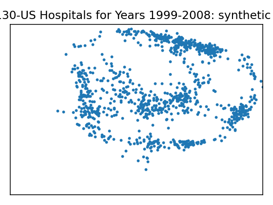
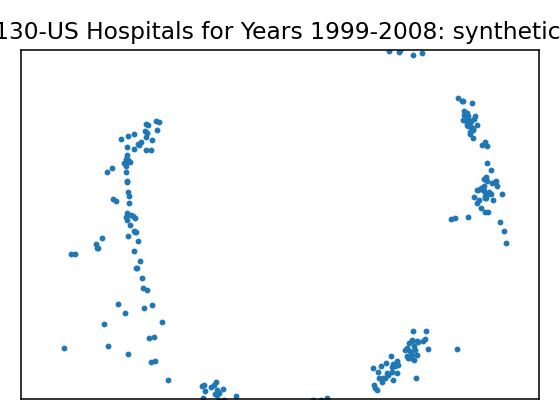
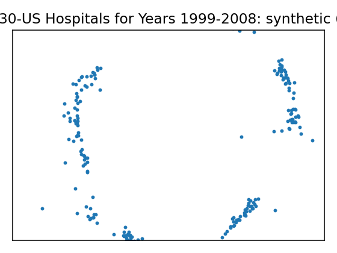
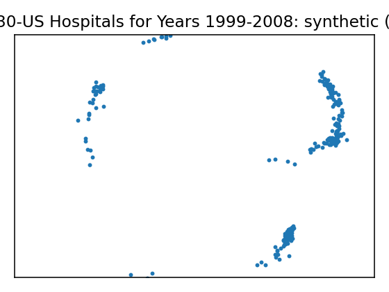
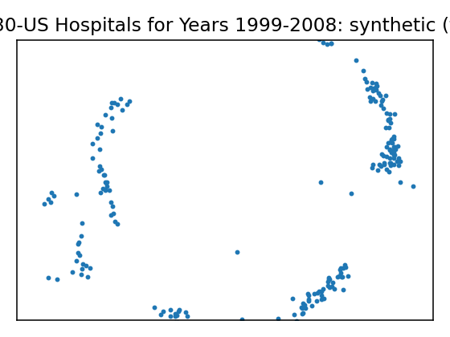
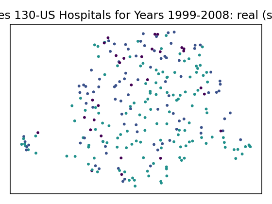
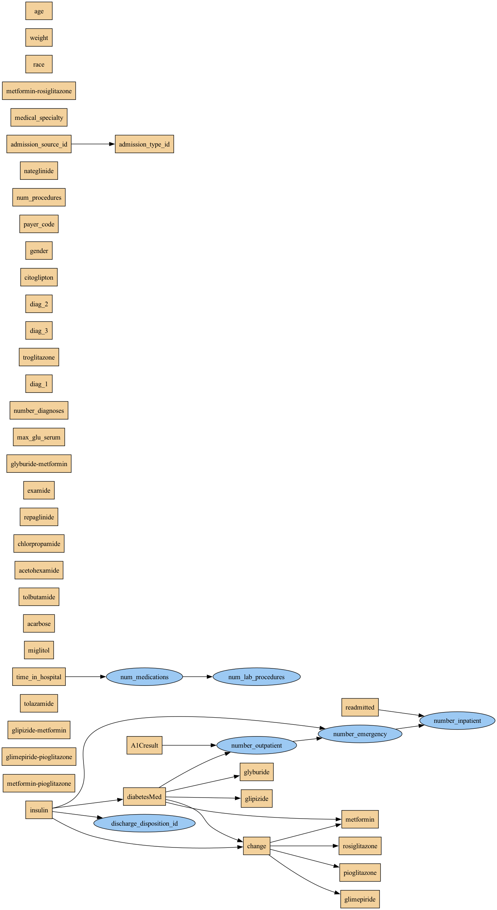

# Data Report — Diabetes 130-US Hospitals for Years 1999-2008

**Source**: [UCI dataset 296](https://archive.ics.uci.edu/dataset/296)

**SemMap JSON-LD**: [dataset.semmap.json](dataset.semmap.json) · [RDFa HTML](dataset.semmap.html)
## Overview

| Metric      | Value                                                                         |
|:------------|:------------------------------------------------------------------------------|
| Dataset     | Diabetes 130-US Hospitals for Years 1999-2008                                 |
| Source      | [UCI dataset 296](https://archive.ics.uci.edu/dataset/296)                    |
| Rows        | 101,766                                                                       |
| Columns     | 48                                                                            |
| Discrete    | 42                                                                            |
| Continuous  | 6                                                                             |
| SemMap      | [SemMap JSON-LD](dataset.semmap.json) [SemMap HTML](dataset.semmap.html) |
| Missingness | Not modeled                                                                   |

## Variables and summary

| variable                 | inferred   | dist                                                                                                                                                                                                                                                                                                                                                                            |
|:-------------------------|:-----------|:--------------------------------------------------------------------------------------------------------------------------------------------------------------------------------------------------------------------------------------------------------------------------------------------------------------------------------------------------------------------------------|
| race                     | discrete   | Caucasian [Caucasian]: 77840 (76.49%) African American [AfricanAmerican]: 19622 (19.28%) Hispanic [Hispanic]: 2094 (2.06%) Other [Other]: 1542 (1.52%) Asian [Asian]: 668 (0.66%)                                                                                                                                                                           |
| gender                   | discrete   | Female [Female]: 54708 (53.76%) Male [Male]: 47055 (46.24%) Unknown/Invalid [Unknown/Invalid]: 3 (0.00%)                                                                                                                                                                                                                                                              |
| age                      | discrete   | [70-80): 26068 (25.62%) [60-70): 22483 (22.09%) [50-60): 17256 (16.96%) [80-90): 17197 (16.90%) [40-50): 9685 (9.52%) [30-40): 3775 (3.71%) [90-100): 2793 (2.74%) [20-30): 1657 (1.63%) [10-20): 691 (0.68%) [0-10): 161 (0.16%)                                                                                                  |
| weight                   | discrete   | [75-100): 44067 (43.30%) [50-75): 28250 (27.76%) [100-125): 18437 (18.12%) [125-150): 4899 (4.81%) [25-50): 2915 (2.86%) [0-25): 1828 (1.80%) [150-175): 937 (0.92%) [175-200): 366 (0.36%) >200: 67 (0.07%)                                                                                                                            |
| admission_type_id        | discrete   | 1: 53990 (53.05%) 3: 18869 (18.54%) 2: 18480 (18.16%) 6: 5291 (5.20%) 5: 4785 (4.70%) 8: 320 (0.31%) 7: 21 (0.02%) 4: 10 (0.01%)                                                                                                                                                                                                             |
| discharge_disposition_id | continuous | 3.7156 ± 5.2802 [1, 1, 1, 4, 28]                                                                                                                                                                                                                                                                                                                                                |
| admission_source_id      | discrete   | 7: 57494 (56.50%) 1: 29565 (29.05%) 17: 6781 (6.66%) 4: 3187 (3.13%) 6: 2264 (2.22%) 2: 1104 (1.08%) 5: 855 (0.84%) 3: 187 (0.18%) 20: 161 (0.16%) 9: 125 (0.12%) … (+7 more)                                                                                                                                                 |
| time_in_hospital         | discrete   | 3: 17756 (17.45%) 2: 17224 (16.93%) 1: 14208 (13.96%) 4: 13924 (13.68%) 5: 9966 (9.79%) 6: 7539 (7.41%) 7: 5859 (5.76%) 8: 4391 (4.31%) 9: 3002 (2.95%) 10: 2342 (2.30%) … (+4 more)                                                                                                                                          |
| payer_code               | discrete   | MC: 65018 (63.89%) HM: 7934 (7.80%) SP: 6136 (6.03%) BC: 5963 (5.86%) MD: 4711 (4.63%) UN: 3360 (3.30%) CP: 3143 (3.09%) CM: 2283 (2.24%) OG: 1204 (1.18%) PO: 703 (0.69%) … (+7 more)                                                                                                                                        |
| medical_specialty        | discrete   | InternalMedicine: 26599 (26.14%) Emergency/Trauma: 18817 (18.49%) Family/GeneralPractice: 13744 (13.51%) Cardiology: 10034 (9.86%) Surgery-General: 6145 (6.04%) Radiologist: 3291 (3.23%) Orthopedics: 2999 (2.95%) Nephrology: 2867 (2.82%) Orthopedics-Reconstructive: 1965 (1.93%) Pulmonology: 1642 (1.61%) … (+62 more) |
| num_lab_procedures       | continuous | 43.0956 ± 19.6744 [1, 31, 44, 57, 132]                                                                                                                                                                                                                                                                                                                                          |
| num_procedures           | discrete   | 0: 46652 (45.84%) 1: 20742 (20.38%) 2: 12717 (12.50%) 3: 9443 (9.28%) 6: 4954 (4.87%) 4: 4180 (4.11%) 5: 3078 (3.02%)                                                                                                                                                                                                                             |
| num_medications          | continuous | 16.0218 ± 8.1276 [1, 10, 15, 20, 81]                                                                                                                                                                                                                                                                                                                                            |
| number_outpatient        | continuous | 0.3694 ± 1.2673 [0, 0, 0, 0, 42]                                                                                                                                                                                                                                                                                                                                                |
| number_emergency         | continuous | 0.1978 ± 0.9305 [0, 0, 0, 0, 76]                                                                                                                                                                                                                                                                                                                                                |
| number_inpatient         | continuous | 0.6356 ± 1.2629 [0, 0, 0, 1, 21]                                                                                                                                                                                                                                                                                                                                                |
| diag_1                   | discrete   | 428: 6863 (6.74%) 414: 6584 (6.47%) 786: 4017 (3.95%) 410: 3616 (3.55%) 486: 3509 (3.45%) 427: 2768 (2.72%) 491: 2275 (2.24%) 715: 2151 (2.11%) 682: 2042 (2.01%) 434: 2029 (1.99%) … (+706 more)                                                                                                                             |
| diag_2                   | discrete   | 276: 6773 (6.66%) 428: 6687 (6.57%) 250: 6096 (5.99%) 427: 5048 (4.96%) 401: 3754 (3.69%) 496: 3314 (3.26%) 599: 3294 (3.24%) 403: 2836 (2.79%) 414: 2665 (2.62%) 411: 2578 (2.53%) … (+738 more)                                                                                                                             |
| diag_3                   | discrete   | 250: 11733 (11.53%) 401: 8424 (8.28%) 276: 5239 (5.15%) 428: 4641 (4.56%) 427: 4005 (3.94%) 414: 3718 (3.65%) 496: 2635 (2.59%) 403: 2395 (2.35%) 585: 2007 (1.97%) 272: 1992 (1.96%) … (+779 more)                                                                                                                           |
| number_diagnoses         | discrete   | 9: 49474 (48.62%) 5: 11393 (11.20%) 8: 10616 (10.43%) 7: 10393 (10.21%) 6: 10161 (9.98%) 4: 5537 (5.44%) 3: 2835 (2.79%) 2: 1023 (1.01%) 1: 219 (0.22%) 16: 45 (0.04%) … (+6 more)                                                                                                                                            |
| max_glu_serum            | discrete   | Norm: 40817 (40.11%) >300: 36052 (35.43%) >200: 24897 (24.46%)                                                                                                                                                                                                                                                                                                        |
| A1Cresult                | discrete   | >8: 49610 (48.75%) Norm: 29207 (28.70%) >7: 22949 (22.55%)                                                                                                                                                                                                                                                                                                            |
| metformin                | discrete   | No: 81778 (80.36%) Steady: 18346 (18.03%) Up: 1067 (1.05%) Down: 575 (0.57%)                                                                                                                                                                                                                                                                                     |
| repaglinide              | discrete   | No: 100227 (98.49%) Steady: 1384 (1.36%) Up: 110 (0.11%) Down: 45 (0.04%)                                                                                                                                                                                                                                                                                        |
| nateglinide              | discrete   | No: 101063 (99.31%) Steady: 668 (0.66%) Up: 24 (0.02%) Down: 11 (0.01%)                                                                                                                                                                                                                                                                                          |
| chlorpropamide           | discrete   | No: 101680 (99.92%) Steady: 79 (0.08%) Up: 6 (0.01%) Down: 1 (0.00%)                                                                                                                                                                                                                                                                                             |
| glimepiride              | discrete   | No: 96575 (94.90%) Steady: 4670 (4.59%) Up: 327 (0.32%) Down: 194 (0.19%)                                                                                                                                                                                                                                                                                        |
| acetohexamide            | discrete   | No: 101765 (100.00%)                                                                                                                                                                                                                                                                                                                                                            |
| glipizide                | discrete   | No: 89080 (87.53%) Steady: 11356 (11.16%) Up: 770 (0.76%) Down: 560 (0.55%)                                                                                                                                                                                                                                                                                      |
| glyburide                | discrete   | No: 91116 (89.53%) Steady: 9274 (9.11%) Up: 812 (0.80%) Down: 564 (0.55%)                                                                                                                                                                                                                                                                                        |
| tolbutamide              | discrete   | No: 101743 (99.98%)                                                                                                                                                                                                                                                                                                                                                             |
| pioglitazone             | discrete   | No: 94438 (92.80%) Steady: 6976 (6.85%) Up: 234 (0.23%) Down: 118 (0.12%)                                                                                                                                                                                                                                                                                        |
| rosiglitazone            | discrete   | No: 95401 (93.75%) Steady: 6100 (5.99%) Up: 178 (0.17%) Down: 87 (0.09%)                                                                                                                                                                                                                                                                                         |
| acarbose                 | discrete   | No: 101458 (99.70%) Steady: 295 (0.29%) Up: 10 (0.01%) Down: 3 (0.00%)                                                                                                                                                                                                                                                                                           |
| miglitol                 | discrete   | No: 101728 (99.96%) Steady: 31 (0.03%) Down: 5 (0.00%) Up: 2 (0.00%)                                                                                                                                                                                                                                                                                             |
| troglitazone             | discrete   | No: 101763 (100.00%)                                                                                                                                                                                                                                                                                                                                                            |
| tolazamide               | discrete   | No: 101727 (99.96%) Steady: 38 (0.04%) Up: 1 (0.00%)                                                                                                                                                                                                                                                                                                                  |
| examide                  | discrete   | No: 101766 (100.00%)                                                                                                                                                                                                                                                                                                                                                            |
| citoglipton              | discrete   | No: 101766 (100.00%)                                                                                                                                                                                                                                                                                                                                                            |
| insulin                  | discrete   | No: 47383 (46.56%) Steady: 30849 (30.31%) Down: 12218 (12.01%) Up: 11316 (11.12%)                                                                                                                                                                                                                                                                                |
| glyburide-metformin      | discrete   | No: 101060 (99.31%) Steady: 692 (0.68%) Up: 8 (0.01%) Down: 6 (0.01%)                                                                                                                                                                                                                                                                                            |
| glipizide-metformin      | discrete   | No: 101753 (99.99%)                                                                                                                                                                                                                                                                                                                                                             |
| glimepiride-pioglitazone | discrete   | No: 101765 (100.00%)                                                                                                                                                                                                                                                                                                                                                            |
| metformin-rosiglitazone  | discrete   | No: 101764 (100.00%)                                                                                                                                                                                                                                                                                                                                                            |
| metformin-pioglitazone   | discrete   | No: 101765 (100.00%)                                                                                                                                                                                                                                                                                                                                                            |
| change                   | discrete   | No: 54755 (53.80%)                                                                                                                                                                                                                                                                                                                                                              |
| diabetesMed              | discrete   | Yes: 78363 (77.00%)                                                                                                                                                                                                                                                                                                                                                             |
| readmitted               | discrete   | NO: 54864 (53.91%) >30: 35545 (34.93%) <30: 11357 (11.16%)                                                                                                                                                                                                                                                                                                            |

## Fidelity summary

| umap                                                 | model      | backend   |   disc jsd mean |   disc jsd median |   cont ks mean |   cont w1 mean | downstream sign match   |
|:-----------------------------------------------------|:-----------|:----------|----------------:|------------------:|---------------:|---------------:|:------------------------|
|     | metasyn    | metasyn   |          0.0793 |            0.0434 |         0.5417 |         1.2278 |                         |
|     | clg_mi2    | pybnesian |          0.0803 |            0.0533 |         0.315  |         1.5054 |                         |
|    | semi_mi5   | pybnesian |          0.0803 |            0.0533 |         0.315  |         1.5054 |                         |
|  | ctgan_fast | synthcity |          0.2747 |            0.1882 |         0.3647 |         6.7779 |                         |
|  | tvae_quick | synthcity |          0.1394 |            0.0791 |         0.1614 |         1.3723 |                         |

## Privacy summary

| model      | backend   |   n real |   n synth |   exact overlap rate |   near duplicate rate eps |   nn distance mean |   k min |   k pct lt5 |   k map |   rare qi reproduction rate |   identifiability score |   delta presence |
|:-----------|:----------|---------:|----------:|---------------------:|--------------------------:|-------------------:|--------:|------------:|--------:|----------------------------:|------------------------:|-----------------:|
| metasyn    | metasyn   |   101766 |      1000 |               0.046  |                    0.987  |             0.013  |       1 |        0.11 |       8 |                      0.5641 |                  0.005  |           1.5385 |
| clg_mi2    | pybnesian |   101766 |      1000 |               0.042  |                    0.981  |             0.0143 |       1 |        0.11 |       8 |                      0.4744 |                  0.004  |           1.9362 |
| semi_mi5   | pybnesian |   101766 |      1000 |               0.042  |                    0.981  |             0.0143 |       1 |        0.11 |       8 |                      0.4744 |                  0.004  |           1.9362 |
| ctgan_fast | synthcity |   101766 |       256 |               0.0859 |                    0.9102 |             0.0552 |       1 |        0.11 |       1 |                      0.2564 |                  0.0117 |           5      |
| tvae_quick | synthcity |   101766 |       256 |               0.1016 |                    0.957  |             0.0309 |       1 |        0.11 |       2 |                      0.1026 |                  0.0117 |           2.1429 |

## Models

<table>
<tr><th>UMAP</th><th>Details</th><th>Structure</th></tr>
<tr><td></td><td>
<h3>Real data</h3></td><td></td></tr>
<tr><td></td><td>

<h3>Model: metasyn (metasyn)</h3>
<ul>
<li>Seed: 42, rows: 1000</li>
<li> <a href="models/metasyn/synthetic.csv">Synthetic CSV</a></li>
<li> <a href="models/metasyn/per_variable_metrics.csv">Per-variable metrics</a></li>
<li> <a href="models/metasyn/metrics.json">Metrics JSON</a></li>
<li> <a href="models/metasyn/metrics.privacy.json">Privacy metrics</a></li>
<li> <a href="models/metasyn/metrics.downstream.json">Downstream metrics</a></li>
</ul>

<strong>Per-variable fidelity</strong>

<table class="dataframe">
  <thead>
    <tr style="text-align: right;">
      <th>variable</th>
      <th>type</th>
      <th>KS</th>
      <th>W1</th>
      <th>JSD</th>
    </tr>
  </thead>
  <tbody>
    <tr>
      <td>race</td>
      <td>discrete</td>
      <td></td>
      <td></td>
      <td>0.0689</td>
    </tr>
    <tr>
      <td>gender</td>
      <td>discrete</td>
      <td></td>
      <td></td>
      <td>0.0655</td>
    </tr>
    <tr>
      <td>age</td>
      <td>discrete</td>
      <td></td>
      <td></td>
      <td>0.0818</td>
    </tr>
    <tr>
      <td>weight</td>
      <td>discrete</td>
      <td></td>
      <td></td>
      <td>0.1077</td>
    </tr>
    <tr>
      <td>admission_type_id</td>
      <td>discrete</td>
      <td></td>
      <td></td>
      <td>0.0957</td>
    </tr>
    <tr>
      <td>discharge_disposition_id</td>
      <td>continuous</td>
      <td>0.615</td>
      <td>1.664</td>
      <td></td>
    </tr>
    <tr>
      <td>admission_source_id</td>
      <td>discrete</td>
      <td></td>
      <td></td>
      <td>0.088</td>
    </tr>
    <tr>
      <td>time_in_hospital</td>
      <td>discrete</td>
      <td></td>
      <td></td>
      <td>0.0832</td>
    </tr>
    <tr>
      <td>payer_code</td>
      <td>discrete</td>
      <td></td>
      <td></td>
      <td>0.1178</td>
    </tr>
    <tr>
      <td>medical_specialty</td>
      <td>discrete</td>
      <td></td>
      <td></td>
      <td>0.2378</td>
    </tr>
  </tbody>
</table>

<strong>Downstream metrics</strong>

<table class="dataframe">
  <thead>
    <tr style="text-align: right;">
      <th>metric</th>
      <th>value</th>
    </tr>
  </thead>
  <tbody>
    <tr>
      <td>sign_match_rate</td>
      <td></td>
    </tr>
    <tr>
      <td>formula</td>
      <td></td>
    </tr>
  </tbody>
</table>

<strong>Privacy metrics</strong>

<table class="dataframe">
  <thead>
    <tr style="text-align: right;">
      <th>metric</th>
      <th>value</th>
    </tr>
  </thead>
  <tbody>
    <tr>
      <td>n_real</td>
      <td>101766</td>
    </tr>
    <tr>
      <td>n_synth</td>
      <td>1000</td>
    </tr>
    <tr>
      <td>exact_overlap_rate</td>
      <td>0.046</td>
    </tr>
    <tr>
      <td>near_duplicate_rate_eps</td>
      <td>0.987</td>
    </tr>
    <tr>
      <td>nn_distance_mean</td>
      <td>0.013</td>
    </tr>
    <tr>
      <td>k_min</td>
      <td>1</td>
    </tr>
    <tr>
      <td>k_pct_lt5</td>
      <td>0.11</td>
    </tr>
    <tr>
      <td>k_map</td>
      <td>8</td>
    </tr>
    <tr>
      <td>rare_qi_reproduction_rate</td>
      <td>0.5641</td>
    </tr>
    <tr>
      <td>identifiability_score</td>
      <td>0.005</td>
    </tr>
    <tr>
      <td>delta_presence</td>
      <td>1.5385</td>
    </tr>
  </tbody>
</table>

</td><td>
<table class="dataframe">
  <thead>
    <tr style="text-align: right;">
      <th>variable</th>
      <th>distribution</th>
    </tr>
  </thead>
  <tbody>
    <tr>
      <td>race</td>
      <td>core.multinoulli</td>
    </tr>
    <tr>
      <td>gender</td>
      <td>core.multinoulli</td>
    </tr>
    <tr>
      <td>age</td>
      <td>core.multinoulli</td>
    </tr>
    <tr>
      <td>weight</td>
      <td>core.multinoulli</td>
    </tr>
    <tr>
      <td>admission_type_id</td>
      <td>core.multinoulli</td>
    </tr>
    <tr>
      <td>discharge_disposition_id</td>
      <td>core.truncated_normal</td>
    </tr>
    <tr>
      <td>admission_source_id</td>
      <td>core.multinoulli</td>
    </tr>
    <tr>
      <td>time_in_hospital</td>
      <td>core.multinoulli</td>
    </tr>
    <tr>
      <td>payer_code</td>
      <td>core.multinoulli</td>
    </tr>
    <tr>
      <td>medical_specialty</td>
      <td>core.multinoulli</td>
    </tr>
    <tr>
      <td>num_lab_procedures</td>
      <td>core.truncated_normal</td>
    </tr>
    <tr>
      <td>num_procedures</td>
      <td>core.multinoulli</td>
    </tr>
    <tr>
      <td>num_medications</td>
      <td>core.truncated_normal</td>
    </tr>
    <tr>
      <td>number_outpatient</td>
      <td>core.truncated_normal</td>
    </tr>
    <tr>
      <td>number_emergency</td>
      <td>core.truncated_normal</td>
    </tr>
    <tr>
      <td>number_inpatient</td>
      <td>core.truncated_normal</td>
    </tr>
    <tr>
      <td>diag_1</td>
      <td>core.multinoulli</td>
    </tr>
    <tr>
      <td>diag_2</td>
      <td>core.multinoulli</td>
    </tr>
    <tr>
      <td>diag_3</td>
      <td>core.multinoulli</td>
    </tr>
    <tr>
      <td>number_diagnoses</td>
      <td>core.multinoulli</td>
    </tr>
    <tr>
      <td>max_glu_serum</td>
      <td>core.multinoulli</td>
    </tr>
    <tr>
      <td>A1Cresult</td>
      <td>core.multinoulli</td>
    </tr>
    <tr>
      <td>metformin</td>
      <td>core.multinoulli</td>
    </tr>
    <tr>
      <td>repaglinide</td>
      <td>core.multinoulli</td>
    </tr>
    <tr>
      <td>nateglinide</td>
      <td>core.multinoulli</td>
    </tr>
    <tr>
      <td>chlorpropamide</td>
      <td>core.multinoulli</td>
    </tr>
    <tr>
      <td>glimepiride</td>
      <td>core.multinoulli</td>
    </tr>
    <tr>
      <td>acetohexamide</td>
      <td>core.multinoulli</td>
    </tr>
    <tr>
      <td>glipizide</td>
      <td>core.multinoulli</td>
    </tr>
    <tr>
      <td>glyburide</td>
      <td>core.multinoulli</td>
    </tr>
    <tr>
      <td>tolbutamide</td>
      <td>core.multinoulli</td>
    </tr>
    <tr>
      <td>pioglitazone</td>
      <td>core.multinoulli</td>
    </tr>
    <tr>
      <td>rosiglitazone</td>
      <td>core.multinoulli</td>
    </tr>
    <tr>
      <td>acarbose</td>
      <td>core.multinoulli</td>
    </tr>
    <tr>
      <td>miglitol</td>
      <td>core.multinoulli</td>
    </tr>
    <tr>
      <td>troglitazone</td>
      <td>core.multinoulli</td>
    </tr>
    <tr>
      <td>tolazamide</td>
      <td>core.multinoulli</td>
    </tr>
    <tr>
      <td>examide</td>
      <td>core.multinoulli</td>
    </tr>
    <tr>
      <td>citoglipton</td>
      <td>core.multinoulli</td>
    </tr>
    <tr>
      <td>insulin</td>
      <td>core.multinoulli</td>
    </tr>
    <tr>
      <td>glyburide-metformin</td>
      <td>core.multinoulli</td>
    </tr>
    <tr>
      <td>glipizide-metformin</td>
      <td>core.multinoulli</td>
    </tr>
    <tr>
      <td>glimepiride-pioglitazone</td>
      <td>core.multinoulli</td>
    </tr>
    <tr>
      <td>metformin-rosiglitazone</td>
      <td>core.multinoulli</td>
    </tr>
    <tr>
      <td>metformin-pioglitazone</td>
      <td>core.multinoulli</td>
    </tr>
    <tr>
      <td>change</td>
      <td>core.multinoulli</td>
    </tr>
    <tr>
      <td>diabetesMed</td>
      <td>core.multinoulli</td>
    </tr>
    <tr>
      <td>readmitted</td>
      <td>core.multinoulli</td>
    </tr>
  </tbody>
</table></td></tr>

<tr><td></td><td>

<h3>Model: clg_mi2 (pybnesian)</h3>
<ul>
<li>Seed: 42, rows: 1000</li>
<li> Params: <tt>{"max_indegree": 2, "operators": ["arcs"], "score": "bic", "type": "clg"}</tt></li><li> <a href="models/clg_mi2/synthetic.csv">Synthetic CSV</a></li>
<li> <a href="models/clg_mi2/per_variable_metrics.csv">Per-variable metrics</a></li>
<li> <a href="models/clg_mi2/metrics.json">Metrics JSON</a></li>
<li> <a href="models/clg_mi2/metrics.privacy.json">Privacy metrics</a></li>
</ul>

<strong>Per-variable fidelity</strong>

<table class="dataframe">
  <thead>
    <tr style="text-align: right;">
      <th>variable</th>
      <th>type</th>
      <th>KS</th>
      <th>W1</th>
      <th>JSD</th>
    </tr>
  </thead>
  <tbody>
    <tr>
      <td>race</td>
      <td>discrete</td>
      <td></td>
      <td></td>
      <td>0.0628</td>
    </tr>
    <tr>
      <td>gender</td>
      <td>discrete</td>
      <td></td>
      <td></td>
      <td>0.0602</td>
    </tr>
    <tr>
      <td>age</td>
      <td>discrete</td>
      <td></td>
      <td></td>
      <td>0.0564</td>
    </tr>
    <tr>
      <td>weight</td>
      <td>discrete</td>
      <td></td>
      <td></td>
      <td>0.1179</td>
    </tr>
    <tr>
      <td>admission_type_id</td>
      <td>discrete</td>
      <td></td>
      <td></td>
      <td>0.0867</td>
    </tr>
    <tr>
      <td>discharge_disposition_id</td>
      <td>continuous</td>
      <td>0.329</td>
      <td>2.8717</td>
      <td></td>
    </tr>
    <tr>
      <td>admission_source_id</td>
      <td>discrete</td>
      <td></td>
      <td></td>
      <td>0.0885</td>
    </tr>
    <tr>
      <td>time_in_hospital</td>
      <td>discrete</td>
      <td></td>
      <td></td>
      <td>0.0898</td>
    </tr>
    <tr>
      <td>payer_code</td>
      <td>discrete</td>
      <td></td>
      <td></td>
      <td>0.1586</td>
    </tr>
    <tr>
      <td>medical_specialty</td>
      <td>discrete</td>
      <td></td>
      <td></td>
      <td>0.1933</td>
    </tr>
  </tbody>
</table>

<strong>Privacy metrics</strong>

<table class="dataframe">
  <thead>
    <tr style="text-align: right;">
      <th>metric</th>
      <th>value</th>
    </tr>
  </thead>
  <tbody>
    <tr>
      <td>n_real</td>
      <td>101766</td>
    </tr>
    <tr>
      <td>n_synth</td>
      <td>1000</td>
    </tr>
    <tr>
      <td>exact_overlap_rate</td>
      <td>0.042</td>
    </tr>
    <tr>
      <td>near_duplicate_rate_eps</td>
      <td>0.981</td>
    </tr>
    <tr>
      <td>nn_distance_mean</td>
      <td>0.0143</td>
    </tr>
    <tr>
      <td>k_min</td>
      <td>1</td>
    </tr>
    <tr>
      <td>k_pct_lt5</td>
      <td>0.11</td>
    </tr>
    <tr>
      <td>k_map</td>
      <td>8</td>
    </tr>
    <tr>
      <td>rare_qi_reproduction_rate</td>
      <td>0.4744</td>
    </tr>
    <tr>
      <td>identifiability_score</td>
      <td>0.004</td>
    </tr>
    <tr>
      <td>delta_presence</td>
      <td>1.9362</td>
    </tr>
  </tbody>
</table>

</td><td>
</td></tr>

<tr><td></td><td>

<h3>Model: semi_mi5 (pybnesian)</h3>
<ul>
<li>Seed: 42, rows: 1000</li>
<li> Params: <tt>{"max_indegree": 5, "operators": ["arcs"], "score": "bic", "type": "semiparametric"}</tt></li><li> <a href="models/semi_mi5/synthetic.csv">Synthetic CSV</a></li>
<li> <a href="models/semi_mi5/per_variable_metrics.csv">Per-variable metrics</a></li>
<li> <a href="models/semi_mi5/metrics.json">Metrics JSON</a></li>
<li> <a href="models/semi_mi5/metrics.privacy.json">Privacy metrics</a></li>
</ul>

<strong>Per-variable fidelity</strong>

<table class="dataframe">
  <thead>
    <tr style="text-align: right;">
      <th>variable</th>
      <th>type</th>
      <th>KS</th>
      <th>W1</th>
      <th>JSD</th>
    </tr>
  </thead>
  <tbody>
    <tr>
      <td>race</td>
      <td>discrete</td>
      <td></td>
      <td></td>
      <td>0.0628</td>
    </tr>
    <tr>
      <td>gender</td>
      <td>discrete</td>
      <td></td>
      <td></td>
      <td>0.0602</td>
    </tr>
    <tr>
      <td>age</td>
      <td>discrete</td>
      <td></td>
      <td></td>
      <td>0.0564</td>
    </tr>
    <tr>
      <td>weight</td>
      <td>discrete</td>
      <td></td>
      <td></td>
      <td>0.1179</td>
    </tr>
    <tr>
      <td>admission_type_id</td>
      <td>discrete</td>
      <td></td>
      <td></td>
      <td>0.0867</td>
    </tr>
    <tr>
      <td>discharge_disposition_id</td>
      <td>continuous</td>
      <td>0.329</td>
      <td>2.8717</td>
      <td></td>
    </tr>
    <tr>
      <td>admission_source_id</td>
      <td>discrete</td>
      <td></td>
      <td></td>
      <td>0.0885</td>
    </tr>
    <tr>
      <td>time_in_hospital</td>
      <td>discrete</td>
      <td></td>
      <td></td>
      <td>0.0898</td>
    </tr>
    <tr>
      <td>payer_code</td>
      <td>discrete</td>
      <td></td>
      <td></td>
      <td>0.1586</td>
    </tr>
    <tr>
      <td>medical_specialty</td>
      <td>discrete</td>
      <td></td>
      <td></td>
      <td>0.1933</td>
    </tr>
  </tbody>
</table>

<strong>Privacy metrics</strong>

<table class="dataframe">
  <thead>
    <tr style="text-align: right;">
      <th>metric</th>
      <th>value</th>
    </tr>
  </thead>
  <tbody>
    <tr>
      <td>n_real</td>
      <td>101766</td>
    </tr>
    <tr>
      <td>n_synth</td>
      <td>1000</td>
    </tr>
    <tr>
      <td>exact_overlap_rate</td>
      <td>0.042</td>
    </tr>
    <tr>
      <td>near_duplicate_rate_eps</td>
      <td>0.981</td>
    </tr>
    <tr>
      <td>nn_distance_mean</td>
      <td>0.0143</td>
    </tr>
    <tr>
      <td>k_min</td>
      <td>1</td>
    </tr>
    <tr>
      <td>k_pct_lt5</td>
      <td>0.11</td>
    </tr>
    <tr>
      <td>k_map</td>
      <td>8</td>
    </tr>
    <tr>
      <td>rare_qi_reproduction_rate</td>
      <td>0.4744</td>
    </tr>
    <tr>
      <td>identifiability_score</td>
      <td>0.004</td>
    </tr>
    <tr>
      <td>delta_presence</td>
      <td>1.9362</td>
    </tr>
  </tbody>
</table>

</td><td>
</td></tr>

<tr><td></td><td>

<h3>Model: ctgan_fast (synthcity)</h3>
<ul>
<li>Seed: 42, rows: 256</li>
<li> Params: <tt>{"batch_size": 256, "n_iter": 5}</tt></li><li> <a href="models/ctgan_fast/synthetic.csv">Synthetic CSV</a></li>
<li> <a href="models/ctgan_fast/per_variable_metrics.csv">Per-variable metrics</a></li>
<li> <a href="models/ctgan_fast/metrics.json">Metrics JSON</a></li>
<li> <a href="models/ctgan_fast/metrics.privacy.json">Privacy metrics</a></li>
</ul>

<strong>Per-variable fidelity</strong>

<table class="dataframe">
  <thead>
    <tr style="text-align: right;">
      <th>variable</th>
      <th>type</th>
      <th>KS</th>
      <th>W1</th>
      <th>JSD</th>
    </tr>
  </thead>
  <tbody>
    <tr>
      <td>race</td>
      <td>discrete</td>
      <td></td>
      <td></td>
      <td>0.234</td>
    </tr>
    <tr>
      <td>gender</td>
      <td>discrete</td>
      <td></td>
      <td></td>
      <td>0.0905</td>
    </tr>
    <tr>
      <td>age</td>
      <td>discrete</td>
      <td></td>
      <td></td>
      <td>0.329</td>
    </tr>
    <tr>
      <td>weight</td>
      <td>discrete</td>
      <td></td>
      <td></td>
      <td>0.295</td>
    </tr>
    <tr>
      <td>admission_type_id</td>
      <td>discrete</td>
      <td></td>
      <td></td>
      <td>0.3584</td>
    </tr>
    <tr>
      <td>discharge_disposition_id</td>
      <td>continuous</td>
      <td>0.245</td>
      <td>1.8958</td>
      <td></td>
    </tr>
    <tr>
      <td>admission_source_id</td>
      <td>discrete</td>
      <td></td>
      <td></td>
      <td>0.2299</td>
    </tr>
    <tr>
      <td>time_in_hospital</td>
      <td>discrete</td>
      <td></td>
      <td></td>
      <td>0.9173</td>
    </tr>
    <tr>
      <td>payer_code</td>
      <td>discrete</td>
      <td></td>
      <td></td>
      <td>0.8811</td>
    </tr>
    <tr>
      <td>medical_specialty</td>
      <td>discrete</td>
      <td></td>
      <td></td>
      <td>0.9886</td>
    </tr>
  </tbody>
</table>

<strong>Privacy metrics</strong>

<table class="dataframe">
  <thead>
    <tr style="text-align: right;">
      <th>metric</th>
      <th>value</th>
    </tr>
  </thead>
  <tbody>
    <tr>
      <td>n_real</td>
      <td>101766</td>
    </tr>
    <tr>
      <td>n_synth</td>
      <td>256</td>
    </tr>
    <tr>
      <td>exact_overlap_rate</td>
      <td>0.0859</td>
    </tr>
    <tr>
      <td>near_duplicate_rate_eps</td>
      <td>0.9102</td>
    </tr>
    <tr>
      <td>nn_distance_mean</td>
      <td>0.0552</td>
    </tr>
    <tr>
      <td>k_min</td>
      <td>1</td>
    </tr>
    <tr>
      <td>k_pct_lt5</td>
      <td>0.11</td>
    </tr>
    <tr>
      <td>k_map</td>
      <td>1</td>
    </tr>
    <tr>
      <td>rare_qi_reproduction_rate</td>
      <td>0.2564</td>
    </tr>
    <tr>
      <td>identifiability_score</td>
      <td>0.0117</td>
    </tr>
    <tr>
      <td>delta_presence</td>
      <td>5</td>
    </tr>
  </tbody>
</table>

</td><td>
</td></tr>

<tr><td></td><td>

<h3>Model: tvae_quick (synthcity)</h3>
<ul>
<li>Seed: 42, rows: 256</li>
<li> Params: <tt>{"batch_size": 256}</tt></li><li> <a href="models/tvae_quick/synthetic.csv">Synthetic CSV</a></li>
<li> <a href="models/tvae_quick/per_variable_metrics.csv">Per-variable metrics</a></li>
<li> <a href="models/tvae_quick/metrics.json">Metrics JSON</a></li>
<li> <a href="models/tvae_quick/metrics.privacy.json">Privacy metrics</a></li>
</ul>

<strong>Per-variable fidelity</strong>

<table class="dataframe">
  <thead>
    <tr style="text-align: right;">
      <th>variable</th>
      <th>type</th>
      <th>KS</th>
      <th>W1</th>
      <th>JSD</th>
    </tr>
  </thead>
  <tbody>
    <tr>
      <td>race</td>
      <td>discrete</td>
      <td></td>
      <td></td>
      <td>0.1456</td>
    </tr>
    <tr>
      <td>gender</td>
      <td>discrete</td>
      <td></td>
      <td></td>
      <td>0.0817</td>
    </tr>
    <tr>
      <td>age</td>
      <td>discrete</td>
      <td></td>
      <td></td>
      <td>0.124</td>
    </tr>
    <tr>
      <td>weight</td>
      <td>discrete</td>
      <td></td>
      <td></td>
      <td>0.2066</td>
    </tr>
    <tr>
      <td>admission_type_id</td>
      <td>discrete</td>
      <td></td>
      <td></td>
      <td>0.1353</td>
    </tr>
    <tr>
      <td>discharge_disposition_id</td>
      <td>continuous</td>
      <td>0.5095</td>
      <td>0.4571</td>
      <td></td>
    </tr>
    <tr>
      <td>admission_source_id</td>
      <td>discrete</td>
      <td></td>
      <td></td>
      <td>0.1622</td>
    </tr>
    <tr>
      <td>time_in_hospital</td>
      <td>discrete</td>
      <td></td>
      <td></td>
      <td>0.3194</td>
    </tr>
    <tr>
      <td>payer_code</td>
      <td>discrete</td>
      <td></td>
      <td></td>
      <td>0.4272</td>
    </tr>
    <tr>
      <td>medical_specialty</td>
      <td>discrete</td>
      <td></td>
      <td></td>
      <td>0.5594</td>
    </tr>
  </tbody>
</table>

<strong>Privacy metrics</strong>

<table class="dataframe">
  <thead>
    <tr style="text-align: right;">
      <th>metric</th>
      <th>value</th>
    </tr>
  </thead>
  <tbody>
    <tr>
      <td>n_real</td>
      <td>101766</td>
    </tr>
    <tr>
      <td>n_synth</td>
      <td>256</td>
    </tr>
    <tr>
      <td>exact_overlap_rate</td>
      <td>0.1016</td>
    </tr>
    <tr>
      <td>near_duplicate_rate_eps</td>
      <td>0.957</td>
    </tr>
    <tr>
      <td>nn_distance_mean</td>
      <td>0.0309</td>
    </tr>
    <tr>
      <td>k_min</td>
      <td>1</td>
    </tr>
    <tr>
      <td>k_pct_lt5</td>
      <td>0.11</td>
    </tr>
    <tr>
      <td>k_map</td>
      <td>2</td>
    </tr>
    <tr>
      <td>rare_qi_reproduction_rate</td>
      <td>0.1026</td>
    </tr>
    <tr>
      <td>identifiability_score</td>
      <td>0.0117</td>
    </tr>
    <tr>
      <td>delta_presence</td>
      <td>2.1429</td>
    </tr>
  </tbody>
</table>

</td><td>
</td></tr>

</table>