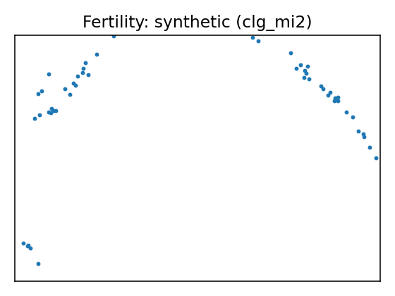
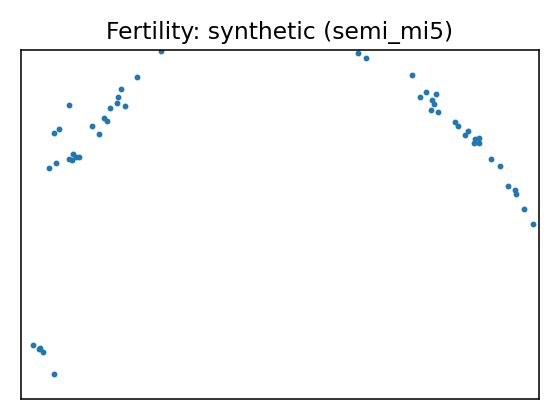
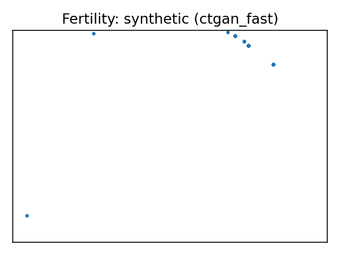
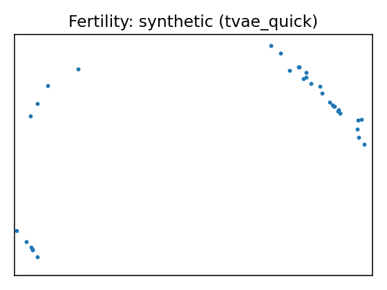
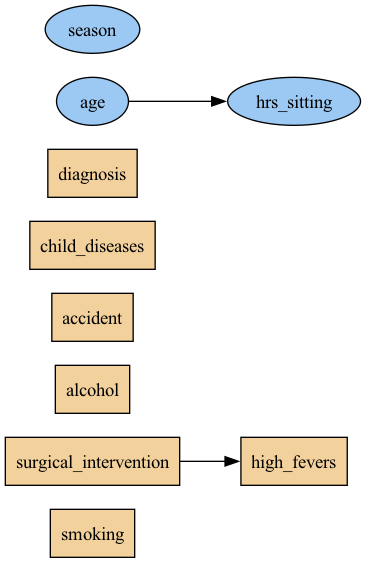

# Data Report — Fertility

**Documentation**: Season in which the analysis was performed. 	1) winter, 2) spring, 3) Summer, 4) fall. 	(-1, -0.33, 0.33, 1) 

Age at the time of analysis. 	18-36 	(0, 1) 

Childish diseases (ie , chicken pox, measles, mumps, polio)	1) yes, 2) no. 	(0, 1) 

Accident or serious trauma 	1) yes, 2) no. 	(0, 1) 

Surgical intervention 	1) yes, 2) no. 	(0, 1) 

High fevers in the last year 	1) less than three months ago, 2) more than three months ago, 3) no. 	(-1, 0, 1) 

Frequency of alcohol consumption 	1) several times a day, 2) every day, 3) several times a week, 4) once a week, 5) hardly ever or never 	(0, 1) 

Smoking habit 	1) never, 2) occasional 3) daily. 	(-1, 0, 1) 

Number of hours spent sitting per day 	ene-16	(0, 1) 

Output: Diagnosis	normal (N), altered (O)	

**Citation**: {'@type': 'schema:ScholarlyArticle', 'title': 'Predicting seminal quality with artificial intelligence methods', 'schema:author': ['David Gil', 'J. L. Girela', 'Joaquin De Juan', 'M. Jose Gomez-Torres', 'Magnus Johnsson'], 'schema:isPartOf': 'Expert systems with applications', 'schema:datePublished': 2012, 'url': 'https://www.semanticscholar.org/paper/Predicting-seminal-quality-with-artificial-methods-Gil-Girela/92759c5ee08b9e6e7b17d1ccd48a7f8c02aba893'}

**Source**: [UCI dataset 244](https://archive.ics.uci.edu/dataset/244)

**SemMap JSON-LD**: [dataset.semmap.json](dataset.semmap.json) · [RDFa HTML](dataset.semmap.html)
## Overview

| Metric      | Value                                                                         |
|:------------|:------------------------------------------------------------------------------|
| Dataset     | Fertility                                                                     |
| Source      | [UCI dataset 244](https://archive.ics.uci.edu/dataset/244)                    |
| Rows        | 100                                                                           |
| Columns     | 10                                                                            |
| Discrete    | 7                                                                             |
| Continuous  | 3                                                                             |
| SemMap      | [SemMap JSON-LD](dataset.semmap.json) [SemMap HTML](dataset.semmap.html) |
| Missingness | Not modeled                                                                   |

## Variables and summary

| variable              | inferred   | dist                                                                                               |
|:----------------------|:-----------|:---------------------------------------------------------------------------------------------------|
| season                | continuous | -0.0789 ± 0.7967 [-1, -1, -0.33, 1, 1]                                                             |
| age                   | continuous | 0.6690 ± 0.1213 [0.5, 0.56, 0.67, 0.75, 1]                                                         |
| child_diseases        | discrete   | 1: 87 (87.00%)                                                                                     |
| accident              | discrete   | 1: 44 (44.00%)                                                                                     |
| surgical_intervention | discrete   | 1: 51 (51.00%)                                                                                     |
| high_fevers           | discrete   | 0: 63 (63.00%) 1: 28 (28.00%) -1: 9 (9.00%)                                              |
| alcohol               | discrete   | 1: 40 (40.00%) 0.8: 39 (39.00%) 0.6: 19 (19.00%) 0.2: 1 (1.00%) 0.4: 1 (1.00%) |
| smoking               | discrete   | -1: 56 (56.00%) 0: 23 (23.00%) 1: 21 (21.00%)                                            |
| hrs_sitting           | continuous | 0.4068 ± 0.1864 [0.06, 0.25, 0.38, 0.5, 1]                                                         |
| diagnosis             | discrete   | N: 88 (88.00%)                                                                                     |

## Fidelity summary

| umap                                                 | model      | backend   |   disc jsd mean |   disc jsd median |   cont ks mean |   cont w1 mean |   downstream sign match |
|:-----------------------------------------------------|:-----------|:----------|----------------:|------------------:|---------------:|---------------:|------------------------:|
|     | metasyn    | metasyn   |          0.058  |            0.0683 |         0.2033 |         0.1181 |                    0.25 |
|     | clg_mi2    | pybnesian |          0.0647 |            0.0362 |         0.1833 |         0.1201 |                         |
|    | semi_mi5   | pybnesian |          0.0647 |            0.0362 |         0.1833 |         0.1201 |                         |
|  | ctgan_fast | synthcity |          0.3398 |            0.3911 |         0.6367 |         0.2003 |                         |
|  | tvae_quick | synthcity |          0.1168 |            0.1052 |         0.2933 |         0.1255 |                         |

## Privacy summary

| model      | backend   |   n real |   n synth |   exact overlap rate |   near duplicate rate eps |   nn distance mean |   k min |   k pct lt5 |   k map |   rare qi reproduction rate | identifiability score   |   delta presence |
|:-----------|:----------|---------:|----------:|---------------------:|--------------------------:|-------------------:|--------:|------------:|--------:|----------------------------:|:------------------------|-----------------:|
| metasyn    | metasyn   |      100 |       100 |                    0 |                      0.21 |             0.4309 |       1 |           1 |       3 |                           0 |                         |           2.6667 |
| clg_mi2    | pybnesian |      100 |       100 |                    0 |                      0.22 |             0.4959 |       1 |           1 |       2 |                           0 |                         |           2.5    |
| semi_mi5   | pybnesian |      100 |       100 |                    0 |                      0.22 |             0.4959 |       1 |           1 |       2 |                           0 |                         |           2.5    |
| ctgan_fast | synthcity |      100 |       100 |                    0 |                      0.12 |             0.3655 |       1 |           1 |       1 |                           0 |                         |          36      |
| tvae_quick | synthcity |      100 |       100 |                    0 |                      0.08 |             0.3762 |       1 |           1 |       1 |                           0 |                         |           7      |

## Models

<table>
<tr><th>UMAP</th><th>Details</th><th>Structure</th></tr>
<tr><td></td><td>
<h3>Real data</h3></td><td></td></tr>
<tr><td></td><td>

<h3>Model: metasyn (metasyn)</h3>
<ul>
<li>Seed: 42, rows: 100</li>
<li> Missingness: wrapped (random state 42) via pipeline</li><li> <a href="models/metasyn/synthetic.csv">Synthetic CSV</a></li>
<li> <a href="models/metasyn/per_variable_metrics.csv">Per-variable metrics</a></li>
<li> <a href="models/metasyn/metrics.json">Metrics JSON</a></li>
<li> <a href="models/metasyn/metrics.privacy.json">Privacy metrics</a></li>
<li> <a href="models/metasyn/metrics.downstream.json">Downstream metrics</a></li>
</ul>

<strong>Per-variable fidelity</strong>

<table class="dataframe">
  <thead>
    <tr style="text-align: right;">
      <th>variable</th>
      <th>type</th>
      <th>KS</th>
      <th>W1</th>
      <th>JSD</th>
    </tr>
  </thead>
  <tbody>
    <tr>
      <td>season</td>
      <td>continuous</td>
      <td>0.31</td>
      <td>0.2876</td>
      <td></td>
    </tr>
    <tr>
      <td>age</td>
      <td>continuous</td>
      <td>0.15</td>
      <td>0.0261</td>
      <td></td>
    </tr>
    <tr>
      <td>child_diseases</td>
      <td>discrete</td>
      <td></td>
      <td></td>
      <td>0.0245</td>
    </tr>
    <tr>
      <td>accident</td>
      <td>discrete</td>
      <td></td>
      <td></td>
      <td>0.0694</td>
    </tr>
    <tr>
      <td>surgical_intervention</td>
      <td>discrete</td>
      <td></td>
      <td></td>
      <td>0.0683</td>
    </tr>
    <tr>
      <td>high_fevers</td>
      <td>discrete</td>
      <td></td>
      <td></td>
      <td>0.069</td>
    </tr>
    <tr>
      <td>alcohol</td>
      <td>discrete</td>
      <td></td>
      <td></td>
      <td>0.0812</td>
    </tr>
    <tr>
      <td>smoking</td>
      <td>discrete</td>
      <td></td>
      <td></td>
      <td>0.0523</td>
    </tr>
    <tr>
      <td>hrs_sitting</td>
      <td>continuous</td>
      <td>0.15</td>
      <td>0.0405</td>
      <td></td>
    </tr>
    <tr>
      <td>diagnosis</td>
      <td>discrete</td>
      <td></td>
      <td></td>
      <td>0.0416</td>
    </tr>
  </tbody>
</table>

<strong>Downstream metrics</strong>

<table class="dataframe">
  <thead>
    <tr style="text-align: right;">
      <th>metric</th>
      <th>value</th>
    </tr>
  </thead>
  <tbody>
    <tr>
      <td>sign_match_rate</td>
      <td>0.25</td>
    </tr>
    <tr>
      <td>formula</td>
      <td>diagnosis ~ Q('season') + Q('age') + Q('child_diseases') + Q('accident') + Q('surgical_intervention') + Q('hrs_sitting') + Q('season'):Q('age') + Q('age'):Q('child_diseases') + Q('child_diseases'):Q('accident') + Q('accident'):Q('surgical_intervention') + Q('surgical_intervention'):Q('hrs_sitting')</td>
    </tr>
    <tr>
      <td>skipped_reason</td>
      <td></td>
    </tr>
  </tbody>
</table>

<strong>Privacy metrics</strong>

<table class="dataframe">
  <thead>
    <tr style="text-align: right;">
      <th>metric</th>
      <th>value</th>
    </tr>
  </thead>
  <tbody>
    <tr>
      <td>n_real</td>
      <td>100</td>
    </tr>
    <tr>
      <td>n_synth</td>
      <td>100</td>
    </tr>
    <tr>
      <td>exact_overlap_rate</td>
      <td>0</td>
    </tr>
    <tr>
      <td>near_duplicate_rate_eps</td>
      <td>0.21</td>
    </tr>
    <tr>
      <td>nn_distance_mean</td>
      <td>0.4309</td>
    </tr>
    <tr>
      <td>k_min</td>
      <td>1</td>
    </tr>
    <tr>
      <td>k_pct_lt5</td>
      <td>1</td>
    </tr>
    <tr>
      <td>k_map</td>
      <td>3</td>
    </tr>
    <tr>
      <td>rare_qi_reproduction_rate</td>
      <td>0</td>
    </tr>
    <tr>
      <td>delta_presence</td>
      <td>2.6667</td>
    </tr>
  </tbody>
</table>

</td><td>
<table class="dataframe">
  <thead>
    <tr style="text-align: right;">
      <th>variable</th>
      <th>distribution</th>
    </tr>
  </thead>
  <tbody>
    <tr>
      <td>season</td>
      <td>core.uniform</td>
    </tr>
    <tr>
      <td>age</td>
      <td>core.truncated_normal</td>
    </tr>
    <tr>
      <td>child_diseases</td>
      <td>core.multinoulli</td>
    </tr>
    <tr>
      <td>accident</td>
      <td>core.multinoulli</td>
    </tr>
    <tr>
      <td>surgical_intervention</td>
      <td>core.multinoulli</td>
    </tr>
    <tr>
      <td>high_fevers</td>
      <td>core.multinoulli</td>
    </tr>
    <tr>
      <td>alcohol</td>
      <td>core.multinoulli</td>
    </tr>
    <tr>
      <td>smoking</td>
      <td>core.multinoulli</td>
    </tr>
    <tr>
      <td>hrs_sitting</td>
      <td>core.normal</td>
    </tr>
    <tr>
      <td>diagnosis</td>
      <td>core.multinoulli</td>
    </tr>
  </tbody>
</table></td></tr>

<tr><td></td><td>

<h3>Model: clg_mi2 (pybnesian)</h3>
<ul>
<li>Seed: 42, rows: 100</li>
<li> Params: <tt>{"max_indegree": 2, "operators": ["arcs"], "score": "bic", "type": "clg"}</tt></li><li> Missingness: wrapped (random state 42) via pipeline</li><li> <a href="models/clg_mi2/synthetic.csv">Synthetic CSV</a></li>
<li> <a href="models/clg_mi2/per_variable_metrics.csv">Per-variable metrics</a></li>
<li> <a href="models/clg_mi2/metrics.json">Metrics JSON</a></li>
<li> <a href="models/clg_mi2/metrics.privacy.json">Privacy metrics</a></li>
</ul>

<strong>Per-variable fidelity</strong>

<table class="dataframe">
  <thead>
    <tr style="text-align: right;">
      <th>variable</th>
      <th>type</th>
      <th>KS</th>
      <th>W1</th>
      <th>JSD</th>
    </tr>
  </thead>
  <tbody>
    <tr>
      <td>season</td>
      <td>continuous</td>
      <td>0.27</td>
      <td>0.3014</td>
      <td></td>
    </tr>
    <tr>
      <td>age</td>
      <td>continuous</td>
      <td>0.15</td>
      <td>0.026</td>
      <td></td>
    </tr>
    <tr>
      <td>child_diseases</td>
      <td>discrete</td>
      <td></td>
      <td></td>
      <td>0.0362</td>
    </tr>
    <tr>
      <td>accident</td>
      <td>discrete</td>
      <td></td>
      <td></td>
      <td>0</td>
    </tr>
    <tr>
      <td>surgical_intervention</td>
      <td>discrete</td>
      <td></td>
      <td></td>
      <td>0.0597</td>
    </tr>
    <tr>
      <td>high_fevers</td>
      <td>discrete</td>
      <td></td>
      <td></td>
      <td>0.0286</td>
    </tr>
    <tr>
      <td>alcohol</td>
      <td>discrete</td>
      <td></td>
      <td></td>
      <td>0.1875</td>
    </tr>
    <tr>
      <td>smoking</td>
      <td>discrete</td>
      <td></td>
      <td></td>
      <td>0.1279</td>
    </tr>
    <tr>
      <td>hrs_sitting</td>
      <td>continuous</td>
      <td>0.13</td>
      <td>0.0329</td>
      <td></td>
    </tr>
    <tr>
      <td>diagnosis</td>
      <td>discrete</td>
      <td></td>
      <td></td>
      <td>0.0133</td>
    </tr>
  </tbody>
</table>

<strong>Privacy metrics</strong>

<table class="dataframe">
  <thead>
    <tr style="text-align: right;">
      <th>metric</th>
      <th>value</th>
    </tr>
  </thead>
  <tbody>
    <tr>
      <td>n_real</td>
      <td>100</td>
    </tr>
    <tr>
      <td>n_synth</td>
      <td>100</td>
    </tr>
    <tr>
      <td>exact_overlap_rate</td>
      <td>0</td>
    </tr>
    <tr>
      <td>near_duplicate_rate_eps</td>
      <td>0.22</td>
    </tr>
    <tr>
      <td>nn_distance_mean</td>
      <td>0.4959</td>
    </tr>
    <tr>
      <td>k_min</td>
      <td>1</td>
    </tr>
    <tr>
      <td>k_pct_lt5</td>
      <td>1</td>
    </tr>
    <tr>
      <td>k_map</td>
      <td>2</td>
    </tr>
    <tr>
      <td>rare_qi_reproduction_rate</td>
      <td>0</td>
    </tr>
    <tr>
      <td>delta_presence</td>
      <td>2.5</td>
    </tr>
  </tbody>
</table>

</td><td>
</td></tr>

<tr><td></td><td>

<h3>Model: semi_mi5 (pybnesian)</h3>
<ul>
<li>Seed: 42, rows: 100</li>
<li> Params: <tt>{"max_indegree": 5, "operators": ["arcs"], "score": "bic", "type": "semiparametric"}</tt></li><li> Missingness: wrapped (random state 42) via pipeline</li><li> <a href="models/semi_mi5/synthetic.csv">Synthetic CSV</a></li>
<li> <a href="models/semi_mi5/per_variable_metrics.csv">Per-variable metrics</a></li>
<li> <a href="models/semi_mi5/metrics.json">Metrics JSON</a></li>
<li> <a href="models/semi_mi5/metrics.privacy.json">Privacy metrics</a></li>
</ul>

<strong>Per-variable fidelity</strong>

<table class="dataframe">
  <thead>
    <tr style="text-align: right;">
      <th>variable</th>
      <th>type</th>
      <th>KS</th>
      <th>W1</th>
      <th>JSD</th>
    </tr>
  </thead>
  <tbody>
    <tr>
      <td>season</td>
      <td>continuous</td>
      <td>0.27</td>
      <td>0.3014</td>
      <td></td>
    </tr>
    <tr>
      <td>age</td>
      <td>continuous</td>
      <td>0.15</td>
      <td>0.026</td>
      <td></td>
    </tr>
    <tr>
      <td>child_diseases</td>
      <td>discrete</td>
      <td></td>
      <td></td>
      <td>0.0362</td>
    </tr>
    <tr>
      <td>accident</td>
      <td>discrete</td>
      <td></td>
      <td></td>
      <td>0</td>
    </tr>
    <tr>
      <td>surgical_intervention</td>
      <td>discrete</td>
      <td></td>
      <td></td>
      <td>0.0597</td>
    </tr>
    <tr>
      <td>high_fevers</td>
      <td>discrete</td>
      <td></td>
      <td></td>
      <td>0.0286</td>
    </tr>
    <tr>
      <td>alcohol</td>
      <td>discrete</td>
      <td></td>
      <td></td>
      <td>0.1875</td>
    </tr>
    <tr>
      <td>smoking</td>
      <td>discrete</td>
      <td></td>
      <td></td>
      <td>0.1279</td>
    </tr>
    <tr>
      <td>hrs_sitting</td>
      <td>continuous</td>
      <td>0.13</td>
      <td>0.0329</td>
      <td></td>
    </tr>
    <tr>
      <td>diagnosis</td>
      <td>discrete</td>
      <td></td>
      <td></td>
      <td>0.0133</td>
    </tr>
  </tbody>
</table>

<strong>Privacy metrics</strong>

<table class="dataframe">
  <thead>
    <tr style="text-align: right;">
      <th>metric</th>
      <th>value</th>
    </tr>
  </thead>
  <tbody>
    <tr>
      <td>n_real</td>
      <td>100</td>
    </tr>
    <tr>
      <td>n_synth</td>
      <td>100</td>
    </tr>
    <tr>
      <td>exact_overlap_rate</td>
      <td>0</td>
    </tr>
    <tr>
      <td>near_duplicate_rate_eps</td>
      <td>0.22</td>
    </tr>
    <tr>
      <td>nn_distance_mean</td>
      <td>0.4959</td>
    </tr>
    <tr>
      <td>k_min</td>
      <td>1</td>
    </tr>
    <tr>
      <td>k_pct_lt5</td>
      <td>1</td>
    </tr>
    <tr>
      <td>k_map</td>
      <td>2</td>
    </tr>
    <tr>
      <td>rare_qi_reproduction_rate</td>
      <td>0</td>
    </tr>
    <tr>
      <td>delta_presence</td>
      <td>2.5</td>
    </tr>
  </tbody>
</table>

</td><td>
</td></tr>

<tr><td></td><td>

<h3>Model: ctgan_fast (synthcity)</h3>
<ul>
<li>Seed: 42, rows: 100</li>
<li> Params: <tt>{"batch_size": 256, "n_iter": 5}</tt></li><li> Missingness: wrapped (random state 42) via pipeline</li><li> <a href="models/ctgan_fast/synthetic.csv">Synthetic CSV</a></li>
<li> <a href="models/ctgan_fast/per_variable_metrics.csv">Per-variable metrics</a></li>
<li> <a href="models/ctgan_fast/metrics.json">Metrics JSON</a></li>
<li> <a href="models/ctgan_fast/metrics.privacy.json">Privacy metrics</a></li>
</ul>

<strong>Per-variable fidelity</strong>

<table class="dataframe">
  <thead>
    <tr style="text-align: right;">
      <th>variable</th>
      <th>type</th>
      <th>KS</th>
      <th>W1</th>
      <th>JSD</th>
    </tr>
  </thead>
  <tbody>
    <tr>
      <td>season</td>
      <td>continuous</td>
      <td>0.12</td>
      <td>0.1127</td>
      <td></td>
    </tr>
    <tr>
      <td>age</td>
      <td>continuous</td>
      <td>0.93</td>
      <td>0.169</td>
      <td></td>
    </tr>
    <tr>
      <td>child_diseases</td>
      <td>discrete</td>
      <td></td>
      <td></td>
      <td>0.1621</td>
    </tr>
    <tr>
      <td>accident</td>
      <td>discrete</td>
      <td></td>
      <td></td>
      <td>0.4065</td>
    </tr>
    <tr>
      <td>surgical_intervention</td>
      <td>discrete</td>
      <td></td>
      <td></td>
      <td>0.3911</td>
    </tr>
    <tr>
      <td>high_fevers</td>
      <td>discrete</td>
      <td></td>
      <td></td>
      <td>0.4932</td>
    </tr>
    <tr>
      <td>alcohol</td>
      <td>discrete</td>
      <td></td>
      <td></td>
      <td>0.266</td>
    </tr>
    <tr>
      <td>smoking</td>
      <td>discrete</td>
      <td></td>
      <td></td>
      <td>0.4694</td>
    </tr>
    <tr>
      <td>hrs_sitting</td>
      <td>continuous</td>
      <td>0.86</td>
      <td>0.3192</td>
      <td></td>
    </tr>
    <tr>
      <td>diagnosis</td>
      <td>discrete</td>
      <td></td>
      <td></td>
      <td>0.1901</td>
    </tr>
  </tbody>
</table>

<strong>Privacy metrics</strong>

<table class="dataframe">
  <thead>
    <tr style="text-align: right;">
      <th>metric</th>
      <th>value</th>
    </tr>
  </thead>
  <tbody>
    <tr>
      <td>n_real</td>
      <td>100</td>
    </tr>
    <tr>
      <td>n_synth</td>
      <td>100</td>
    </tr>
    <tr>
      <td>exact_overlap_rate</td>
      <td>0</td>
    </tr>
    <tr>
      <td>near_duplicate_rate_eps</td>
      <td>0.12</td>
    </tr>
    <tr>
      <td>nn_distance_mean</td>
      <td>0.3655</td>
    </tr>
    <tr>
      <td>k_min</td>
      <td>1</td>
    </tr>
    <tr>
      <td>k_pct_lt5</td>
      <td>1</td>
    </tr>
    <tr>
      <td>k_map</td>
      <td>1</td>
    </tr>
    <tr>
      <td>rare_qi_reproduction_rate</td>
      <td>0</td>
    </tr>
    <tr>
      <td>delta_presence</td>
      <td>36</td>
    </tr>
  </tbody>
</table>

</td><td>
</td></tr>

<tr><td></td><td>

<h3>Model: tvae_quick (synthcity)</h3>
<ul>
<li>Seed: 42, rows: 100</li>
<li> Params: <tt>{"batch_size": 256}</tt></li><li> Missingness: wrapped (random state 42) via pipeline</li><li> <a href="models/tvae_quick/synthetic.csv">Synthetic CSV</a></li>
<li> <a href="models/tvae_quick/per_variable_metrics.csv">Per-variable metrics</a></li>
<li> <a href="models/tvae_quick/metrics.json">Metrics JSON</a></li>
<li> <a href="models/tvae_quick/metrics.privacy.json">Privacy metrics</a></li>
</ul>

<strong>Per-variable fidelity</strong>

<table class="dataframe">
  <thead>
    <tr style="text-align: right;">
      <th>variable</th>
      <th>type</th>
      <th>KS</th>
      <th>W1</th>
      <th>JSD</th>
    </tr>
  </thead>
  <tbody>
    <tr>
      <td>season</td>
      <td>continuous</td>
      <td>0.21</td>
      <td>0.2272</td>
      <td></td>
    </tr>
    <tr>
      <td>age</td>
      <td>continuous</td>
      <td>0.29</td>
      <td>0.0491</td>
      <td></td>
    </tr>
    <tr>
      <td>child_diseases</td>
      <td>discrete</td>
      <td></td>
      <td></td>
      <td>0.1867</td>
    </tr>
    <tr>
      <td>accident</td>
      <td>discrete</td>
      <td></td>
      <td></td>
      <td>0.1052</td>
    </tr>
    <tr>
      <td>surgical_intervention</td>
      <td>discrete</td>
      <td></td>
      <td></td>
      <td>0.0856</td>
    </tr>
    <tr>
      <td>high_fevers</td>
      <td>discrete</td>
      <td></td>
      <td></td>
      <td>0.1405</td>
    </tr>
    <tr>
      <td>alcohol</td>
      <td>discrete</td>
      <td></td>
      <td></td>
      <td>0.138</td>
    </tr>
    <tr>
      <td>smoking</td>
      <td>discrete</td>
      <td></td>
      <td></td>
      <td>0.072</td>
    </tr>
    <tr>
      <td>hrs_sitting</td>
      <td>continuous</td>
      <td>0.38</td>
      <td>0.1002</td>
      <td></td>
    </tr>
    <tr>
      <td>diagnosis</td>
      <td>discrete</td>
      <td></td>
      <td></td>
      <td>0.0898</td>
    </tr>
  </tbody>
</table>

<strong>Privacy metrics</strong>

<table class="dataframe">
  <thead>
    <tr style="text-align: right;">
      <th>metric</th>
      <th>value</th>
    </tr>
  </thead>
  <tbody>
    <tr>
      <td>n_real</td>
      <td>100</td>
    </tr>
    <tr>
      <td>n_synth</td>
      <td>100</td>
    </tr>
    <tr>
      <td>exact_overlap_rate</td>
      <td>0</td>
    </tr>
    <tr>
      <td>near_duplicate_rate_eps</td>
      <td>0.08</td>
    </tr>
    <tr>
      <td>nn_distance_mean</td>
      <td>0.3762</td>
    </tr>
    <tr>
      <td>k_min</td>
      <td>1</td>
    </tr>
    <tr>
      <td>k_pct_lt5</td>
      <td>1</td>
    </tr>
    <tr>
      <td>k_map</td>
      <td>1</td>
    </tr>
    <tr>
      <td>rare_qi_reproduction_rate</td>
      <td>0</td>
    </tr>
    <tr>
      <td>delta_presence</td>
      <td>7</td>
    </tr>
  </tbody>
</table>

</td><td>
</td></tr>

</table>