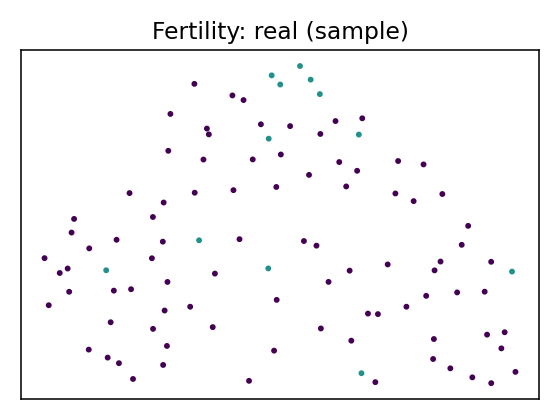
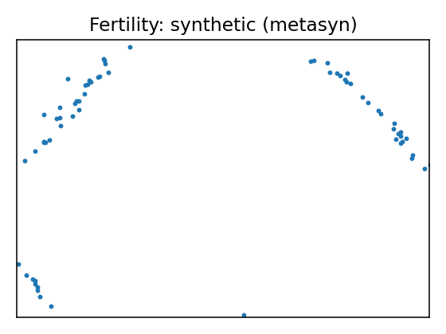

# Data Report — Fertility

**Documentation**: Season in which the analysis was performed. 	1) winter, 2) spring, 3) Summer, 4) fall. 	(-1, -0.33, 0.33, 1) 

Age at the time of analysis. 	18-36 	(0, 1) 

Childish diseases (ie , chicken pox, measles, mumps, polio)	1) yes, 2) no. 	(0, 1) 

Accident or serious trauma 	1) yes, 2) no. 	(0, 1) 

Surgical intervention 	1) yes, 2) no. 	(0, 1) 

High fevers in the last year 	1) less than three months ago, 2) more than three months ago, 3) no. 	(-1, 0, 1) 

Frequency of alcohol consumption 	1) several times a day, 2) every day, 3) several times a week, 4) once a week, 5) hardly ever or never 	(0, 1) 

Smoking habit 	1) never, 2) occasional 3) daily. 	(-1, 0, 1) 

Number of hours spent sitting per day 	ene-16	(0, 1) 

Output: Diagnosis	normal (N), altered (O)	

**Citation**: {'@type': 'schema:ScholarlyArticle', 'title': 'Predicting seminal quality with artificial intelligence methods', 'schema:author': ['David Gil', 'J. L. Girela', 'Joaquin De Juan', 'M. Jose Gomez-Torres', 'Magnus Johnsson'], 'schema:isPartOf': 'Expert systems with applications', 'schema:datePublished': 2012, 'url': 'https://www.semanticscholar.org/paper/Predicting-seminal-quality-with-artificial-methods-Gil-Girela/92759c5ee08b9e6e7b17d1ccd48a7f8c02aba893'}

**Source**: [UCI dataset 244](https://archive.ics.uci.edu/dataset/244)

**SemMap JSON-LD**: [dataset.semmap.json](dataset.semmap.json) · [RDFa HTML](dataset.semmap.html)
## Overview

| Metric      | Value                                                                         |
|:------------|:------------------------------------------------------------------------------|
| Dataset     | Fertility                                                                     |
| Source      | [UCI dataset 244](https://archive.ics.uci.edu/dataset/244)                    |
| Rows        | 100                                                                           |
| Columns     | 10                                                                            |
| Discrete    | 7                                                                             |
| Continuous  | 3                                                                             |
| SemMap      | [SemMap JSON-LD](dataset.semmap.json) [SemMap HTML](dataset.semmap.html) |
| Missingness | Not modeled                                                                   |

## Variables and summary

| variable              | inferred   | dist                                                                                               |
|:----------------------|:-----------|:---------------------------------------------------------------------------------------------------|
| season                | continuous | -0.0789 ± 0.7967 [-1, -1, -0.33, 1, 1]                                                             |
| age                   | continuous | 0.6690 ± 0.1213 [0.5, 0.56, 0.67, 0.75, 1]                                                         |
| child_diseases        | discrete   | 1: 87 (87.00%)                                                                                     |
| accident              | discrete   | 1: 44 (44.00%)                                                                                     |
| surgical_intervention | discrete   | 1: 51 (51.00%)                                                                                     |
| high_fevers           | discrete   | 0: 63 (63.00%) 1: 28 (28.00%) -1: 9 (9.00%)                                              |
| alcohol               | discrete   | 1: 40 (40.00%) 0.8: 39 (39.00%) 0.6: 19 (19.00%) 0.2: 1 (1.00%) 0.4: 1 (1.00%) |
| smoking               | discrete   | -1: 56 (56.00%) 0: 23 (23.00%) 1: 21 (21.00%)                                            |
| hrs_sitting           | continuous | 0.4068 ± 0.1864 [0.06, 0.25, 0.38, 0.5, 1]                                                         |
| diagnosis             | discrete   | N: 88 (88.00%)                                                                                     |

## Fidelity summary

| model   | backend   |   disc jsd mean |   disc jsd median |   cont ks mean |   cont w1 mean |   downstream sign match |
|:--------|:----------|----------------:|------------------:|---------------:|---------------:|------------------------:|
| metasyn | metasyn   |          0.1865 |            0.2097 |         0.2267 |         0.1334 |                    0.25 |

## Privacy summary

| model   | backend   |   n real |   n synth |   exact overlap rate |   near duplicate rate eps |   nn distance mean |   k min |   k pct lt5 |   k map |   rare qi reproduction rate | identifiability score   |   delta presence |
|:--------|:----------|---------:|----------:|---------------------:|--------------------------:|-------------------:|--------:|------------:|--------:|----------------------------:|:------------------------|-----------------:|
| metasyn | metasyn   |      100 |       100 |                    0 |                      0.24 |             0.4892 |       1 |           1 |       3 |                           0 |                         |                2 |

## Models

<table>
<tr><th>UMAP</th><th>Details</th><th>Structure</th></tr>
<tr><td></td><td>
<h3>Real data</h3></td><td></td></tr>
<tr><td></td><td>

<h3>Model: metasyn (metasyn)</h3>
<ul>
<li>Seed: 42, rows: 100</li>
<li> <a href="models/metasyn/synthetic.csv">Synthetic CSV</a></li>
<li> <a href="models/metasyn/per_variable_metrics.csv">Per-variable metrics</a></li>
<li> <a href="models/metasyn/metrics.json">Metrics JSON</a></li>
<li> <a href="models/metasyn/metrics.privacy.json">Privacy metrics</a></li>
<li> <a href="models/metasyn/metrics.downstream.json">Downstream metrics</a></li>
</ul>

<strong>Per-variable fidelity</strong>

<table class="dataframe">
  <thead>
    <tr style="text-align: right;">
      <th>variable</th>
      <th>type</th>
      <th>KS</th>
      <th>W1</th>
      <th>JSD</th>
    </tr>
  </thead>
  <tbody>
    <tr>
      <td>season</td>
      <td>continuous</td>
      <td>0.35</td>
      <td>0.3312</td>
      <td></td>
    </tr>
    <tr>
      <td>age</td>
      <td>continuous</td>
      <td>0.16</td>
      <td>0.0209</td>
      <td></td>
    </tr>
    <tr>
      <td>child_diseases</td>
      <td>discrete</td>
      <td></td>
      <td></td>
      <td>0.1985</td>
    </tr>
    <tr>
      <td>accident</td>
      <td>discrete</td>
      <td></td>
      <td></td>
      <td>0.3357</td>
    </tr>
    <tr>
      <td>surgical_intervention</td>
      <td>discrete</td>
      <td></td>
      <td></td>
      <td>0.0596</td>
    </tr>
    <tr>
      <td>high_fevers</td>
      <td>discrete</td>
      <td></td>
      <td></td>
      <td>0.2174</td>
    </tr>
    <tr>
      <td>alcohol</td>
      <td>discrete</td>
      <td></td>
      <td></td>
      <td>0.2704</td>
    </tr>
    <tr>
      <td>smoking</td>
      <td>discrete</td>
      <td></td>
      <td></td>
      <td>0.2097</td>
    </tr>
    <tr>
      <td>hrs_sitting</td>
      <td>continuous</td>
      <td>0.17</td>
      <td>0.048</td>
      <td></td>
    </tr>
    <tr>
      <td>diagnosis</td>
      <td>discrete</td>
      <td></td>
      <td></td>
      <td>0.0139</td>
    </tr>
  </tbody>
</table>

<strong>Downstream metrics</strong>

<table class="dataframe">
  <thead>
    <tr style="text-align: right;">
      <th>metric</th>
      <th>value</th>
    </tr>
  </thead>
  <tbody>
    <tr>
      <td>sign_match_rate</td>
      <td>0.25</td>
    </tr>
    <tr>
      <td>formula</td>
      <td>diagnosis ~ Q('season') + Q('age') + Q('child_diseases') + Q('accident') + Q('surgical_intervention') + Q('hrs_sitting') + Q('season'):Q('age') + Q('age'):Q('child_diseases') + Q('child_diseases'):Q('accident') + Q('accident'):Q('surgical_intervention') + Q('surgical_intervention'):Q('hrs_sitting')</td>
    </tr>
    <tr>
      <td>skipped_reason</td>
      <td></td>
    </tr>
  </tbody>
</table>

<strong>Privacy metrics</strong>

<table class="dataframe">
  <thead>
    <tr style="text-align: right;">
      <th>metric</th>
      <th>value</th>
    </tr>
  </thead>
  <tbody>
    <tr>
      <td>n_real</td>
      <td>100</td>
    </tr>
    <tr>
      <td>n_synth</td>
      <td>100</td>
    </tr>
    <tr>
      <td>exact_overlap_rate</td>
      <td>0</td>
    </tr>
    <tr>
      <td>near_duplicate_rate_eps</td>
      <td>0.24</td>
    </tr>
    <tr>
      <td>nn_distance_mean</td>
      <td>0.4892</td>
    </tr>
    <tr>
      <td>k_min</td>
      <td>1</td>
    </tr>
    <tr>
      <td>k_pct_lt5</td>
      <td>1</td>
    </tr>
    <tr>
      <td>k_map</td>
      <td>3</td>
    </tr>
    <tr>
      <td>rare_qi_reproduction_rate</td>
      <td>0</td>
    </tr>
    <tr>
      <td>delta_presence</td>
      <td>2</td>
    </tr>
  </tbody>
</table>

</td><td>
<table class="dataframe">
  <thead>
    <tr style="text-align: right;">
      <th>variable</th>
      <th>distribution</th>
    </tr>
  </thead>
  <tbody>
    <tr>
      <td>season</td>
      <td>core.uniform</td>
    </tr>
    <tr>
      <td>age</td>
      <td>core.truncated_normal</td>
    </tr>
    <tr>
      <td>child_diseases</td>
      <td>core.multinoulli</td>
    </tr>
    <tr>
      <td>accident</td>
      <td>core.multinoulli</td>
    </tr>
    <tr>
      <td>surgical_intervention</td>
      <td>core.multinoulli</td>
    </tr>
    <tr>
      <td>high_fevers</td>
      <td>core.multinoulli</td>
    </tr>
    <tr>
      <td>alcohol</td>
      <td>core.multinoulli</td>
    </tr>
    <tr>
      <td>smoking</td>
      <td>core.multinoulli</td>
    </tr>
    <tr>
      <td>hrs_sitting</td>
      <td>core.normal</td>
    </tr>
    <tr>
      <td>diagnosis</td>
      <td>core.multinoulli</td>
    </tr>
  </tbody>
</table></td></tr>

</table>