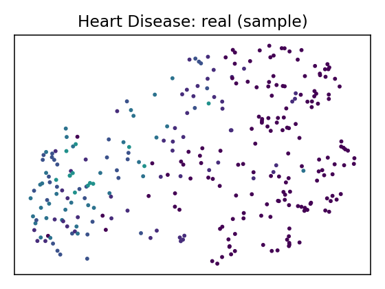

# Data Report — Heart Disease

**Source**: [UCI dataset 45](https://archive.ics.uci.edu/dataset/45)

**SemMap JSON-LD**: [dataset.semmap.json](dataset.semmap.json) · [RDFa HTML](dataset.semmap.html)
## Overview

| Metric      | Value                                                                         |
|:------------|:------------------------------------------------------------------------------|
| Dataset     | Heart Disease                                                                 |
| Source      | [UCI dataset 45](https://archive.ics.uci.edu/dataset/45)                      |
| Rows        | 297                                                                           |
| Columns     | 14                                                                            |
| Discrete    | 12                                                                            |
| Continuous  | 2                                                                             |
| SemMap      | [SemMap JSON-LD](dataset.semmap.json) [SemMap HTML](dataset.semmap.html) |
| Missingness | Not modeled                                                                   |

## Variables and summary

| variable   | inferred   | dist                                                                                                                                                                                                                             |
|:-----------|:-----------|:---------------------------------------------------------------------------------------------------------------------------------------------------------------------------------------------------------------------------------|
| age        | discrete   | 58: 18 (6.06%) 57: 17 (5.72%) 54: 16 (5.39%) 59: 14 (4.71%) 51: 12 (4.04%) 60: 12 (4.04%) 44: 11 (3.70%) 52: 11 (3.70%) 56: 11 (3.70%) 62: 11 (3.70%) … (+31 more)             |
| sex        | discrete   | 1: 201 (67.68%)                                                                                                                                                                                                                  |
| cp         | discrete   | 4: 142 (47.81%) 3: 83 (27.95%) 2: 49 (16.50%) 1: 23 (7.74%)                                                                                                                                                       |
| trestbps   | discrete   | 120: 37 (12.46%) 130: 36 (12.12%) 140: 32 (10.77%) 110: 19 (6.40%) 150: 17 (5.72%) 160: 11 (3.70%) 125: 10 (3.37%) 128: 10 (3.37%) 138: 10 (3.37%) 112: 9 (3.03%) … (+40 more) |
| chol       | discrete   | 197: 6 (2.02%) 234: 6 (2.02%) 204: 5 (1.68%) 212: 5 (1.68%) 254: 5 (1.68%) 269: 5 (1.68%) 177: 4 (1.35%) 211: 4 (1.35%) 226: 4 (1.35%) 233: 4 (1.35%) … (+142 more)            |
| fbs        | discrete   | 1: 43 (14.48%)                                                                                                                                                                                                                   |
| restecg    | discrete   | 0: 147 (49.49%) 2: 146 (49.16%) 1: 4 (1.35%)                                                                                                                                                                           |
| thalach    | continuous | 149.5993 ± 22.9416 [71, 133, 153, 166, 202]                                                                                                                                                                                      |
| exang      | discrete   | 1: 97 (32.66%)                                                                                                                                                                                                                   |
| oldpeak    | continuous | 1.0556 ± 1.1661 [0, 0, 0.8, 1.6, 6.2]                                                                                                                                                                                            |
| slope      | discrete   | 1: 139 (46.80%) 2: 137 (46.13%) 3: 21 (7.07%)                                                                                                                                                                          |
| ca         | discrete   | 0: 174 (58.59%) 1: 65 (21.89%) 2: 38 (12.79%) 3: 20 (6.73%)                                                                                                                                                       |
| thal       | discrete   | 3: 164 (55.22%) 7: 115 (38.72%) 6: 18 (6.06%)                                                                                                                                                                          |
| num        | discrete   | 0: 160 (53.87%) 1: 54 (18.18%) 2: 35 (11.78%) 3: 35 (11.78%) 4: 13 (4.38%)                                                                                                                                   |

## Fidelity summary

| model      | backend   |   disc_jsd_mean |   disc_jsd_median |   cont_ks_mean |   cont_w1_mean | privacy_overlap   | downstream_sign_match   |
|:-----------|:----------|----------------:|------------------:|---------------:|---------------:|:------------------|:------------------------|
| metasyn    | metasyn   |          0.2168 |            0.1116 |         0.2319 |         2.324  |                   |                         |
| clg_mi2    | pybnesian |          0.094  |            0.1012 |         0.169  |         4.5617 |                   |                         |
| semi_mi5   | pybnesian |          0.094  |            0.1012 |         0.169  |         4.5617 |                   |                         |
| ctgan_fast | synthcity |          0.4269 |            0.4085 |         0.686  |        30.8935 |                   |                         |
| tvae_quick | synthcity |          0.1021 |            0.1128 |         0.2007 |         6.072  |                   |                         |

## Models

<table>
<tr><th>UMAP</th><th>Details</th><th>Structure</th></tr>
<tr><td></td><td>
<h3>Real data</h3></td><td></td></tr>
<tr><td></td><td>

<h3>Model: metasyn (metasyn)</h3>
<ul>
<li>Seed: 42, rows: 303</li>
<li> <a href="models/metasyn/synthetic.csv">Synthetic CSV</a></li>
<li> <a href="models/metasyn/per_variable_metrics.csv">Per-variable metrics</a></li>
<li> <a href="models/metasyn/metrics.json">Metrics JSON</a></li>
<li> <a href="models/metasyn/metrics.downstream.json">Downstream metrics</a></li>
</ul>

</td><td>
</td></tr>

<tr><td></td><td>

<h3>Model: clg_mi2 (pybnesian)</h3>
<ul>
<li>Seed: 42, rows: 303</li>
<li> Params: <tt>{"max_indegree": 2, "operators": ["arcs"], "score": "bic", "type": "clg"}</tt></li><li> <a href="models/clg_mi2/synthetic.csv">Synthetic CSV</a></li>
<li> <a href="models/clg_mi2/per_variable_metrics.csv">Per-variable metrics</a></li>
<li> <a href="models/clg_mi2/metrics.json">Metrics JSON</a></li>
</ul>

</td><td>
</td></tr>

<tr><td></td><td>

<h3>Model: semi_mi5 (pybnesian)</h3>
<ul>
<li>Seed: 42, rows: 303</li>
<li> Params: <tt>{"max_indegree": 5, "operators": ["arcs"], "score": "bic", "type": "semiparametric"}</tt></li><li> <a href="models/semi_mi5/synthetic.csv">Synthetic CSV</a></li>
<li> <a href="models/semi_mi5/per_variable_metrics.csv">Per-variable metrics</a></li>
<li> <a href="models/semi_mi5/metrics.json">Metrics JSON</a></li>
</ul>

</td><td>
</td></tr>

<tr><td></td><td>

<h3>Model: ctgan_fast (synthcity)</h3>
<ul>
<li>Seed: 42, rows: 1000</li>
<li> Params: <tt>{"batch_size": 256, "n_iter": 5}</tt></li><li> <a href="models/ctgan_fast/synthetic.csv">Synthetic CSV</a></li>
<li> <a href="models/ctgan_fast/per_variable_metrics.csv">Per-variable metrics</a></li>
<li> <a href="models/ctgan_fast/metrics.json">Metrics JSON</a></li>
</ul>

</td><td>
</td></tr>

<tr><td></td><td>

<h3>Model: tvae_quick (synthcity)</h3>
<ul>
<li>Seed: 42, rows: 1000</li>
<li> Params: <tt>{"batch_size": 256}</tt></li><li> <a href="models/tvae_quick/synthetic.csv">Synthetic CSV</a></li>
<li> <a href="models/tvae_quick/per_variable_metrics.csv">Per-variable metrics</a></li>
<li> <a href="models/tvae_quick/metrics.json">Metrics JSON</a></li>
</ul>

</td><td>
</td></tr>

</table>
