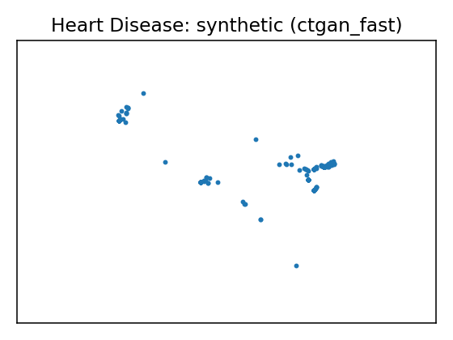
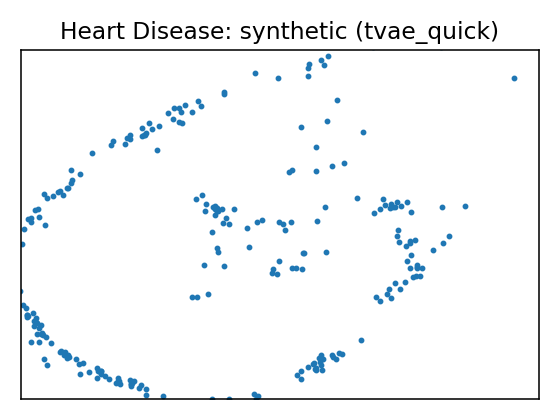

# Data Report — Heart Disease (UCI id 45)

4 databases: Cleveland, Hungary, Switzerland, and the VA Long Beach

**Source**: [UCI dataset 45](https://archive.ics.uci.edu/dataset/45)

**SemMap JSON-LD**: [dataset.semmap.json](dataset.semmap.json) · [RDFa HTML](dataset.semmap.html)
## Overview

| Metric      | Value                                                                         |
|:------------|:------------------------------------------------------------------------------|
| Dataset     | Heart Disease (UCI id 45)                                                     |
| Source      | [UCI dataset 45](https://archive.ics.uci.edu/dataset/45)                      |
| Rows        | 297                                                                           |
| Columns     | 14                                                                            |
| Discrete    | 9                                                                             |
| Continuous  | 5                                                                             |
| SemMap      | [SemMap JSON-LD](dataset.semmap.json) [SemMap HTML](dataset.semmap.html) |
| Missingness | Not modeled                                                                   |

## Variables and summary

| variable   | inferred   | dist                                                                                                                                                  |
|:-----------|:-----------|:------------------------------------------------------------------------------------------------------------------------------------------------------|
| age        | continuous | 54.5421 ± 9.0497 [29, 48, 56, 61, 77]                                                                                                                 |
| sex        | discrete   | male [1]: 201 (67.68%)                                                                                                                                |
| cp         | discrete   | Asymptomatic [4]: 142 (47.81%) Non-cardiac chest pain [3]: 83 (27.95%) Atypical angina [2]: 49 (16.50%) Typical angina [1]: 23 (7.74%) |
| trestbps   | continuous | 131.6936 ± 17.7628 [94, 120, 130, 140, 200]                                                                                                           |
| chol       | continuous | 247.3502 ± 51.9976 [126, 211, 243, 276, 564]                                                                                                          |
| fbs        | discrete   | >120 mg/dL [1]: 43 (14.48%)                                                                                                                           |
| restecg    | discrete   | normal [0]: 147 (49.49%) LVH (Estes) [2]: 146 (49.16%) ST-T abnormality [1]: 4 (1.35%)                                                      |
| thalach    | continuous | 149.5993 ± 22.9416 [71, 133, 153, 166, 202]                                                                                                           |
| exang      | discrete   | yes [1]: 97 (32.66%)                                                                                                                                  |
| oldpeak    | continuous | 1.0556 ± 1.1661 [0, 0, 0.8, 1.6, 6.2]                                                                                                                 |
| slope      | discrete   | upsloping [1]: 139 (46.80%) flat [2]: 137 (46.13%) downsloping [3]: 21 (7.07%)                                                              |
| ca         | discrete   | 0: 174 (58.59%) 1: 65 (21.89%) 2: 38 (12.79%) 3: 20 (6.73%)                                                                            |
| thal       | discrete   | normal [3]: 164 (55.22%) reversible defect [7]: 115 (38.72%) fixed defect [6]: 18 (6.06%)                                                   |
| num        | discrete   | <50% narrowing [0]: 160 (53.87%) ≥50% narrowing [1]: 54 (18.18%) 2: 35 (11.78%) 3: 35 (11.78%) 4: 13 (4.38%)                      |

## Fidelity summary

| umap                                                 | model      | backend   |   disc jsd mean |   disc jsd median |   cont ks mean |   cont w1 mean |   downstream sign match |
|:-----------------------------------------------------|:-----------|:----------|----------------:|------------------:|---------------:|---------------:|------------------------:|
|     | metasyn    | metasyn   |          0.1149 |            0.1208 |         0.1683 |         3.5644 |                  0.6316 |
|     | clg_mi2    | pybnesian |          0.1002 |            0.0941 |         0.1604 |         4.7232 |                         |
|    | semi_mi5   | pybnesian |          0.1002 |            0.0941 |         0.1604 |         4.7232 |                         |
|  | ctgan_fast | synthcity |          0.4027 |            0.3651 |         0.8823 |        43.3414 |                         |
|  | tvae_quick | synthcity |          0.1058 |            0.1173 |         0.2518 |         8.402  |                         |

## Privacy summary

| model      | backend   |   n real |   n synth |   exact overlap rate |   near duplicate rate eps |   nn distance mean |   k min |   k pct lt5 |   k map |   rare qi reproduction rate | identifiability score   |   delta presence |
|:-----------|:----------|---------:|----------:|---------------------:|--------------------------:|-------------------:|--------:|------------:|--------:|----------------------------:|:------------------------|-----------------:|
| metasyn    | metasyn   |      297 |       303 |                    0 |                    0.9966 |             0.0587 |       1 |           1 |       2 |                           0 |                         |             2    |
| clg_mi2    | pybnesian |      297 |       303 |                    0 |                    0.9865 |             0.0658 |       1 |           1 |       8 |                           0 |                         |             2.75 |
| semi_mi5   | pybnesian |      297 |       303 |                    0 |                    0.9865 |             0.0658 |       1 |           1 |       8 |                           0 |                         |             2.75 |
| ctgan_fast | synthcity |      297 |       256 |                    0 |                    0.1719 |             0.3699 |       1 |           1 |       5 |                           0 |                         |             2.2  |
| tvae_quick | synthcity |      297 |       256 |                    0 |                    0.6641 |             0.1902 |       1 |           1 |       1 |                           0 |                         |            17    |

## Models

<table>
<tr><th>UMAP</th><th>Details</th><th>Structure</th></tr>
<tr><td></td><td>
<h3>Real data</h3></td><td></td></tr>
<tr><td></td><td>

<h3>Model: metasyn (metasyn)</h3>
<ul>
<li>Seed: 42, rows: 303</li>
<li> <a href="models/metasyn/synthetic.csv">Synthetic CSV</a></li>
<li> <a href="models/metasyn/per_variable_metrics.csv">Per-variable metrics</a></li>
<li> <a href="models/metasyn/metrics.json">Metrics JSON</a></li>
<li> <a href="models/metasyn/metrics.privacy.json">Privacy metrics</a></li>
<li> <a href="models/metasyn/metrics.downstream.json">Downstream metrics</a></li>
</ul>

<strong>Per-variable fidelity</strong>

<table class="dataframe">
  <thead>
    <tr style="text-align: right;">
      <th>variable</th>
      <th>type</th>
      <th>KS</th>
      <th>W1</th>
      <th>JSD</th>
    </tr>
  </thead>
  <tbody>
    <tr>
      <td>age</td>
      <td>continuous</td>
      <td>0.0977</td>
      <td>1.2657</td>
      <td></td>
    </tr>
    <tr>
      <td>sex</td>
      <td>discrete</td>
      <td></td>
      <td></td>
      <td>0.1062</td>
    </tr>
    <tr>
      <td>cp</td>
      <td>discrete</td>
      <td></td>
      <td></td>
      <td>0.1343</td>
    </tr>
    <tr>
      <td>trestbps</td>
      <td>continuous</td>
      <td>0.1777</td>
      <td>3.7632</td>
      <td></td>
    </tr>
    <tr>
      <td>chol</td>
      <td>continuous</td>
      <td>0.0891</td>
      <td>6.297</td>
      <td></td>
    </tr>
    <tr>
      <td>fbs</td>
      <td>discrete</td>
      <td></td>
      <td></td>
      <td>0.1098</td>
    </tr>
    <tr>
      <td>restecg</td>
      <td>discrete</td>
      <td></td>
      <td></td>
      <td>0.1403</td>
    </tr>
    <tr>
      <td>thalach</td>
      <td>continuous</td>
      <td>0.1937</td>
      <td>6.2553</td>
      <td></td>
    </tr>
    <tr>
      <td>exang</td>
      <td>discrete</td>
      <td></td>
      <td></td>
      <td>0.1208</td>
    </tr>
    <tr>
      <td>oldpeak</td>
      <td>continuous</td>
      <td>0.2833</td>
      <td>0.2407</td>
      <td></td>
    </tr>
  </tbody>
</table>

<strong>Downstream metrics</strong>

<table class="dataframe">
  <thead>
    <tr style="text-align: right;">
      <th>metric</th>
      <th>value</th>
    </tr>
  </thead>
  <tbody>
    <tr>
      <td>sign_match_rate</td>
      <td>0.6316</td>
    </tr>
    <tr>
      <td>formula</td>
      <td>num ~ Q('age') + Q('sex') + Q('cp') + Q('fbs') + Q('trestbps') + Q('chol') + Q('restecg') + Q('thalach') + Q('exang') + Q('oldpeak') + Q('slope') + Q('ca') + Q('thal') + Q('age'):Q('sex') + Q('sex'):Q('cp') + Q('cp'):Q('fbs') + Q('fbs'):Q('trestbps') + Q('trestbps'):Q('chol')</td>
    </tr>
    <tr>
      <td>skipped_reason</td>
      <td></td>
    </tr>
  </tbody>
</table>

<strong>Privacy metrics</strong>

<table class="dataframe">
  <thead>
    <tr style="text-align: right;">
      <th>metric</th>
      <th>value</th>
    </tr>
  </thead>
  <tbody>
    <tr>
      <td>n_real</td>
      <td>297</td>
    </tr>
    <tr>
      <td>n_synth</td>
      <td>303</td>
    </tr>
    <tr>
      <td>exact_overlap_rate</td>
      <td>0</td>
    </tr>
    <tr>
      <td>near_duplicate_rate_eps</td>
      <td>0.9966</td>
    </tr>
    <tr>
      <td>nn_distance_mean</td>
      <td>0.0587</td>
    </tr>
    <tr>
      <td>k_min</td>
      <td>1</td>
    </tr>
    <tr>
      <td>k_pct_lt5</td>
      <td>1</td>
    </tr>
    <tr>
      <td>k_map</td>
      <td>2</td>
    </tr>
    <tr>
      <td>rare_qi_reproduction_rate</td>
      <td>0</td>
    </tr>
    <tr>
      <td>delta_presence</td>
      <td>2</td>
    </tr>
  </tbody>
</table>

</td><td>
<table class="dataframe">
  <thead>
    <tr style="text-align: right;">
      <th>variable</th>
      <th>distribution</th>
    </tr>
  </thead>
  <tbody>
    <tr>
      <td>age</td>
      <td>core.normal</td>
    </tr>
    <tr>
      <td>sex</td>
      <td>core.multinoulli</td>
    </tr>
    <tr>
      <td>cp</td>
      <td>core.multinoulli</td>
    </tr>
    <tr>
      <td>trestbps</td>
      <td>core.lognormal</td>
    </tr>
    <tr>
      <td>chol</td>
      <td>core.lognormal</td>
    </tr>
    <tr>
      <td>fbs</td>
      <td>core.multinoulli</td>
    </tr>
    <tr>
      <td>restecg</td>
      <td>core.multinoulli</td>
    </tr>
    <tr>
      <td>thalach</td>
      <td>core.normal</td>
    </tr>
    <tr>
      <td>exang</td>
      <td>core.multinoulli</td>
    </tr>
    <tr>
      <td>oldpeak</td>
      <td>core.truncated_normal</td>
    </tr>
    <tr>
      <td>slope</td>
      <td>core.multinoulli</td>
    </tr>
    <tr>
      <td>ca</td>
      <td>core.multinoulli</td>
    </tr>
    <tr>
      <td>thal</td>
      <td>core.multinoulli</td>
    </tr>
    <tr>
      <td>num</td>
      <td>core.multinoulli</td>
    </tr>
  </tbody>
</table></td></tr>

<tr><td></td><td>

<h3>Model: clg_mi2 (pybnesian)</h3>
<ul>
<li>Seed: 42, rows: 303</li>
<li> Params: <tt>{"max_indegree": 2, "operators": ["arcs"], "score": "bic", "type": "clg"}</tt></li><li> <a href="models/clg_mi2/synthetic.csv">Synthetic CSV</a></li>
<li> <a href="models/clg_mi2/per_variable_metrics.csv">Per-variable metrics</a></li>
<li> <a href="models/clg_mi2/metrics.json">Metrics JSON</a></li>
<li> <a href="models/clg_mi2/metrics.privacy.json">Privacy metrics</a></li>
</ul>

<strong>Per-variable fidelity</strong>

<table class="dataframe">
  <thead>
    <tr style="text-align: right;">
      <th>variable</th>
      <th>type</th>
      <th>KS</th>
      <th>W1</th>
      <th>JSD</th>
    </tr>
  </thead>
  <tbody>
    <tr>
      <td>age</td>
      <td>continuous</td>
      <td>0.0838</td>
      <td>1.1178</td>
      <td></td>
    </tr>
    <tr>
      <td>sex</td>
      <td>discrete</td>
      <td></td>
      <td></td>
      <td>0.0941</td>
    </tr>
    <tr>
      <td>cp</td>
      <td>discrete</td>
      <td></td>
      <td></td>
      <td>0.1516</td>
    </tr>
    <tr>
      <td>trestbps</td>
      <td>continuous</td>
      <td>0.1645</td>
      <td>3.4709</td>
      <td></td>
    </tr>
    <tr>
      <td>chol</td>
      <td>continuous</td>
      <td>0.1784</td>
      <td>11.0214</td>
      <td></td>
    </tr>
    <tr>
      <td>fbs</td>
      <td>discrete</td>
      <td></td>
      <td></td>
      <td>0.1171</td>
    </tr>
    <tr>
      <td>restecg</td>
      <td>discrete</td>
      <td></td>
      <td></td>
      <td>0.126</td>
    </tr>
    <tr>
      <td>thalach</td>
      <td>continuous</td>
      <td>0.2135</td>
      <td>7.7047</td>
      <td></td>
    </tr>
    <tr>
      <td>exang</td>
      <td>discrete</td>
      <td></td>
      <td></td>
      <td>0.1121</td>
    </tr>
    <tr>
      <td>oldpeak</td>
      <td>continuous</td>
      <td>0.1617</td>
      <td>0.301</td>
      <td></td>
    </tr>
  </tbody>
</table>

<strong>Privacy metrics</strong>

<table class="dataframe">
  <thead>
    <tr style="text-align: right;">
      <th>metric</th>
      <th>value</th>
    </tr>
  </thead>
  <tbody>
    <tr>
      <td>n_real</td>
      <td>297</td>
    </tr>
    <tr>
      <td>n_synth</td>
      <td>303</td>
    </tr>
    <tr>
      <td>exact_overlap_rate</td>
      <td>0</td>
    </tr>
    <tr>
      <td>near_duplicate_rate_eps</td>
      <td>0.9865</td>
    </tr>
    <tr>
      <td>nn_distance_mean</td>
      <td>0.0658</td>
    </tr>
    <tr>
      <td>k_min</td>
      <td>1</td>
    </tr>
    <tr>
      <td>k_pct_lt5</td>
      <td>1</td>
    </tr>
    <tr>
      <td>k_map</td>
      <td>8</td>
    </tr>
    <tr>
      <td>rare_qi_reproduction_rate</td>
      <td>0</td>
    </tr>
    <tr>
      <td>delta_presence</td>
      <td>2.75</td>
    </tr>
  </tbody>
</table>

</td><td>
</td></tr>

<tr><td></td><td>

<h3>Model: semi_mi5 (pybnesian)</h3>
<ul>
<li>Seed: 42, rows: 303</li>
<li> Params: <tt>{"max_indegree": 5, "operators": ["arcs"], "score": "bic", "type": "semiparametric"}</tt></li><li> <a href="models/semi_mi5/synthetic.csv">Synthetic CSV</a></li>
<li> <a href="models/semi_mi5/per_variable_metrics.csv">Per-variable metrics</a></li>
<li> <a href="models/semi_mi5/metrics.json">Metrics JSON</a></li>
<li> <a href="models/semi_mi5/metrics.privacy.json">Privacy metrics</a></li>
</ul>

<strong>Per-variable fidelity</strong>

<table class="dataframe">
  <thead>
    <tr style="text-align: right;">
      <th>variable</th>
      <th>type</th>
      <th>KS</th>
      <th>W1</th>
      <th>JSD</th>
    </tr>
  </thead>
  <tbody>
    <tr>
      <td>age</td>
      <td>continuous</td>
      <td>0.0838</td>
      <td>1.1178</td>
      <td></td>
    </tr>
    <tr>
      <td>sex</td>
      <td>discrete</td>
      <td></td>
      <td></td>
      <td>0.0941</td>
    </tr>
    <tr>
      <td>cp</td>
      <td>discrete</td>
      <td></td>
      <td></td>
      <td>0.1516</td>
    </tr>
    <tr>
      <td>trestbps</td>
      <td>continuous</td>
      <td>0.1645</td>
      <td>3.4709</td>
      <td></td>
    </tr>
    <tr>
      <td>chol</td>
      <td>continuous</td>
      <td>0.1784</td>
      <td>11.0214</td>
      <td></td>
    </tr>
    <tr>
      <td>fbs</td>
      <td>discrete</td>
      <td></td>
      <td></td>
      <td>0.1171</td>
    </tr>
    <tr>
      <td>restecg</td>
      <td>discrete</td>
      <td></td>
      <td></td>
      <td>0.126</td>
    </tr>
    <tr>
      <td>thalach</td>
      <td>continuous</td>
      <td>0.2135</td>
      <td>7.7047</td>
      <td></td>
    </tr>
    <tr>
      <td>exang</td>
      <td>discrete</td>
      <td></td>
      <td></td>
      <td>0.1121</td>
    </tr>
    <tr>
      <td>oldpeak</td>
      <td>continuous</td>
      <td>0.1617</td>
      <td>0.301</td>
      <td></td>
    </tr>
  </tbody>
</table>

<strong>Privacy metrics</strong>

<table class="dataframe">
  <thead>
    <tr style="text-align: right;">
      <th>metric</th>
      <th>value</th>
    </tr>
  </thead>
  <tbody>
    <tr>
      <td>n_real</td>
      <td>297</td>
    </tr>
    <tr>
      <td>n_synth</td>
      <td>303</td>
    </tr>
    <tr>
      <td>exact_overlap_rate</td>
      <td>0</td>
    </tr>
    <tr>
      <td>near_duplicate_rate_eps</td>
      <td>0.9865</td>
    </tr>
    <tr>
      <td>nn_distance_mean</td>
      <td>0.0658</td>
    </tr>
    <tr>
      <td>k_min</td>
      <td>1</td>
    </tr>
    <tr>
      <td>k_pct_lt5</td>
      <td>1</td>
    </tr>
    <tr>
      <td>k_map</td>
      <td>8</td>
    </tr>
    <tr>
      <td>rare_qi_reproduction_rate</td>
      <td>0</td>
    </tr>
    <tr>
      <td>delta_presence</td>
      <td>2.75</td>
    </tr>
  </tbody>
</table>

</td><td>
</td></tr>

<tr><td></td><td>

<h3>Model: ctgan_fast (synthcity)</h3>
<ul>
<li>Seed: 42, rows: 256</li>
<li> Params: <tt>{"batch_size": 256, "n_iter": 5}</tt></li><li> <a href="models/ctgan_fast/synthetic.csv">Synthetic CSV</a></li>
<li> <a href="models/ctgan_fast/per_variable_metrics.csv">Per-variable metrics</a></li>
<li> <a href="models/ctgan_fast/metrics.json">Metrics JSON</a></li>
<li> <a href="models/ctgan_fast/metrics.privacy.json">Privacy metrics</a></li>
</ul>

<strong>Per-variable fidelity</strong>

<table class="dataframe">
  <thead>
    <tr style="text-align: right;">
      <th>variable</th>
      <th>type</th>
      <th>KS</th>
      <th>W1</th>
      <th>JSD</th>
    </tr>
  </thead>
  <tbody>
    <tr>
      <td>age</td>
      <td>continuous</td>
      <td>0.9667</td>
      <td>20.1587</td>
      <td></td>
    </tr>
    <tr>
      <td>sex</td>
      <td>discrete</td>
      <td></td>
      <td></td>
      <td>0.4136</td>
    </tr>
    <tr>
      <td>cp</td>
      <td>discrete</td>
      <td></td>
      <td></td>
      <td>0.5973</td>
    </tr>
    <tr>
      <td>trestbps</td>
      <td>continuous</td>
      <td>0.9833</td>
      <td>35.4833</td>
      <td></td>
    </tr>
    <tr>
      <td>chol</td>
      <td>continuous</td>
      <td>1</td>
      <td>116.9667</td>
      <td></td>
    </tr>
    <tr>
      <td>fbs</td>
      <td>discrete</td>
      <td></td>
      <td></td>
      <td>0.048</td>
    </tr>
    <tr>
      <td>restecg</td>
      <td>discrete</td>
      <td></td>
      <td></td>
      <td>0.7657</td>
    </tr>
    <tr>
      <td>thalach</td>
      <td>continuous</td>
      <td>0.8495</td>
      <td>41.4656</td>
      <td></td>
    </tr>
    <tr>
      <td>exang</td>
      <td>discrete</td>
      <td></td>
      <td></td>
      <td>0.3378</td>
    </tr>
    <tr>
      <td>oldpeak</td>
      <td>continuous</td>
      <td>0.612</td>
      <td>2.6329</td>
      <td></td>
    </tr>
  </tbody>
</table>

<strong>Privacy metrics</strong>

<table class="dataframe">
  <thead>
    <tr style="text-align: right;">
      <th>metric</th>
      <th>value</th>
    </tr>
  </thead>
  <tbody>
    <tr>
      <td>n_real</td>
      <td>297</td>
    </tr>
    <tr>
      <td>n_synth</td>
      <td>256</td>
    </tr>
    <tr>
      <td>exact_overlap_rate</td>
      <td>0</td>
    </tr>
    <tr>
      <td>near_duplicate_rate_eps</td>
      <td>0.1719</td>
    </tr>
    <tr>
      <td>nn_distance_mean</td>
      <td>0.3699</td>
    </tr>
    <tr>
      <td>k_min</td>
      <td>1</td>
    </tr>
    <tr>
      <td>k_pct_lt5</td>
      <td>1</td>
    </tr>
    <tr>
      <td>k_map</td>
      <td>5</td>
    </tr>
    <tr>
      <td>rare_qi_reproduction_rate</td>
      <td>0</td>
    </tr>
    <tr>
      <td>delta_presence</td>
      <td>2.2</td>
    </tr>
  </tbody>
</table>

</td><td>
</td></tr>

<tr><td></td><td>

<h3>Model: tvae_quick (synthcity)</h3>
<ul>
<li>Seed: 42, rows: 256</li>
<li> Params: <tt>{"batch_size": 256}</tt></li><li> <a href="models/tvae_quick/synthetic.csv">Synthetic CSV</a></li>
<li> <a href="models/tvae_quick/per_variable_metrics.csv">Per-variable metrics</a></li>
<li> <a href="models/tvae_quick/metrics.json">Metrics JSON</a></li>
<li> <a href="models/tvae_quick/metrics.privacy.json">Privacy metrics</a></li>
</ul>

<strong>Per-variable fidelity</strong>

<table class="dataframe">
  <thead>
    <tr style="text-align: right;">
      <th>variable</th>
      <th>type</th>
      <th>KS</th>
      <th>W1</th>
      <th>JSD</th>
    </tr>
  </thead>
  <tbody>
    <tr>
      <td>age</td>
      <td>continuous</td>
      <td>0.1956</td>
      <td>2.8816</td>
      <td></td>
    </tr>
    <tr>
      <td>sex</td>
      <td>discrete</td>
      <td></td>
      <td></td>
      <td>0.1173</td>
    </tr>
    <tr>
      <td>cp</td>
      <td>discrete</td>
      <td></td>
      <td></td>
      <td>0.1046</td>
    </tr>
    <tr>
      <td>trestbps</td>
      <td>continuous</td>
      <td>0.2924</td>
      <td>6.3688</td>
      <td></td>
    </tr>
    <tr>
      <td>chol</td>
      <td>continuous</td>
      <td>0.3034</td>
      <td>24.9184</td>
      <td></td>
    </tr>
    <tr>
      <td>fbs</td>
      <td>discrete</td>
      <td></td>
      <td></td>
      <td>0.002</td>
    </tr>
    <tr>
      <td>restecg</td>
      <td>discrete</td>
      <td></td>
      <td></td>
      <td>0.1584</td>
    </tr>
    <tr>
      <td>thalach</td>
      <td>continuous</td>
      <td>0.2227</td>
      <td>7.4954</td>
      <td></td>
    </tr>
    <tr>
      <td>exang</td>
      <td>discrete</td>
      <td></td>
      <td></td>
      <td>0.0933</td>
    </tr>
    <tr>
      <td>oldpeak</td>
      <td>continuous</td>
      <td>0.2448</td>
      <td>0.3459</td>
      <td></td>
    </tr>
  </tbody>
</table>

<strong>Privacy metrics</strong>

<table class="dataframe">
  <thead>
    <tr style="text-align: right;">
      <th>metric</th>
      <th>value</th>
    </tr>
  </thead>
  <tbody>
    <tr>
      <td>n_real</td>
      <td>297</td>
    </tr>
    <tr>
      <td>n_synth</td>
      <td>256</td>
    </tr>
    <tr>
      <td>exact_overlap_rate</td>
      <td>0</td>
    </tr>
    <tr>
      <td>near_duplicate_rate_eps</td>
      <td>0.6641</td>
    </tr>
    <tr>
      <td>nn_distance_mean</td>
      <td>0.1902</td>
    </tr>
    <tr>
      <td>k_min</td>
      <td>1</td>
    </tr>
    <tr>
      <td>k_pct_lt5</td>
      <td>1</td>
    </tr>
    <tr>
      <td>k_map</td>
      <td>1</td>
    </tr>
    <tr>
      <td>rare_qi_reproduction_rate</td>
      <td>0</td>
    </tr>
    <tr>
      <td>delta_presence</td>
      <td>17</td>
    </tr>
  </tbody>
</table>

</td><td>
</td></tr>

</table>