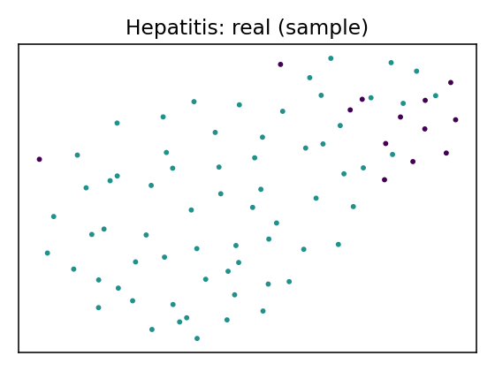
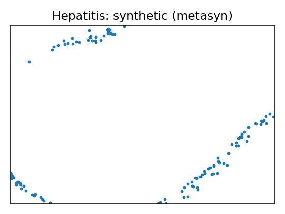
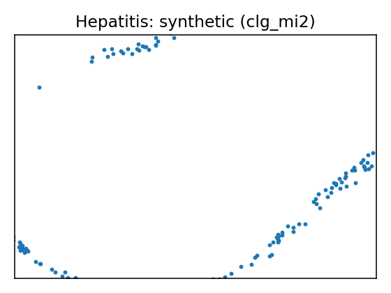
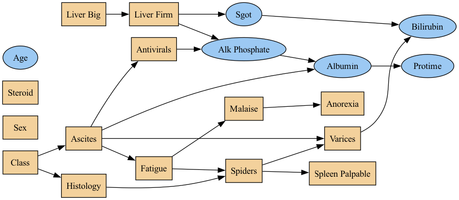
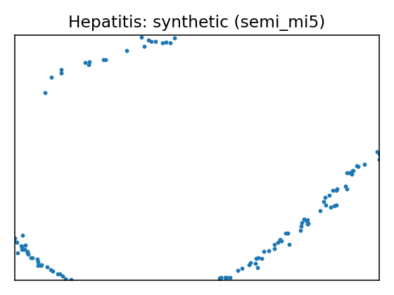
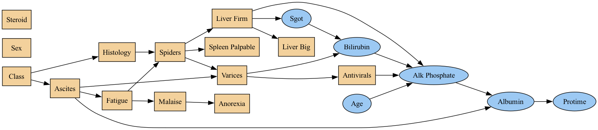

# Data Report — Hepatitis

**Source**: [UCI dataset 46](https://archive.ics.uci.edu/dataset/46)

**SemMap JSON-LD**: [dataset.semmap.json](dataset.semmap.json) · [RDFa HTML](dataset.semmap.html)
## Overview

| Metric      | Value                                                                         |
|:------------|:------------------------------------------------------------------------------|
| Dataset     | Hepatitis                                                                     |
| Source      | [UCI dataset 46](https://archive.ics.uci.edu/dataset/46)                      |
| Rows        | 80                                                                            |
| Columns     | 20                                                                            |
| Discrete    | 14                                                                            |
| Continuous  | 6                                                                             |
| SemMap      | [SemMap JSON-LD](dataset.semmap.json) [SemMap HTML](dataset.semmap.html) |
| Missingness | Not modeled                                                                   |

## Variables and summary

| variable        | inferred   | dist                                             |
|:----------------|:-----------|:-------------------------------------------------|
| Age             | continuous | 40.6625 ± 11.2800 [20, 32, 38.5, 49.25, 72]      |
| Sex             | discrete   | 1: 69 (86.25%)                                   |
| Steroid         | discrete   | 1: 38 (47.50%)                                   |
| Antivirals      | discrete   | 1: 21 (26.25%)                                   |
| Fatigue         | discrete   | 1: 52 (65.00%)                                   |
| Malaise         | discrete   | 1: 31 (38.75%)                                   |
| Anorexia        | discrete   | 1: 12 (15.00%)                                   |
| Liver Big       | discrete   | 1: 13 (16.25%)                                   |
| Liver Firm      | discrete   | 1: 38 (47.50%)                                   |
| Spleen Palpable | discrete   | 1: 15 (18.75%)                                   |
| Spiders         | discrete   | 1: 25 (31.25%)                                   |
| Ascites         | discrete   | 1: 12 (15.00%)                                   |
| Varices         | discrete   | 1: 10 (12.50%)                                   |
| Bilirubin       | continuous | 1.2212 ± 0.8752 [0.3, 0.7, 1, 1.3, 4.8]          |
| Alk Phosphate   | continuous | 102.9125 ± 53.6848 [26, 68.25, 85, 133.5, 280]   |
| Sgot            | continuous | 82.0250 ± 71.6000 [14, 30.75, 56.5, 102.75, 420] |
| Albumin         | continuous | 3.8438 ± 0.5763 [2.1, 3.5, 4, 4.2, 5]            |
| Protime         | continuous | 62.5125 ± 23.4278 [0, 46, 62, 77.25, 100]        |
| Histology       | discrete   | 1: 47 (58.75%)                                   |
| Class           | discrete   | 1: 13 (16.25%)                                   |

## Fidelity summary

| model    | backend   |   disc jsd mean |   disc jsd median |   cont ks mean |   cont w1 mean |   downstream sign match |
|:---------|:----------|----------------:|------------------:|---------------:|---------------:|------------------------:|
| metasyn  | metasyn   |          0.1288 |            0.1336 |         0.1979 |         9.7231 |                    0.64 |
| clg_mi2  | pybnesian |          0.135  |            0.1415 |         0.2267 |        11.4339 |                         |
| semi_mi5 | pybnesian |          0.1322 |            0.1374 |         0.1935 |         9.5575 |                         |

## Privacy summary

| model    | backend   |   n real |   n synth |   exact overlap rate |   near duplicate rate eps |   nn distance mean |   k min |   k pct lt5 |   k map |   rare qi reproduction rate | identifiability score   |   delta presence |
|:---------|:----------|---------:|----------:|---------------------:|--------------------------:|-------------------:|--------:|------------:|--------:|----------------------------:|:------------------------|-----------------:|
| metasyn  | metasyn   |       80 |       155 |                    0 |                    0.95   |             0.1035 |       1 |           1 |       5 |                           0 |                         |           1.8182 |
| clg_mi2  | pybnesian |       80 |       155 |                    0 |                    0.9125 |             0.0955 |       1 |           1 |       9 |                           0 |                         |           2.2222 |
| semi_mi5 | pybnesian |       80 |       155 |                    0 |                    0.9625 |             0.088  |       1 |           1 |       7 |                           0 |                         |           1.4    |

## Models

<table>
<tr><th>UMAP</th><th>Details</th><th>Structure</th></tr>
<tr><td></td><td>
<h3>Real data</h3></td><td></td></tr>
<tr><td></td><td>

<h3>Model: metasyn (metasyn)</h3>
<ul>
<li>Seed: 42, rows: 155</li>
<li> <a href="models/metasyn/synthetic.csv">Synthetic CSV</a></li>
<li> <a href="models/metasyn/per_variable_metrics.csv">Per-variable metrics</a></li>
<li> <a href="models/metasyn/metrics.json">Metrics JSON</a></li>
<li> <a href="models/metasyn/metrics.privacy.json">Privacy metrics</a></li>
<li> <a href="models/metasyn/metrics.downstream.json">Downstream metrics</a></li>
</ul>

<strong>Per-variable fidelity</strong>

<table class="dataframe">
  <thead>
    <tr style="text-align: right;">
      <th>variable</th>
      <th>type</th>
      <th>KS</th>
      <th>W1</th>
      <th>JSD</th>
    </tr>
  </thead>
  <tbody>
    <tr>
      <td>Age</td>
      <td>continuous</td>
      <td>0.1274</td>
      <td>2.8194</td>
      <td></td>
    </tr>
    <tr>
      <td>Sex</td>
      <td>discrete</td>
      <td></td>
      <td></td>
      <td>0.1352</td>
    </tr>
    <tr>
      <td>Steroid</td>
      <td>discrete</td>
      <td></td>
      <td></td>
      <td>0.1858</td>
    </tr>
    <tr>
      <td>Antivirals</td>
      <td>discrete</td>
      <td></td>
      <td></td>
      <td>0.0141</td>
    </tr>
    <tr>
      <td>Fatigue</td>
      <td>discrete</td>
      <td></td>
      <td></td>
      <td>0.164</td>
    </tr>
    <tr>
      <td>Malaise</td>
      <td>discrete</td>
      <td></td>
      <td></td>
      <td>0.2062</td>
    </tr>
    <tr>
      <td>Anorexia</td>
      <td>discrete</td>
      <td></td>
      <td></td>
      <td>0.132</td>
    </tr>
    <tr>
      <td>Liver Big</td>
      <td>discrete</td>
      <td></td>
      <td></td>
      <td>0.0848</td>
    </tr>
    <tr>
      <td>Liver Firm</td>
      <td>discrete</td>
      <td></td>
      <td></td>
      <td>0.0559</td>
    </tr>
    <tr>
      <td>Spleen Palpable</td>
      <td>discrete</td>
      <td></td>
      <td></td>
      <td>0.1001</td>
    </tr>
  </tbody>
</table>

<strong>Downstream metrics</strong>

<table class="dataframe">
  <thead>
    <tr style="text-align: right;">
      <th>metric</th>
      <th>value</th>
    </tr>
  </thead>
  <tbody>
    <tr>
      <td>sign_match_rate</td>
      <td>0.64</td>
    </tr>
    <tr>
      <td>formula</td>
      <td>Class ~ Age + Sex + Steroid + Antivirals + Fatigue + Malaise + Anorexia + Liver_Big + Liver_Firm + Spleen_Palpable + Spiders + Ascites + Varices + Bilirubin + Alk_Phosphate + Sgot + Albumin + Protime + Histology + Age:Sex + Sex:Steroid + Steroid:Antivirals + Antivirals:Fatigue + Fatigue:Malaise</td>
    </tr>
  </tbody>
</table>

<strong>Privacy metrics</strong>

<table class="dataframe">
  <thead>
    <tr style="text-align: right;">
      <th>metric</th>
      <th>value</th>
    </tr>
  </thead>
  <tbody>
    <tr>
      <td>n_real</td>
      <td>80</td>
    </tr>
    <tr>
      <td>n_synth</td>
      <td>155</td>
    </tr>
    <tr>
      <td>exact_overlap_rate</td>
      <td>0</td>
    </tr>
    <tr>
      <td>near_duplicate_rate_eps</td>
      <td>0.95</td>
    </tr>
    <tr>
      <td>nn_distance_mean</td>
      <td>0.1035</td>
    </tr>
    <tr>
      <td>k_min</td>
      <td>1</td>
    </tr>
    <tr>
      <td>k_pct_lt5</td>
      <td>1</td>
    </tr>
    <tr>
      <td>k_map</td>
      <td>5</td>
    </tr>
    <tr>
      <td>rare_qi_reproduction_rate</td>
      <td>0</td>
    </tr>
    <tr>
      <td>delta_presence</td>
      <td>1.8182</td>
    </tr>
  </tbody>
</table>

</td><td>
<table class="dataframe">
  <thead>
    <tr style="text-align: right;">
      <th>variable</th>
      <th>distribution</th>
    </tr>
  </thead>
  <tbody>
    <tr>
      <td>Age</td>
      <td>core.lognormal</td>
    </tr>
    <tr>
      <td>Sex</td>
      <td>core.multinoulli</td>
    </tr>
    <tr>
      <td>Steroid</td>
      <td>core.multinoulli</td>
    </tr>
    <tr>
      <td>Antivirals</td>
      <td>core.multinoulli</td>
    </tr>
    <tr>
      <td>Fatigue</td>
      <td>core.multinoulli</td>
    </tr>
    <tr>
      <td>Malaise</td>
      <td>core.multinoulli</td>
    </tr>
    <tr>
      <td>Anorexia</td>
      <td>core.multinoulli</td>
    </tr>
    <tr>
      <td>Liver Big</td>
      <td>core.multinoulli</td>
    </tr>
    <tr>
      <td>Liver Firm</td>
      <td>core.multinoulli</td>
    </tr>
    <tr>
      <td>Spleen Palpable</td>
      <td>core.multinoulli</td>
    </tr>
    <tr>
      <td>Spiders</td>
      <td>core.multinoulli</td>
    </tr>
    <tr>
      <td>Ascites</td>
      <td>core.multinoulli</td>
    </tr>
    <tr>
      <td>Varices</td>
      <td>core.multinoulli</td>
    </tr>
    <tr>
      <td>Bilirubin</td>
      <td>core.lognormal</td>
    </tr>
    <tr>
      <td>Alk Phosphate</td>
      <td>core.lognormal</td>
    </tr>
    <tr>
      <td>Sgot</td>
      <td>core.truncated_normal</td>
    </tr>
    <tr>
      <td>Albumin</td>
      <td>core.normal</td>
    </tr>
    <tr>
      <td>Protime</td>
      <td>core.truncated_normal</td>
    </tr>
    <tr>
      <td>Histology</td>
      <td>core.multinoulli</td>
    </tr>
    <tr>
      <td>Class</td>
      <td>core.multinoulli</td>
    </tr>
  </tbody>
</table></td></tr>

<tr><td></td><td>

<h3>Model: clg_mi2 (pybnesian)</h3>
<ul>
<li>Seed: 42, rows: 155</li>
<li> Params: <tt>{"max_indegree": 2, "operators": ["arcs"], "score": "bic", "type": "clg"}</tt></li><li> <a href="models/clg_mi2/synthetic.csv">Synthetic CSV</a></li>
<li> <a href="models/clg_mi2/per_variable_metrics.csv">Per-variable metrics</a></li>
<li> <a href="models/clg_mi2/metrics.json">Metrics JSON</a></li>
<li> <a href="models/clg_mi2/metrics.privacy.json">Privacy metrics</a></li>
</ul>

<strong>Per-variable fidelity</strong>

<table class="dataframe">
  <thead>
    <tr style="text-align: right;">
      <th>variable</th>
      <th>type</th>
      <th>KS</th>
      <th>W1</th>
      <th>JSD</th>
    </tr>
  </thead>
  <tbody>
    <tr>
      <td>Age</td>
      <td>continuous</td>
      <td>0.225</td>
      <td>4.5188</td>
      <td></td>
    </tr>
    <tr>
      <td>Sex</td>
      <td>discrete</td>
      <td></td>
      <td></td>
      <td>0.1899</td>
    </tr>
    <tr>
      <td>Steroid</td>
      <td>discrete</td>
      <td></td>
      <td></td>
      <td>0.1858</td>
    </tr>
    <tr>
      <td>Antivirals</td>
      <td>discrete</td>
      <td></td>
      <td></td>
      <td>0.0264</td>
    </tr>
    <tr>
      <td>Fatigue</td>
      <td>discrete</td>
      <td></td>
      <td></td>
      <td>0.1253</td>
    </tr>
    <tr>
      <td>Malaise</td>
      <td>discrete</td>
      <td></td>
      <td></td>
      <td>0.2236</td>
    </tr>
    <tr>
      <td>Anorexia</td>
      <td>discrete</td>
      <td></td>
      <td></td>
      <td>0.1569</td>
    </tr>
    <tr>
      <td>Liver Big</td>
      <td>discrete</td>
      <td></td>
      <td></td>
      <td>0.1112</td>
    </tr>
    <tr>
      <td>Liver Firm</td>
      <td>discrete</td>
      <td></td>
      <td></td>
      <td>0.0045</td>
    </tr>
    <tr>
      <td>Spleen Palpable</td>
      <td>discrete</td>
      <td></td>
      <td></td>
      <td>0.1261</td>
    </tr>
  </tbody>
</table>

<strong>Privacy metrics</strong>

<table class="dataframe">
  <thead>
    <tr style="text-align: right;">
      <th>metric</th>
      <th>value</th>
    </tr>
  </thead>
  <tbody>
    <tr>
      <td>n_real</td>
      <td>80</td>
    </tr>
    <tr>
      <td>n_synth</td>
      <td>155</td>
    </tr>
    <tr>
      <td>exact_overlap_rate</td>
      <td>0</td>
    </tr>
    <tr>
      <td>near_duplicate_rate_eps</td>
      <td>0.9125</td>
    </tr>
    <tr>
      <td>nn_distance_mean</td>
      <td>0.0955</td>
    </tr>
    <tr>
      <td>k_min</td>
      <td>1</td>
    </tr>
    <tr>
      <td>k_pct_lt5</td>
      <td>1</td>
    </tr>
    <tr>
      <td>k_map</td>
      <td>9</td>
    </tr>
    <tr>
      <td>rare_qi_reproduction_rate</td>
      <td>0</td>
    </tr>
    <tr>
      <td>delta_presence</td>
      <td>2.2222</td>
    </tr>
  </tbody>
</table>

</td><td>
</td></tr>

<tr><td></td><td>

<h3>Model: semi_mi5 (pybnesian)</h3>
<ul>
<li>Seed: 42, rows: 155</li>
<li> Params: <tt>{"max_indegree": 5, "operators": ["arcs"], "score": "bic", "type": "semiparametric"}</tt></li><li> <a href="models/semi_mi5/synthetic.csv">Synthetic CSV</a></li>
<li> <a href="models/semi_mi5/per_variable_metrics.csv">Per-variable metrics</a></li>
<li> <a href="models/semi_mi5/metrics.json">Metrics JSON</a></li>
<li> <a href="models/semi_mi5/metrics.privacy.json">Privacy metrics</a></li>
</ul>

<strong>Per-variable fidelity</strong>

<table class="dataframe">
  <thead>
    <tr style="text-align: right;">
      <th>variable</th>
      <th>type</th>
      <th>KS</th>
      <th>W1</th>
      <th>JSD</th>
    </tr>
  </thead>
  <tbody>
    <tr>
      <td>Age</td>
      <td>continuous</td>
      <td>0.2113</td>
      <td>4.0159</td>
      <td></td>
    </tr>
    <tr>
      <td>Sex</td>
      <td>discrete</td>
      <td></td>
      <td></td>
      <td>0.1495</td>
    </tr>
    <tr>
      <td>Steroid</td>
      <td>discrete</td>
      <td></td>
      <td></td>
      <td>0.2074</td>
    </tr>
    <tr>
      <td>Antivirals</td>
      <td>discrete</td>
      <td></td>
      <td></td>
      <td>0.0506</td>
    </tr>
    <tr>
      <td>Fatigue</td>
      <td>discrete</td>
      <td></td>
      <td></td>
      <td>0.1253</td>
    </tr>
    <tr>
      <td>Malaise</td>
      <td>discrete</td>
      <td></td>
      <td></td>
      <td>0.2236</td>
    </tr>
    <tr>
      <td>Anorexia</td>
      <td>discrete</td>
      <td></td>
      <td></td>
      <td>0.1569</td>
    </tr>
    <tr>
      <td>Liver Big</td>
      <td>discrete</td>
      <td></td>
      <td></td>
      <td>0.0445</td>
    </tr>
    <tr>
      <td>Liver Firm</td>
      <td>discrete</td>
      <td></td>
      <td></td>
      <td>0.034</td>
    </tr>
    <tr>
      <td>Spleen Palpable</td>
      <td>discrete</td>
      <td></td>
      <td></td>
      <td>0.1197</td>
    </tr>
  </tbody>
</table>

<strong>Privacy metrics</strong>

<table class="dataframe">
  <thead>
    <tr style="text-align: right;">
      <th>metric</th>
      <th>value</th>
    </tr>
  </thead>
  <tbody>
    <tr>
      <td>n_real</td>
      <td>80</td>
    </tr>
    <tr>
      <td>n_synth</td>
      <td>155</td>
    </tr>
    <tr>
      <td>exact_overlap_rate</td>
      <td>0</td>
    </tr>
    <tr>
      <td>near_duplicate_rate_eps</td>
      <td>0.9625</td>
    </tr>
    <tr>
      <td>nn_distance_mean</td>
      <td>0.088</td>
    </tr>
    <tr>
      <td>k_min</td>
      <td>1</td>
    </tr>
    <tr>
      <td>k_pct_lt5</td>
      <td>1</td>
    </tr>
    <tr>
      <td>k_map</td>
      <td>7</td>
    </tr>
    <tr>
      <td>rare_qi_reproduction_rate</td>
      <td>0</td>
    </tr>
    <tr>
      <td>delta_presence</td>
      <td>1.4</td>
    </tr>
  </tbody>
</table>

</td><td>
</td></tr>

</table>