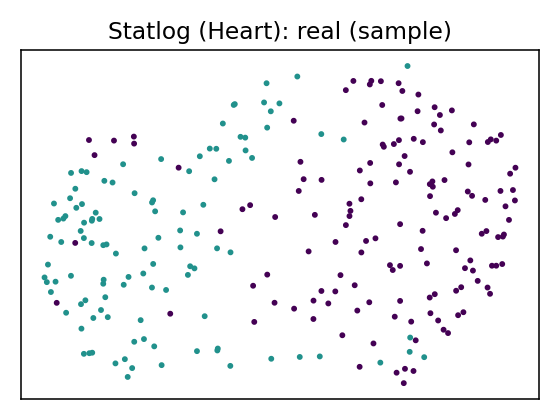
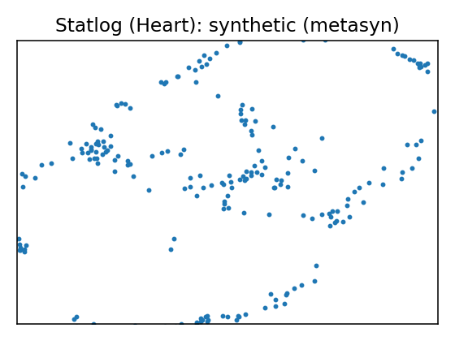
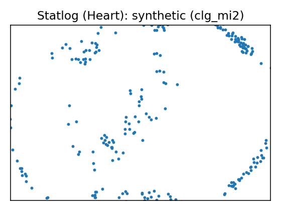
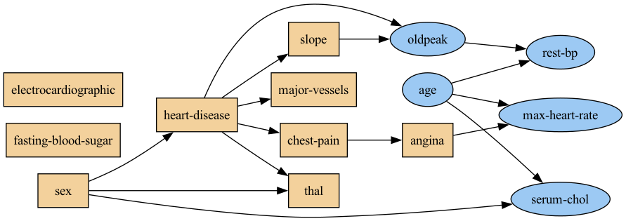
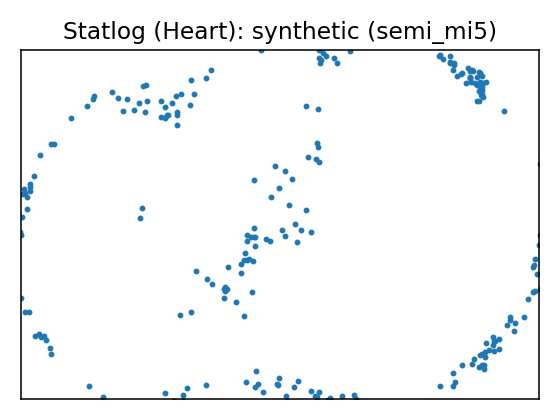
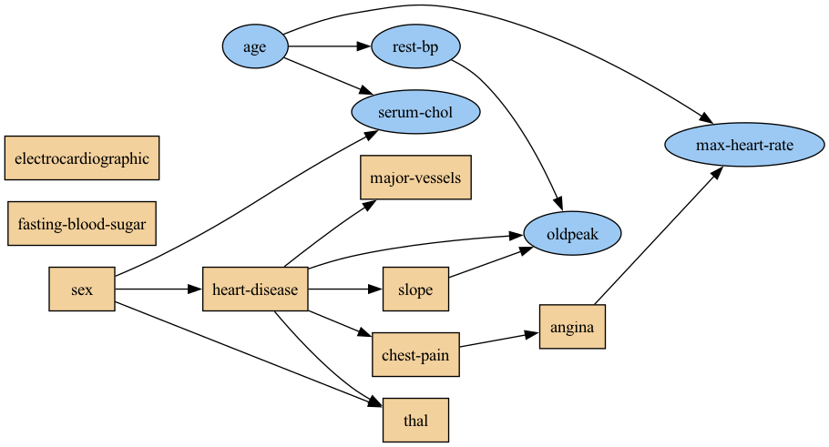

# Data Report — Statlog (Heart)

Cost Matrix

_______	 abse  pres
absence	 0	1
presence  5	0

where the rows represent the true values and the columns the predicted.

**Documentation**: 
Attribute Information:
------------------------
      -- 1. age       
      -- 2. sex       
      -- 3. chest pain type  (4 values)       
      -- 4. resting blood pressure  
      -- 5. serum cholestoral in mg/dl      
      -- 6. fasting blood sugar > 120 mg/dl       
      -- 7. resting electrocardiographic results  (values 0,1,2) 
      -- 8. maximum heart rate achieved  
      -- 9. exercise induced angina    
      -- 10. oldpeak = ST depression induced by exercise relative to rest   
      -- 11. the slope of the peak exercise ST segment     
      -- 12. number of major vessels (0-3) colored by flourosopy        
      -- 13.  thal: 3 = normal; 6 = fixed defect; 7 = reversable defect     

Attributes types
-----------------

Real: 1,4,5,8,10,12
Ordered:11,
Binary: 2,6,9
Nominal:7,3,13

Variable to be predicted
------------------------
Absence (1) or presence (2) of heart disease

**Source**: [UCI dataset 145](https://archive.ics.uci.edu/dataset/145)

**SemMap JSON-LD**: [dataset.semmap.json](dataset.semmap.json) · [RDFa HTML](dataset.semmap.html)
## Overview

| Metric      | Value                                                                         |
|:------------|:------------------------------------------------------------------------------|
| Dataset     | Statlog (Heart)                                                               |
| Source      | [UCI dataset 145](https://archive.ics.uci.edu/dataset/145)                    |
| Rows        | 270                                                                           |
| Columns     | 14                                                                            |
| Discrete    | 9                                                                             |
| Continuous  | 5                                                                             |
| SemMap      | [SemMap JSON-LD](dataset.semmap.json) [SemMap HTML](dataset.semmap.html) |
| Missingness | Not modeled                                                                   |

## Variables and summary

| variable             | inferred   | dist                                                                       |
|:---------------------|:-----------|:---------------------------------------------------------------------------|
| age                  | continuous | 54.4333 ± 9.1091 [29, 48, 55, 61, 77]                                      |
| sex                  | discrete   | 1: 183 (67.78%)                                                            |
| chest-pain           | discrete   | 4: 129 (47.78%) 3: 79 (29.26%) 2: 42 (15.56%) 1: 20 (7.41%) |
| rest-bp              | continuous | 131.3444 ± 17.8616 [94, 120, 130, 140, 200]                                |
| serum-chol           | continuous | 249.6593 ± 51.6862 [126, 213, 245, 280, 564]                               |
| fasting-blood-sugar  | discrete   | 1: 40 (14.81%)                                                             |
| electrocardiographic | discrete   | 2: 137 (50.74%) 0: 131 (48.52%) 1: 2 (0.74%)                     |
| max-heart-rate       | continuous | 149.6778 ± 23.1657 [71, 133, 153.5, 166, 202]                              |
| angina               | discrete   | 1: 89 (32.96%)                                                             |
| oldpeak              | continuous | 1.0500 ± 1.1452 [0, 0, 0.8, 1.6, 6.2]                                      |
| slope                | discrete   | 1: 130 (48.15%) 2: 122 (45.19%) 3: 18 (6.67%)                    |
| major-vessels        | discrete   | 0: 160 (59.26%) 1: 58 (21.48%) 2: 33 (12.22%) 3: 19 (7.04%) |
| thal                 | discrete   | 3: 152 (56.30%) 7: 104 (38.52%) 6: 14 (5.19%)                    |
| heart-disease        | discrete   | 1: 150 (55.56%)                                                            |

## Fidelity summary

| model    | backend   |   disc jsd mean |   disc jsd median |   cont ks mean |   cont w1 mean | downstream sign match   |
|:---------|:----------|----------------:|------------------:|---------------:|---------------:|:------------------------|
| metasyn  | metasyn   |          0.0958 |            0.1037 |         0.183  |         3.1721 |                         |
| clg_mi2  | pybnesian |          0.0928 |            0.078  |         0.1563 |         3.5533 |                         |
| semi_mi5 | pybnesian |          0.0928 |            0.078  |         0.1504 |         3.0953 |                         |

## Privacy summary

| model    | backend   |   n real |   n synth |   exact overlap rate |   near duplicate rate eps |   nn distance mean |   k min |   k pct lt5 |   k map |   rare qi reproduction rate | identifiability score   |   delta presence |
|:---------|:----------|---------:|----------:|---------------------:|--------------------------:|-------------------:|--------:|------------:|--------:|----------------------------:|:------------------------|-----------------:|
| metasyn  | metasyn   |      270 |       270 |                    0 |                    0.9815 |             0.071  |       1 |           1 |       2 |                           0 |                         |              2.5 |
| clg_mi2  | pybnesian |      270 |       270 |                    0 |                    0.9889 |             0.0494 |       1 |           1 |       1 |                           0 |                         |              5   |
| semi_mi5 | pybnesian |      270 |       270 |                    0 |                    0.9926 |             0.0573 |       1 |           1 |       3 |                           0 |                         |              1.8 |

## Models

<table>
<tr><th>UMAP</th><th>Details</th><th>Structure</th></tr>
<tr><td></td><td>
<h3>Real data</h3></td><td></td></tr>
<tr><td></td><td>

<h3>Model: metasyn (metasyn)</h3>
<ul>
<li>Seed: 42, rows: 270</li>
<li> <a href="models/metasyn/synthetic.csv">Synthetic CSV</a></li>
<li> <a href="models/metasyn/per_variable_metrics.csv">Per-variable metrics</a></li>
<li> <a href="models/metasyn/metrics.json">Metrics JSON</a></li>
<li> <a href="models/metasyn/metrics.privacy.json">Privacy metrics</a></li>
<li> <a href="models/metasyn/metrics.downstream.json">Downstream metrics</a></li>
</ul>

<strong>Per-variable fidelity</strong>

<table class="dataframe">
  <thead>
    <tr style="text-align: right;">
      <th>variable</th>
      <th>type</th>
      <th>KS</th>
      <th>W1</th>
      <th>JSD</th>
    </tr>
  </thead>
  <tbody>
    <tr>
      <td>age</td>
      <td>continuous</td>
      <td>0.1889</td>
      <td>2.4354</td>
      <td></td>
    </tr>
    <tr>
      <td>sex</td>
      <td>discrete</td>
      <td></td>
      <td></td>
      <td>0.1198</td>
    </tr>
    <tr>
      <td>chest-pain</td>
      <td>discrete</td>
      <td></td>
      <td></td>
      <td>0.1382</td>
    </tr>
    <tr>
      <td>rest-bp</td>
      <td>continuous</td>
      <td>0.1519</td>
      <td>3.1388</td>
      <td></td>
    </tr>
    <tr>
      <td>serum-chol</td>
      <td>continuous</td>
      <td>0.0926</td>
      <td>6.0966</td>
      <td></td>
    </tr>
    <tr>
      <td>fasting-blood-sugar</td>
      <td>discrete</td>
      <td></td>
      <td></td>
      <td>0.1037</td>
    </tr>
    <tr>
      <td>electrocardiographic</td>
      <td>discrete</td>
      <td></td>
      <td></td>
      <td>0.0433</td>
    </tr>
    <tr>
      <td>max-heart-rate</td>
      <td>continuous</td>
      <td>0.1296</td>
      <td>3.9375</td>
      <td></td>
    </tr>
    <tr>
      <td>angina</td>
      <td>discrete</td>
      <td></td>
      <td></td>
      <td>0.1423</td>
    </tr>
    <tr>
      <td>oldpeak</td>
      <td>continuous</td>
      <td>0.3519</td>
      <td>0.2524</td>
      <td></td>
    </tr>
  </tbody>
</table>

<strong>Downstream metrics</strong>

<table class="dataframe">
  <thead>
    <tr style="text-align: right;">
      <th>metric</th>
      <th>value</th>
    </tr>
  </thead>
  <tbody>
    <tr>
      <td>sign_match_rate</td>
      <td></td>
    </tr>
    <tr>
      <td>formula</td>
      <td>heart_disease ~ age + sex + C(chest_pain, levels=[]) + rest_bp + serum_chol + fasting_blood_sugar + C(electrocardiographic, levels=[]) + max_heart_rate + angina + oldpeak + slope + major_vessels + C(thal, levels=[]) + age:sex + sex:C(chest_pain, levels=[]) + C(chest_pain, levels=[]):rest_bp + rest_bp:serum_chol + serum_chol:fasting_blood_sugar</td>
    </tr>
  </tbody>
</table>

<strong>Privacy metrics</strong>

<table class="dataframe">
  <thead>
    <tr style="text-align: right;">
      <th>metric</th>
      <th>value</th>
    </tr>
  </thead>
  <tbody>
    <tr>
      <td>n_real</td>
      <td>270</td>
    </tr>
    <tr>
      <td>n_synth</td>
      <td>270</td>
    </tr>
    <tr>
      <td>exact_overlap_rate</td>
      <td>0</td>
    </tr>
    <tr>
      <td>near_duplicate_rate_eps</td>
      <td>0.9815</td>
    </tr>
    <tr>
      <td>nn_distance_mean</td>
      <td>0.071</td>
    </tr>
    <tr>
      <td>k_min</td>
      <td>1</td>
    </tr>
    <tr>
      <td>k_pct_lt5</td>
      <td>1</td>
    </tr>
    <tr>
      <td>k_map</td>
      <td>2</td>
    </tr>
    <tr>
      <td>rare_qi_reproduction_rate</td>
      <td>0</td>
    </tr>
    <tr>
      <td>delta_presence</td>
      <td>2.5</td>
    </tr>
  </tbody>
</table>

</td><td>
<table class="dataframe">
  <thead>
    <tr style="text-align: right;">
      <th>variable</th>
      <th>distribution</th>
    </tr>
  </thead>
  <tbody>
    <tr>
      <td>age</td>
      <td>core.normal</td>
    </tr>
    <tr>
      <td>sex</td>
      <td>core.multinoulli</td>
    </tr>
    <tr>
      <td>chest-pain</td>
      <td>core.multinoulli</td>
    </tr>
    <tr>
      <td>rest-bp</td>
      <td>core.lognormal</td>
    </tr>
    <tr>
      <td>serum-chol</td>
      <td>core.lognormal</td>
    </tr>
    <tr>
      <td>fasting-blood-sugar</td>
      <td>core.multinoulli</td>
    </tr>
    <tr>
      <td>electrocardiographic</td>
      <td>core.multinoulli</td>
    </tr>
    <tr>
      <td>max-heart-rate</td>
      <td>core.normal</td>
    </tr>
    <tr>
      <td>angina</td>
      <td>core.multinoulli</td>
    </tr>
    <tr>
      <td>oldpeak</td>
      <td>core.truncated_normal</td>
    </tr>
    <tr>
      <td>slope</td>
      <td>core.multinoulli</td>
    </tr>
    <tr>
      <td>major-vessels</td>
      <td>core.multinoulli</td>
    </tr>
    <tr>
      <td>thal</td>
      <td>core.multinoulli</td>
    </tr>
    <tr>
      <td>heart-disease</td>
      <td>core.multinoulli</td>
    </tr>
  </tbody>
</table></td></tr>

<tr><td></td><td>

<h3>Model: clg_mi2 (pybnesian)</h3>
<ul>
<li>Seed: 42, rows: 270</li>
<li> Params: <tt>{"max_indegree": 2, "operators": ["arcs"], "score": "bic", "type": "clg"}</tt></li><li> <a href="models/clg_mi2/synthetic.csv">Synthetic CSV</a></li>
<li> <a href="models/clg_mi2/per_variable_metrics.csv">Per-variable metrics</a></li>
<li> <a href="models/clg_mi2/metrics.json">Metrics JSON</a></li>
<li> <a href="models/clg_mi2/metrics.privacy.json">Privacy metrics</a></li>
</ul>

<strong>Per-variable fidelity</strong>

<table class="dataframe">
  <thead>
    <tr style="text-align: right;">
      <th>variable</th>
      <th>type</th>
      <th>KS</th>
      <th>W1</th>
      <th>JSD</th>
    </tr>
  </thead>
  <tbody>
    <tr>
      <td>age</td>
      <td>continuous</td>
      <td>0.1259</td>
      <td>1.9895</td>
      <td></td>
    </tr>
    <tr>
      <td>sex</td>
      <td>discrete</td>
      <td></td>
      <td></td>
      <td>0.0519</td>
    </tr>
    <tr>
      <td>chest-pain</td>
      <td>discrete</td>
      <td></td>
      <td></td>
      <td>0.1547</td>
    </tr>
    <tr>
      <td>rest-bp</td>
      <td>continuous</td>
      <td>0.2111</td>
      <td>5.2581</td>
      <td></td>
    </tr>
    <tr>
      <td>serum-chol</td>
      <td>continuous</td>
      <td>0.0889</td>
      <td>6.2472</td>
      <td></td>
    </tr>
    <tr>
      <td>fasting-blood-sugar</td>
      <td>discrete</td>
      <td></td>
      <td></td>
      <td>0.071</td>
    </tr>
    <tr>
      <td>electrocardiographic</td>
      <td>discrete</td>
      <td></td>
      <td></td>
      <td>0.0793</td>
    </tr>
    <tr>
      <td>max-heart-rate</td>
      <td>continuous</td>
      <td>0.1296</td>
      <td>3.8483</td>
      <td></td>
    </tr>
    <tr>
      <td>angina</td>
      <td>discrete</td>
      <td></td>
      <td></td>
      <td>0.1036</td>
    </tr>
    <tr>
      <td>oldpeak</td>
      <td>continuous</td>
      <td>0.2259</td>
      <td>0.4232</td>
      <td></td>
    </tr>
  </tbody>
</table>

<strong>Privacy metrics</strong>

<table class="dataframe">
  <thead>
    <tr style="text-align: right;">
      <th>metric</th>
      <th>value</th>
    </tr>
  </thead>
  <tbody>
    <tr>
      <td>n_real</td>
      <td>270</td>
    </tr>
    <tr>
      <td>n_synth</td>
      <td>270</td>
    </tr>
    <tr>
      <td>exact_overlap_rate</td>
      <td>0</td>
    </tr>
    <tr>
      <td>near_duplicate_rate_eps</td>
      <td>0.9889</td>
    </tr>
    <tr>
      <td>nn_distance_mean</td>
      <td>0.0494</td>
    </tr>
    <tr>
      <td>k_min</td>
      <td>1</td>
    </tr>
    <tr>
      <td>k_pct_lt5</td>
      <td>1</td>
    </tr>
    <tr>
      <td>k_map</td>
      <td>1</td>
    </tr>
    <tr>
      <td>rare_qi_reproduction_rate</td>
      <td>0</td>
    </tr>
    <tr>
      <td>delta_presence</td>
      <td>5</td>
    </tr>
  </tbody>
</table>

</td><td>
</td></tr>

<tr><td></td><td>

<h3>Model: semi_mi5 (pybnesian)</h3>
<ul>
<li>Seed: 42, rows: 270</li>
<li> Params: <tt>{"max_indegree": 5, "operators": ["arcs"], "score": "bic", "type": "semiparametric"}</tt></li><li> <a href="models/semi_mi5/synthetic.csv">Synthetic CSV</a></li>
<li> <a href="models/semi_mi5/per_variable_metrics.csv">Per-variable metrics</a></li>
<li> <a href="models/semi_mi5/metrics.json">Metrics JSON</a></li>
<li> <a href="models/semi_mi5/metrics.privacy.json">Privacy metrics</a></li>
</ul>

<strong>Per-variable fidelity</strong>

<table class="dataframe">
  <thead>
    <tr style="text-align: right;">
      <th>variable</th>
      <th>type</th>
      <th>KS</th>
      <th>W1</th>
      <th>JSD</th>
    </tr>
  </thead>
  <tbody>
    <tr>
      <td>age</td>
      <td>continuous</td>
      <td>0.1407</td>
      <td>1.7605</td>
      <td></td>
    </tr>
    <tr>
      <td>sex</td>
      <td>discrete</td>
      <td></td>
      <td></td>
      <td>0.0519</td>
    </tr>
    <tr>
      <td>chest-pain</td>
      <td>discrete</td>
      <td></td>
      <td></td>
      <td>0.1547</td>
    </tr>
    <tr>
      <td>rest-bp</td>
      <td>continuous</td>
      <td>0.2185</td>
      <td>4.668</td>
      <td></td>
    </tr>
    <tr>
      <td>serum-chol</td>
      <td>continuous</td>
      <td>0.0778</td>
      <td>5.4355</td>
      <td></td>
    </tr>
    <tr>
      <td>fasting-blood-sugar</td>
      <td>discrete</td>
      <td></td>
      <td></td>
      <td>0.071</td>
    </tr>
    <tr>
      <td>electrocardiographic</td>
      <td>discrete</td>
      <td></td>
      <td></td>
      <td>0.0793</td>
    </tr>
    <tr>
      <td>max-heart-rate</td>
      <td>continuous</td>
      <td>0.1148</td>
      <td>3.257</td>
      <td></td>
    </tr>
    <tr>
      <td>angina</td>
      <td>discrete</td>
      <td></td>
      <td></td>
      <td>0.1036</td>
    </tr>
    <tr>
      <td>oldpeak</td>
      <td>continuous</td>
      <td>0.2</td>
      <td>0.3553</td>
      <td></td>
    </tr>
  </tbody>
</table>

<strong>Privacy metrics</strong>

<table class="dataframe">
  <thead>
    <tr style="text-align: right;">
      <th>metric</th>
      <th>value</th>
    </tr>
  </thead>
  <tbody>
    <tr>
      <td>n_real</td>
      <td>270</td>
    </tr>
    <tr>
      <td>n_synth</td>
      <td>270</td>
    </tr>
    <tr>
      <td>exact_overlap_rate</td>
      <td>0</td>
    </tr>
    <tr>
      <td>near_duplicate_rate_eps</td>
      <td>0.9926</td>
    </tr>
    <tr>
      <td>nn_distance_mean</td>
      <td>0.0573</td>
    </tr>
    <tr>
      <td>k_min</td>
      <td>1</td>
    </tr>
    <tr>
      <td>k_pct_lt5</td>
      <td>1</td>
    </tr>
    <tr>
      <td>k_map</td>
      <td>3</td>
    </tr>
    <tr>
      <td>rare_qi_reproduction_rate</td>
      <td>0</td>
    </tr>
    <tr>
      <td>delta_presence</td>
      <td>1.8</td>
    </tr>
  </tbody>
</table>

</td><td>
</td></tr>

</table>