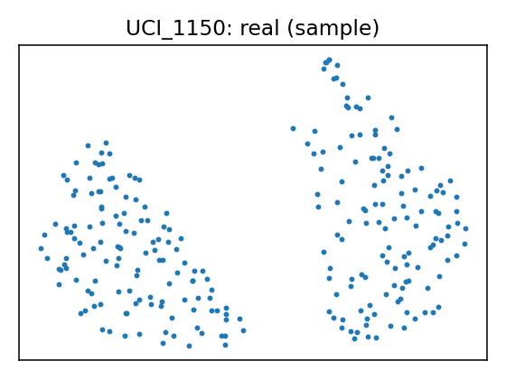
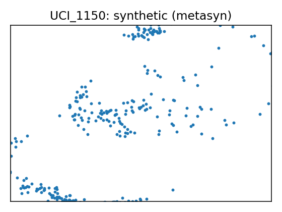

# Data Report — UCI_1150

**Source**: [UCI dataset 1150](https://archive.ics.uci.edu/dataset/1150)

**SemMap JSON-LD**: [dataset.semmap.json](dataset.semmap.json) · [RDFa HTML](dataset.semmap.html)
## Overview

| Metric      | Value                                                                         |
|:------------|:------------------------------------------------------------------------------|
| Dataset     | UCI_1150                                                                      |
| Source      | [UCI dataset 1150](https://archive.ics.uci.edu/dataset/1150)                  |
| Rows        | 319                                                                           |
| Columns     | 39                                                                            |
| Discrete    | 8                                                                             |
| Continuous  | 31                                                                            |
| SemMap      | [SemMap JSON-LD](dataset.semmap.json) [SemMap HTML](dataset.semmap.html) |
| Missingness | Not modeled                                                                   |

## Variables and summary

| variable                                       | inferred   | dist                                                                                          |
|:-----------------------------------------------|:-----------|:----------------------------------------------------------------------------------------------|
| Gallstone Status                               | discrete   | Gallstones absent [1]: 158 (49.53%)                                                           |
| Age                                            | continuous | 48.0690 ± 12.1146 [20, 38.5, 49, 56, 96]                                                      |
| Gender                                         | discrete   | Female [1]: 157 (49.22%)                                                                      |
| Comorbidity                                    | discrete   | 0: 217 (68.03%) 1: 99 (31.03%) 3: 2 (0.63%) 2: 1 (0.31%)                       |
| Coronary Artery Disease (CAD)                  | discrete   | 1: 12 (3.76%)                                                                                 |
| Hypothyroidism                                 | discrete   | 1: 9 (2.82%)                                                                                  |
| Hyperlipidemia                                 | discrete   | 1: 8 (2.51%)                                                                                  |
| Diabetes Mellitus (DM)                         | discrete   | 1: 43 (13.48%)                                                                                |
| Height                                         | continuous | 167.1567 ± 10.0530 [145, 159.5, 168, 175, 191]                                                |
| Weight                                         | continuous | 80.5649 ± 15.7091 [42.9, 69.6, 78.8, 91.25, 143.5]                                            |
| Body Mass Index (BMI)                          | continuous | 28.8771 ± 5.3137 [17.4, 25.25, 28.3, 31.85, 49.7]                                             |
| Total Body Water (TBW)                         | continuous | 40.5878 ± 7.9302 [13, 34.2, 39.8, 47, 66.2]                                                   |
| Extracellular Water (ECW)                      | continuous | 17.0712 ± 3.1619 [9, 14.8, 17.1, 19.4, 27.8]                                                  |
| Intracellular Water (ICW)                      | continuous | 23.6345 ± 5.3493 [13.8, 19.3, 23, 27.55, 57.1]                                                |
| Extracellular Fluid/Total Body Water (ECF/TBW) | continuous | 42.2120 ± 3.2445 [29.23, 40.075, 42, 44, 52]                                                  |
| Total Body Fat Ratio (TBFR) (%)                | continuous | 28.2750 ± 8.4444 [6.3, 22.025, 27.82, 34.81, 50.92]                                           |
| Lean Mass (LM) (%)                             | continuous | 71.6382 ± 8.4376 [48.99, 65.165, 72.11, 77.85, 93.67]                                         |
| Body Protein Content (Protein) (%)             | continuous | 15.9388 ± 2.3347 [5.56, 14.465, 15.87, 17.43, 24.81]                                          |
| Visceral Fat Rating (VFR)                      | continuous | 9.0784 ± 4.3325 [1, 6, 9, 12, 31]                                                             |
| Bone Mass (BM)                                 | continuous | 2.8033 ± 0.5095 [1.4, 2.4, 2.8, 3.2, 4]                                                       |
| Muscle Mass (MM)                               | continuous | 54.2730 ± 10.6038 [4.7, 45.8, 53.9, 62.6, 78.8]                                               |
| Obesity (%)                                    | continuous | 35.8501 ± 109.7997 [0.4, 13.9, 25.6, 41.75, 1954]                                             |
| Total Fat Content (TFC)                        | continuous | 23.4878 ± 9.6076 [3.1, 17, 22.6, 28.55, 62.5]                                                 |
| Visceral Fat Area (VFA)                        | continuous | 12.1716 ± 5.2622 [0.9, 8.57, 11.59, 15.1, 41]                                                 |
| Visceral Muscle Area (VMA) (Kg)                | continuous | 30.4034 ± 4.4605 [18.9, 27.25, 30.4081, 33.8, 41.1]                                           |
| Hepatic Fat Accumulation (HFA)                 | discrete   | 0: 129 (40.44%) 2: 122 (38.24%) 1: 41 (12.85%) 3: 26 (8.15%) 4: 1 (0.31%) |
| Glucose                                        | continuous | 108.6887 ± 44.8487 [69, 92, 98, 109, 575]                                                     |
| Total Cholesterol (TC)                         | continuous | 203.4953 ± 45.7585 [60, 172, 198, 233, 360]                                                   |
| Low Density Lipoprotein (LDL)                  | continuous | 126.6524 ± 38.5412 [11, 100.5, 122, 151, 293]                                                 |
| High Density Lipoprotein (HDL)                 | continuous | 49.4755 ± 17.7187 [25, 40, 46.5, 56, 273]                                                     |
| Triglyceride                                   | continuous | 144.5022 ± 97.9045 [1.39, 83, 119, 172, 838]                                                  |
| Aspartat Aminotransferaz (AST)                 | continuous | 21.6850 ± 16.6976 [8, 15, 18, 23, 195]                                                        |
| Alanin Aminotransferaz (ALT)                   | continuous | 26.8558 ± 27.8844 [3, 14.25, 19, 30, 372]                                                     |
| Alkaline Phosphatase (ALP)                     | continuous | 73.1125 ± 24.1811 [7, 58, 71, 86, 197]                                                        |
| Creatinine                                     | continuous | 0.8006 ± 0.1764 [0.46, 0.65, 0.79, 0.92, 1.46]                                                |
| Glomerular Filtration Rate (GFR)               | continuous | 100.8189 ± 16.9714 [10.6, 94.17, 104, 110.745, 132]                                           |
| C-Reactive Protein (CRP)                       | continuous | 1.8539 ± 4.9896 [0, 0, 0.215, 1.615, 43.4]                                                    |
| Hemoglobin (HGB)                               | continuous | 14.4182 ± 1.7758 [8.5, 13.3, 14.4, 15.7, 18.8]                                                |
| Vitamin D                                      | continuous | 21.4014 ± 9.9817 [3.5, 13.25, 22, 28.06, 53.1]                                                |

## Fidelity summary

| model   | backend   |   disc jsd mean |   disc jsd median |   cont ks mean |   cont w1 mean |   downstream sign match |
|:--------|:----------|----------------:|------------------:|---------------:|---------------:|------------------------:|
| metasyn | metasyn   |          0.0637 |            0.0717 |         0.1279 |         3.5703 |                       1 |

## Privacy summary

| model   | backend   |   n real |   n synth |   exact overlap rate |   near duplicate rate eps |   nn distance mean |   k min |   k pct lt5 |   k map |   rare qi reproduction rate | identifiability score   |   delta presence |
|:--------|:----------|---------:|----------:|---------------------:|--------------------------:|-------------------:|--------:|------------:|--------:|----------------------------:|:------------------------|-----------------:|
| metasyn | metasyn   |      319 |       319 |                    0 |                    0.9969 |             0.0135 |       1 |           1 |       1 |                           0 |                         |                3 |

## Models

<table>
<tr><th>UMAP</th><th>Details</th><th>Structure</th></tr>
<tr><td></td><td>
<h3>Real data</h3></td><td></td></tr>
<tr><td></td><td>

<h3>Model: metasyn (metasyn)</h3>
<ul>
<li>Seed: 42, rows: 319</li>
<li> <a href="models/metasyn/synthetic.csv">Synthetic CSV</a></li>
<li> <a href="models/metasyn/per_variable_metrics.csv">Per-variable metrics</a></li>
<li> <a href="models/metasyn/metrics.json">Metrics JSON</a></li>
<li> <a href="models/metasyn/metrics.privacy.json">Privacy metrics</a></li>
<li> <a href="models/metasyn/metrics.downstream.json">Downstream metrics</a></li>
</ul>

<strong>Per-variable fidelity</strong>

<table class="dataframe">
  <thead>
    <tr style="text-align: right;">
      <th>variable</th>
      <th>type</th>
      <th>KS</th>
      <th>W1</th>
      <th>JSD</th>
    </tr>
  </thead>
  <tbody>
    <tr>
      <td>Gallstone Status</td>
      <td>discrete</td>
      <td></td>
      <td></td>
      <td>0.0546</td>
    </tr>
    <tr>
      <td>Age</td>
      <td>continuous</td>
      <td>0.1122</td>
      <td>2.0198</td>
      <td></td>
    </tr>
    <tr>
      <td>Gender</td>
      <td>discrete</td>
      <td></td>
      <td></td>
      <td>0.0014</td>
    </tr>
    <tr>
      <td>Comorbidity</td>
      <td>discrete</td>
      <td></td>
      <td></td>
      <td>0.1052</td>
    </tr>
    <tr>
      <td>Coronary Artery Disease (CAD)</td>
      <td>discrete</td>
      <td></td>
      <td></td>
      <td>0.0408</td>
    </tr>
    <tr>
      <td>Hypothyroidism</td>
      <td>discrete</td>
      <td></td>
      <td></td>
      <td>0.0148</td>
    </tr>
    <tr>
      <td>Hyperlipidemia</td>
      <td>discrete</td>
      <td></td>
      <td></td>
      <td>0.0888</td>
    </tr>
    <tr>
      <td>Diabetes Mellitus (DM)</td>
      <td>discrete</td>
      <td></td>
      <td></td>
      <td>0.1025</td>
    </tr>
    <tr>
      <td>Height</td>
      <td>continuous</td>
      <td>0.1486</td>
      <td>2.3495</td>
      <td></td>
    </tr>
    <tr>
      <td>Weight</td>
      <td>continuous</td>
      <td>0.0932</td>
      <td>2.4176</td>
      <td></td>
    </tr>
  </tbody>
</table>

<strong>Downstream metrics</strong>

<table class="dataframe">
  <thead>
    <tr style="text-align: right;">
      <th>metric</th>
      <th>value</th>
    </tr>
  </thead>
  <tbody>
    <tr>
      <td>sign_match_rate</td>
      <td>1</td>
    </tr>
    <tr>
      <td>formula</td>
      <td>Gallstone_Status ~ Q('Age') + Q('Gender') + Q('Glucose') + Q('Age'):Q('Gender') + Q('Gender'):Q('Glucose')</td>
    </tr>
    <tr>
      <td>skipped_reason</td>
      <td></td>
    </tr>
  </tbody>
</table>

<strong>Privacy metrics</strong>

<table class="dataframe">
  <thead>
    <tr style="text-align: right;">
      <th>metric</th>
      <th>value</th>
    </tr>
  </thead>
  <tbody>
    <tr>
      <td>n_real</td>
      <td>319</td>
    </tr>
    <tr>
      <td>n_synth</td>
      <td>319</td>
    </tr>
    <tr>
      <td>exact_overlap_rate</td>
      <td>0</td>
    </tr>
    <tr>
      <td>near_duplicate_rate_eps</td>
      <td>0.9969</td>
    </tr>
    <tr>
      <td>nn_distance_mean</td>
      <td>0.0135</td>
    </tr>
    <tr>
      <td>k_min</td>
      <td>1</td>
    </tr>
    <tr>
      <td>k_pct_lt5</td>
      <td>1</td>
    </tr>
    <tr>
      <td>k_map</td>
      <td>1</td>
    </tr>
    <tr>
      <td>rare_qi_reproduction_rate</td>
      <td>0</td>
    </tr>
    <tr>
      <td>delta_presence</td>
      <td>3</td>
    </tr>
  </tbody>
</table>

</td><td>
<table class="dataframe">
  <thead>
    <tr style="text-align: right;">
      <th>variable</th>
      <th>distribution</th>
    </tr>
  </thead>
  <tbody>
    <tr>
      <td>Gallstone Status</td>
      <td>core.multinoulli</td>
    </tr>
    <tr>
      <td>Age</td>
      <td>core.normal</td>
    </tr>
    <tr>
      <td>Gender</td>
      <td>core.multinoulli</td>
    </tr>
    <tr>
      <td>Comorbidity</td>
      <td>core.multinoulli</td>
    </tr>
    <tr>
      <td>Coronary Artery Disease (CAD)</td>
      <td>core.multinoulli</td>
    </tr>
    <tr>
      <td>Hypothyroidism</td>
      <td>core.multinoulli</td>
    </tr>
    <tr>
      <td>Hyperlipidemia</td>
      <td>core.multinoulli</td>
    </tr>
    <tr>
      <td>Diabetes Mellitus (DM)</td>
      <td>core.multinoulli</td>
    </tr>
    <tr>
      <td>Height</td>
      <td>core.truncated_normal</td>
    </tr>
    <tr>
      <td>Weight</td>
      <td>core.lognormal</td>
    </tr>
    <tr>
      <td>Body Mass Index (BMI)</td>
      <td>core.lognormal</td>
    </tr>
    <tr>
      <td>Total Body Water (TBW)</td>
      <td>core.normal</td>
    </tr>
    <tr>
      <td>Extracellular Water (ECW)</td>
      <td>core.normal</td>
    </tr>
    <tr>
      <td>Intracellular Water (ICW)</td>
      <td>core.lognormal</td>
    </tr>
    <tr>
      <td>Extracellular Fluid/Total Body Water (ECF/TBW)</td>
      <td>core.normal</td>
    </tr>
    <tr>
      <td>Total Body Fat Ratio (TBFR) (%)</td>
      <td>core.normal</td>
    </tr>
    <tr>
      <td>Lean Mass (LM) (%)</td>
      <td>core.normal</td>
    </tr>
    <tr>
      <td>Body Protein Content (Protein) (%)</td>
      <td>core.normal</td>
    </tr>
    <tr>
      <td>Visceral Fat Rating (VFR)</td>
      <td>core.truncated_normal</td>
    </tr>
    <tr>
      <td>Bone Mass (BM)</td>
      <td>core.lognormal</td>
    </tr>
    <tr>
      <td>Muscle Mass (MM)</td>
      <td>core.normal</td>
    </tr>
    <tr>
      <td>Obesity (%)</td>
      <td>core.lognormal</td>
    </tr>
    <tr>
      <td>Total Fat Content (TFC)</td>
      <td>core.lognormal</td>
    </tr>
    <tr>
      <td>Visceral Fat Area (VFA)</td>
      <td>core.lognormal</td>
    </tr>
    <tr>
      <td>Visceral Muscle Area (VMA) (Kg)</td>
      <td>core.normal</td>
    </tr>
    <tr>
      <td>Hepatic Fat Accumulation (HFA)</td>
      <td>core.multinoulli</td>
    </tr>
    <tr>
      <td>Glucose</td>
      <td>core.truncated_normal</td>
    </tr>
    <tr>
      <td>Total Cholesterol (TC)</td>
      <td>core.normal</td>
    </tr>
    <tr>
      <td>Low Density Lipoprotein (LDL)</td>
      <td>core.normal</td>
    </tr>
    <tr>
      <td>High Density Lipoprotein (HDL)</td>
      <td>core.lognormal</td>
    </tr>
    <tr>
      <td>Triglyceride</td>
      <td>core.lognormal</td>
    </tr>
    <tr>
      <td>Aspartat Aminotransferaz (AST)</td>
      <td>core.lognormal</td>
    </tr>
    <tr>
      <td>Alanin Aminotransferaz (ALT)</td>
      <td>core.lognormal</td>
    </tr>
    <tr>
      <td>Alkaline Phosphatase (ALP)</td>
      <td>core.normal</td>
    </tr>
    <tr>
      <td>Creatinine</td>
      <td>core.lognormal</td>
    </tr>
    <tr>
      <td>Glomerular Filtration Rate (GFR)</td>
      <td>core.truncated_normal</td>
    </tr>
    <tr>
      <td>C-Reactive Protein (CRP)</td>
      <td>core.truncated_normal</td>
    </tr>
    <tr>
      <td>Hemoglobin (HGB)</td>
      <td>core.normal</td>
    </tr>
    <tr>
      <td>Vitamin D</td>
      <td>core.truncated_normal</td>
    </tr>
  </tbody>
</table></td></tr>

</table>